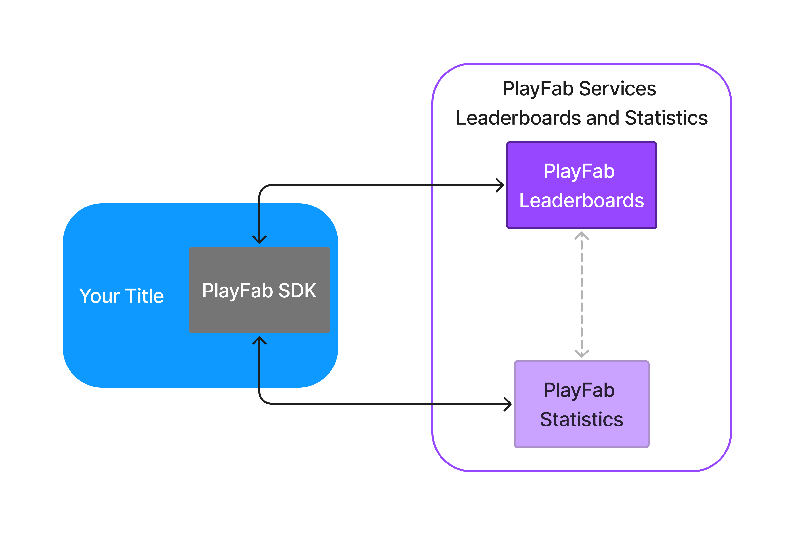
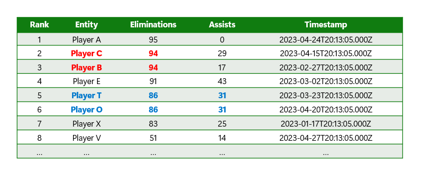
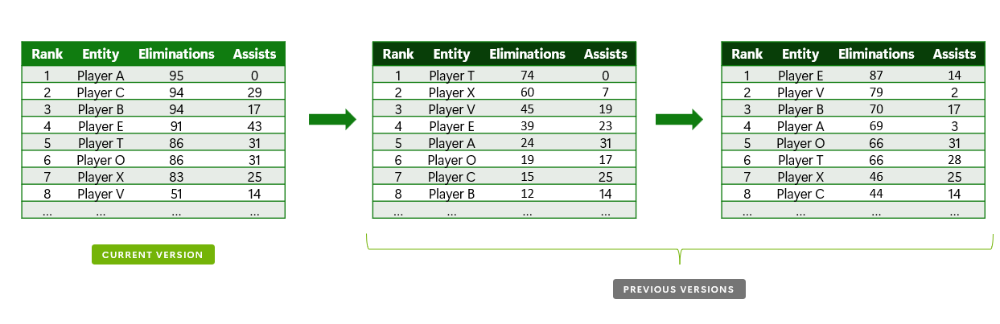
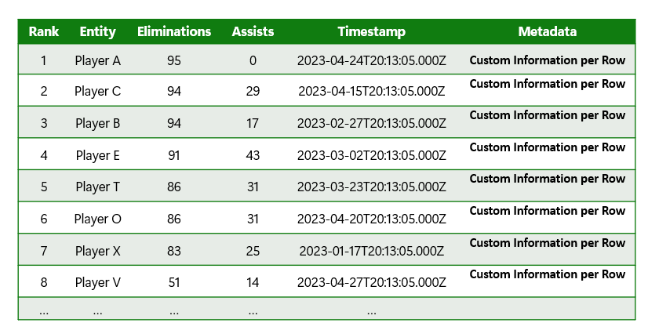

# Azure PlayFab Leaderboards overview

Azure Playfab Leaderboards is a cross-platform service that creates a sorted list of players with the purpose
of ranking them by scores. Leaderboards can be used as a standalone service or be linked with Statistics (so that updates to statistics feed into the entries on the leaderboard).

## Benefits
One of the main benefits of the new leaderboard service is the cross-platform capabilities and capacity of scaling up
to any needs. We're excited to introduce the following set of new features:

### Multicolumn (enhance) tie-breaking: 
This feature enables multiple scores per row that could be sorted with a given priority. With this sorting,
whenever there's a tie, we're able to determine which values take precedence and rank the corresponding player
higher on the leaderboard.

In the following example, we see a tie between Player C and Player B on Eliminations. 
For ranking, we then use the next column as a tie-breaker, in this case, by Assists. The same logic applies for Player T and Player O, which goes further and uses Timestamp as the tie-breaker.

### Versioning:
A leaderboard can have multiple versions of itself based on a reset strategy. Using this feature maintains 
the definition of the leaderboard but resets the content and creates a new version of the leaderboard. 
Older versions are still available for queries (updates are disallowed). 

In this example, we can see how the definition of the leaderboard remains the same but the content 
changes between each version.

### Metadata:
This feature allows the options of setting custom information per row (check if this feature corresponds to your tier).

In this example, you can see how each row has its own metadata associated to it.

### Standalone or linked to statistics

The Leaderboard can be linked to a Statistic definition, so that, whenever a
player hits a new personal record, it automatically gets pushed to the corresponding leaderboard of all players that are doing 
long shots. A leaderboard can also be configured as a standalone component if your game already
has a Statistics engine doing the aggregation.

## See also

- [Quickstart leaderboards](quickstart-leaderboards.md).
- [Create basic leaderboard](create-basic-leaderboard.md).
- [Doing more with leaderboards](doing-more-with-leaderboards.md).
- [Seasonal leaderboards](seasonal-leaderboards.md).
- [Ranking players by stats](leaderboards-linked-to-stats.md).
- [Add contextual data to leaderboards](metadata-leaderboards.md).
- [API reference](api-reference.md).
- [Leaderboard meters](../../pricing/meters/leaderboard-meters.md).
