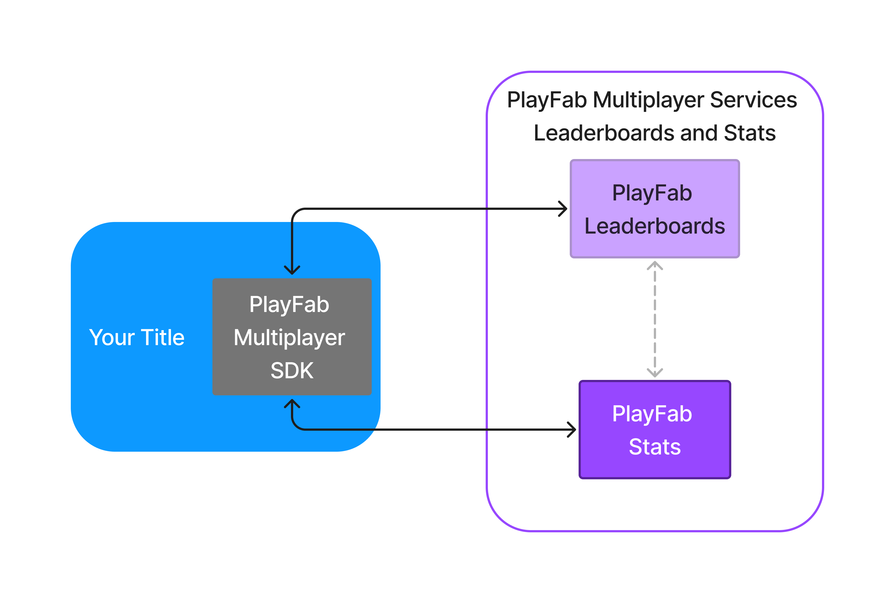
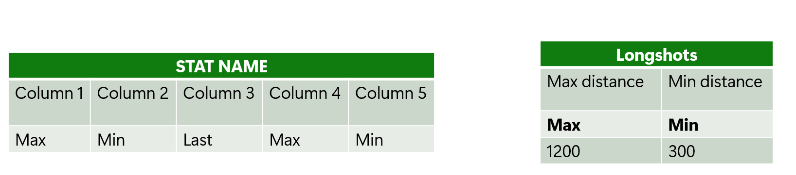
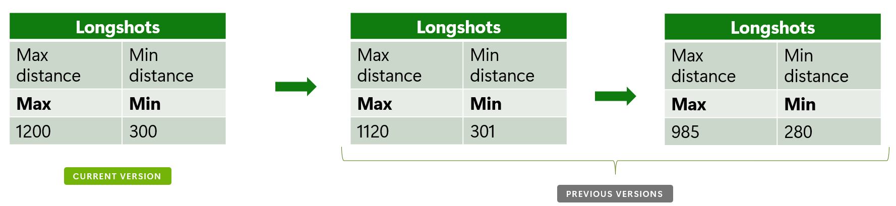
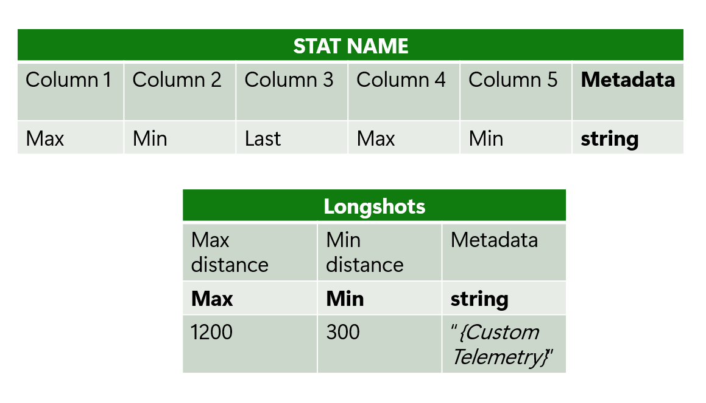

# Azure PlayFab Statistics overview

Azure Playfab Statistics is a cross-platform service that enables the numerical representation of player activity within a title.

## Benefits

One of the main benefits of the new statistics service is its cross-platform capabilities and its ability to scale
according to any requirements. In the following sections, we're going to detail a series of new features of the service.

### Multicolumn Aggregation

The Stat service now supports multiple values under a single stat definition, each with its own aggregation method,
including Max, Min, Last, and Sum.

Below are two examples of a stat definition with multiple columns. On the left is a statistic with five columns, each 
having their own aggregation method. On the right is an example applied to a in-game experience for capturing long shots,
both the furthest and shortest.

### Versioning

Each statistic can now be versioned, allowing for the retention of its definition while the content is refreshed. 
This behavior is achieved through a reset strategy that can be individually defined for each statistic. Every previous version remains 
accessible for historical comparison and analysis.

In this example, we can see how the statistic definition remains the same while the content changes between each version.

### Metadata

Enhanced flexibility is introduced with the option to attach custom information to each statistic, providing context 
and detail that can be tailored to specific needs.

In this example, you can see how metadata is associated with each statistic.

### Standalone components

One key aspect of the Statistics service is that it can work with the Leaderboards service. This capability allows that
every time a player makes an update to their stats, it's going to be reflected into a leaderboard.
However, also this service can work in a standalone fashion if needed.

## See also

- [Quickstart statistics](quickstart-statistics.md).
- [Create basic statistics](create-basic-statistics.md).
- [Doing more with statistics](doing-more-statistics.md).
- [Seasonal statistics](seasonal-statistics.md).
- [Add contextual data to statistics](metadata-statistics.md).
- [API reference](api-reference.md).
- [Ranking players by statistics](../leaderboards/leaderboards-linked-to-stats.md).
- [Statistics meters](../../pricing/meters/statistics-meters.md).
