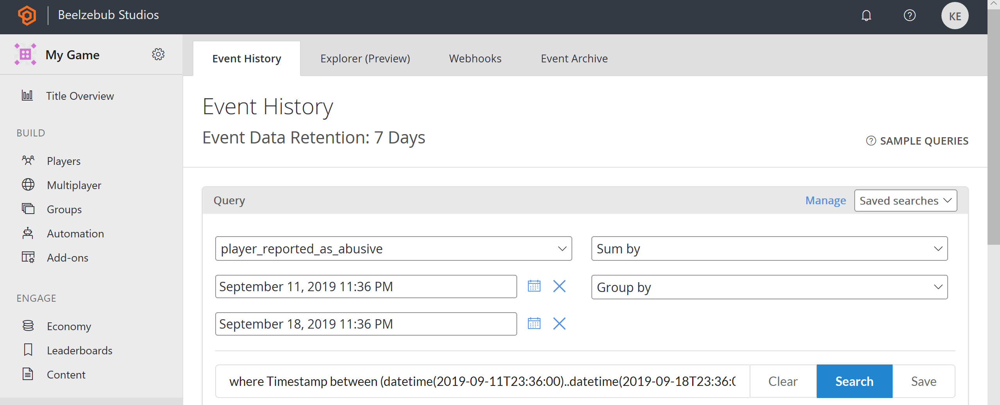
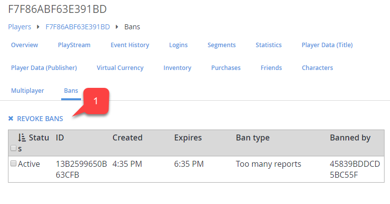

# Player ban system

The player ban feature allows you to restrict access to the game for certain players who break the rules.
> [!NOTE]
> Bans can be temporary or permanent.

The following tutorial shows you how to utilize the ban system, using the PlayFab API and Game Manager.

## Identify

While your game might have a custom system to identify cheaters and rule-breakers, PlayFab offers a player-to-player reporting mechanism. In essence, you rely on your players to report other problematic players.

Use the following snippet in your client code to let the client report a specific player.

```csharp
public void ReportPlayer(string problematicPlayerId, string reason) {
    PlayFabClientAPI.ReportPlayer(new ReportPlayerClientRequest() {
        ReporteeId = problematicPlayerId,
        Comment = reason
    }, result => {
        //... Handle success
    }, error => {
        Debug.Log(error.GenerateErrorReport());
    });
}
```

This API call will produce:

- A **Report Event**, which you'll be able to locate via the **Analytics** tool **(1)**.
- Select the **player_reported_as_abusive** event type **(2)**.
- This will show:
  - The **Event Name (3)**.
  - The reported **Player ID (4)**.

  

## Applying bans

Once the problematic player is identified, you might apply a ban. A community management rep might also apply a ban using Game Manager.

1. Navigate to the Players section.
2. Locate and select the problematic Player.
3. Navigate to the **Bans** tab.
4. Select **Add Ban** to display the **Add Ban** form.
5. Type in the **Reason** for the ban, and the desired duration. Optionally, you can **Ban** by a specific **IP ADDRESS (4)**.
6. Last, select the **ADD BAN** button.

  

If everything is set correctly, you'll see a new **Ban** in the table. You might optionally remove a **Ban** manually by selecting it in the **REVOKE BANS** field.

  

### Creating a ban on the server

Alternatively, you might use the Server SDK to apply a ban via code by using the snippet provided below.

```csharp
public void AddBan(string playerId, uint hours) {
    PlayFabServerAPI.BanUsers(new BanUsersRequest() {
        Bans = new List<BanRequest>() {
            new BanRequest() {
                DurationInHours = hours,
                PlayFabId = playerId,
                Reason = "Automatic ban for WH",
            }
        }
    }, result => {
        //... Handle success
    }, error => {
        Debug.Log(error.GenerateErrorReport());
    });
}
```

Bans applied via code will also be displayed in the table of bans for the target player in Game Manager.

> [!NOTE]
> The PlayFab server SDK methods provide more options, such as **IP** and **MAC** address bans.

Each ban you apply gets an assigned ID. Consider the following Server SDK API methods for precise ban management:

- [GetUserBans](xref:titleid.playfabapi.com.server.accountmanagement.getuserbans)
- [RevokeAllBansForUser](xref:titleid.playfabapi.com.server.accountmanagement.revokeallbansforuser)
- [RevokeBans](xref:titleid.playfabapi.com.server.accountmanagement.revokebans)
- [UpdateBans](xref:titleid.playfabapi.com.server.accountmanagement.updatebans)

> [!NOTE]
> You can use CloudScript functions as part of an automated system that may ban a player. To find out more about CloudScript, see our tutorial [Writing Custom CloudScript](../automation/cloudscript/writing-custom-cloudscript.md).
