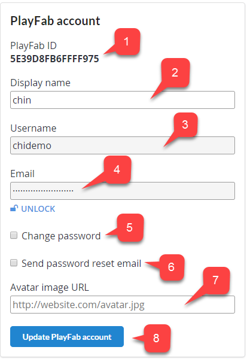
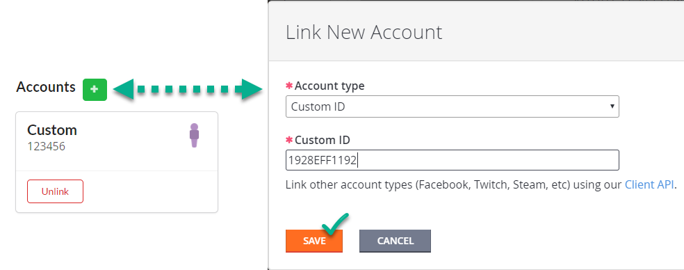
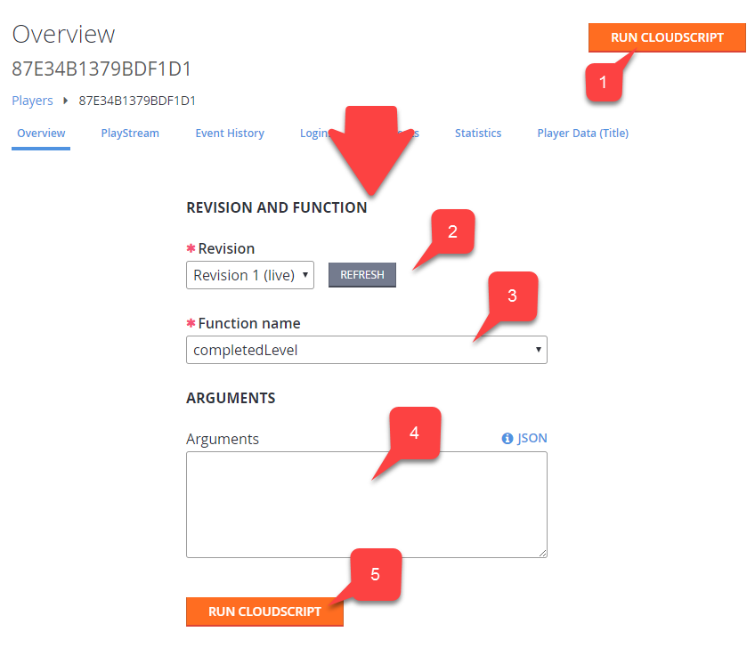

# Using player details

## Accessing player details

1. To access player details, first select **Players**.

2. From the list, locate the player whose details you want to review, and select their **ID**. This displays the Player Overview page.

  

## Overview

The **Player Overview** (or *details* page), is a starting point for controlling your player. A lot of other player pages are available from this page (we'll list them later in this tutorial).

1. The **Player ID** - Shows you the identity of the player you have selected.

2. The **Player toolbar** - Gives you access to various player-related pages.
3. The **Run CloudScript** button - Gives you access to cloud scripting on behalf of the player.

> [!NOTE]
> You can read more about this in our [CloudScript quickstart](../automation/cloudscript/quickstart.md).

4. Information panels contain general information about the player account.

5. The **PlayFab Account Panel** offers pages for managing a player's PlayFab account (described later in this tutorial).

6. The **Accounts** panel allows linking to different accounts for a single player record (described later in this tutorial).

> [!NOTE]
> You can read more about this in our [CloudScript quickstart](../automation/cloudscript/quickstart.md).

  

## Player Toolbar Overview

PlayFab offers a wide set of pages for fine tuning and analyzing your player. These pages are available from the **Player** toolbar panel, and consist of the following items:

- [Logins](player-logins.md) for inspecting a player's login attempts.
- [Segments](player-segments.md) for inspecting the segments that a player belongs to.
- [Statistics](using-player-statistics.md) for inspecting and manipulating a player's statistical values.
- [Player Data (Title)](../data/titledata/quickstart.md) for managing account data within the current scope.
- [Player Data (Publisher)](using-player-publisher-data.md) for managing account data across several titles.
- Virtual currency
- [Inventory](player-inventory.md) for managing the items that a player owns.
- Purchases
- [Friends](../social/friends/quickstart.md) for managing a player's friends list.
- Characters
- Multiplayers
- [Bans](player-bans.md)

  

## Managing a player account

A PlayFab account contains critical, identifying, player data. As an administrator, you can change some of this data.

1. **PlayFab ID** - The player ID identifies the player you are currently inspecting.
2. **Display name** - Allows you to edit the display name for this player.
3. **Username** - A read-only field for inspecting the player's username. Username can be empty. When present, it can be used for a player to log in using a username and password.
4. **Email** - This field is hidden and locked due to PII concerns. The email field can be empty. When present, it can be used for player to log in using email and password. You may use the **Lock** icon button to unlock and change the email value.
5. **Change Password** - When set, this can be used to assign a new password for the user. This setting is mutually exclusive with **Send password reset** email.
6. **Send password reset email** - When set, this allows you to send a **password recovery** email when an email value is present. This setting is mutually exclusive with **Change password**.
7. **Avatar image URL** - This field allows you to force change avatar for the user.
8. **Update PlayFab account** - Use this button to commit any changes you make on this account screen.

  

Additionally, you can manage linking. Read more about linking in our quickstart on [Account linking](../authentication/login/quickstart.md).

  

> [!NOTE]
> It is only possible to manually link Custom ID, Android Device, or iOS Device accounts. For more sophisticated options (Steam, GameCenter, etc.), consider using other Client Account Management APIs listed in our [PlayFab API Reference documentation](../../api-references/index.md).

## Running CloudScript

The **Run CloudScript** button on the **Player Overview** page opens the **REVISION AND FUNCTION** page shown below. On the **REVISION AND FUNCTION** screen:

1. The **Run CloudScript** button - Allows you to access a player's CloudScript settings.

2. **Revision** - Lets you select the revision level of the CloudScript to use. You can select **Refresh** to grab the latest changes.
3. The **Function name** - Lets you select the function to run. The list of available functions is based on your CloudScript revision content.
4. The **Arguments** field - Lets you supply optional JSON arguments.
5. The **RUN CLOUDSCRIPT** button - Lets you commit any changes you make on this screen.

  
