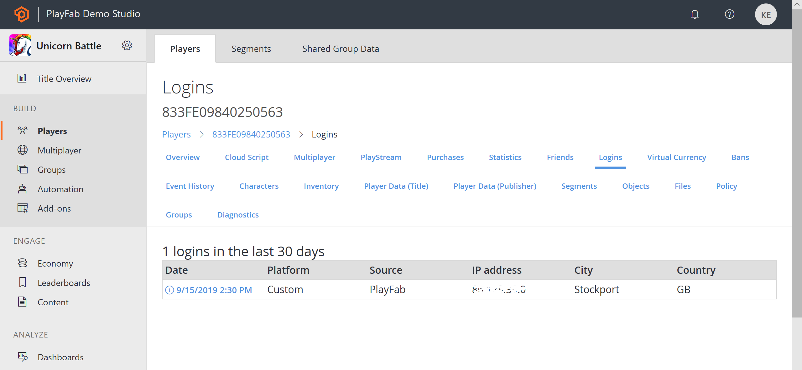

# Players logins

The **Players logins** page offers an overview of all the login attempts for a specific player.

## Access players logins

To access the players logins page:

1. Select **Players** found in the sidebar menu.
2. Select the  **Players** tab.
3. From the list, select the **ID** of the player you want to inspect.
4. Then, select **Logins** in the **Players** toolbar.

  

## Overview

The **Players Login** page contains the following information:

- **Player ID** - A label that identifies the player you are inspecting.
- **Total login attempts** - The total number of login attempts by this player.
- **Date of login attempt** - A human readable date label for each login attempt.
- **IP address** - A label showing the IP address.
- **Source** - A label that indicates where the login attempt came from.
- **Result** - Indicates whether the login attempt was successful.
