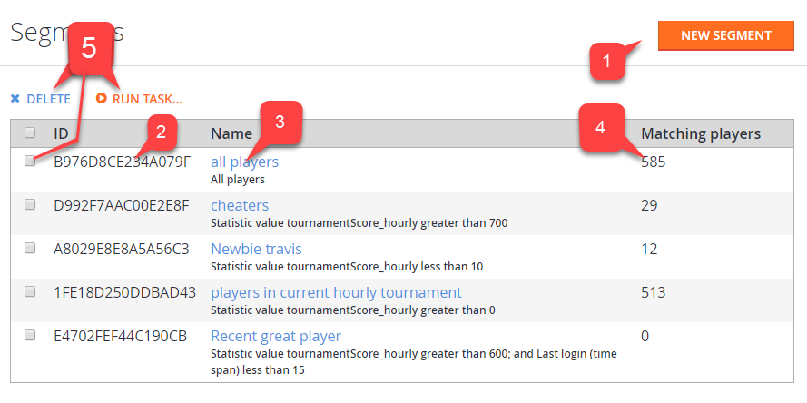

# Player segments

Players can be collected together into a segment, with the idea that all players in the segment meet certain conditions (filters).

Once the segment is defined, you can monitor the total number of players in the segment and run custom actions on those players automatically or manually.

## Access players segments

To access player segments:

- Navigate to **Players (1)** in the menu.
- Select the **Segments** tab **(2)**.

  

## Overview

The **Segments** page displays the segments that you currently have defined, and offers basic management capabilities.

1. Use the **NEW SEGMENT (1)** button to create a new segment.
2. The segment **ID (2)** uniquely identifies the segment.
3. The segment **Name (3)** identifies the player(s).
4. The **Matching players (4)** area displays the total number of players matching the segment filter.
5. Using the check boxes **(5)** to the left of the screen, you can select certain segments, and **X Delete** or **> Run Task...** custom actions on the chosen segments.

  

- For more information about defining segments and the filtering criteria, see our tutorial on [Player Segment configuration](player-segment-configuration.md).

- For more information about executing custom code for all players in a segment (as a one-time event, or on a regular schedule), see our tutorial on [Bulk Actions for an Entire Player Segment](../../data-analytics/acting-data/action-rules-using-cloudscript-actions-with-playstream.md).
