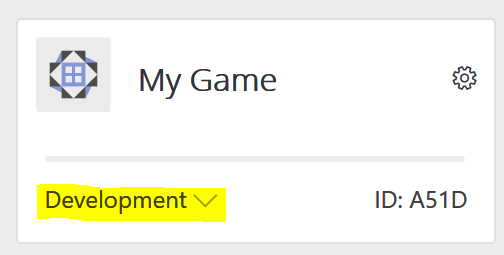

# Titles in Development Mode

All PlayFab titles are in one of two possible states - development mode and live. Development Mode is, as the name suggests, meant for titles currently in development. This mode provides developers with the flexibility to connect a title to PlayFab without running up the bill. However, there are functional limitations for titles in development mode (detailed below). A title in development mode can be [launched](../pricing/upgrades.md) through Game Manager and is then considered live. Launching a title removes all development mode limitations and allows the title to expand outside of test markets.

By default, every title created starts in development mode. The **My Studios and Titles** main page will indicate which state a title is in through a mark on the bottom, left corner of the title block. This indicator can also be viewed at the top of the left nav within a title. Titles in development mode are labeled **Development**. Live titles are blank.

**My Studios view of development mode title tag**

**Title page view of development mode title tag**

**Live title with blank tag**

> [!NOTE]
> As long as your title is in development mode, consumption is not counted towards any of your billable meters.

The following walks you through an example of a fictional customer called Fun Studios:

| Title | Title Mode | Meter Consumption |
| --- | --- | --- |
| Fun Game | Live | 1M PlayStream Events |
| Fun Game 2: The Return of Fun | Development Mode | 100K PlayStream Events

When Fun Studios visits their Billing Summary page, they only see the consumption for their Live title, Fun Game, count against their Standard Plan included resources.

**For more information on these topics, check out these pages:**
 - [Meters](../pricing/Meters/meters.md)
 - [Upgrades](../pricing/Upgrades.md)
 - [Billing Summary](../pricing/billingDetails.md)

## Limits
There are some studio and title limits associated with development mode:

### Studio Limits
| Limit | Amount |
| --- | --- |
| Titles in Development Mode | 10 Titles |

### Title Limits
| Limit | Amount |
| --- | --- |
| Unique Users | 100,000 Users |
| PlayStream Events | 1M Events |
| Telemetry Events | 1M Events |
| Profile Reads | 5M Reads |
| Profile Writes | 1M Writes |
| Profile Storage | 2 GB |
| Content and Configuration Reads | 20K Reads |
| Content and Configuration Writes | 15K Writes |
| Content and Configuration Storage | 2 GB |
| CloudScript Execution Time | 20K GB-s |
| CloudScript Total Executions | 200K Executions |
| Insights Credits | Insights Performance Level 1 |

**Definition of Unique Users:**
Unique Users are simply the total amount of player profiles you have in your title, which is different from MAU - you can delete player profiles through the Players page in Game Manager to reduce the total number of Unique Users if you are approaching the limit but aren't ready to launch your title

> [!NOTE]
> You can learn more about title limits at [PlayFab.com/Pricing](https://www.PlayFab.com/pricing) page.