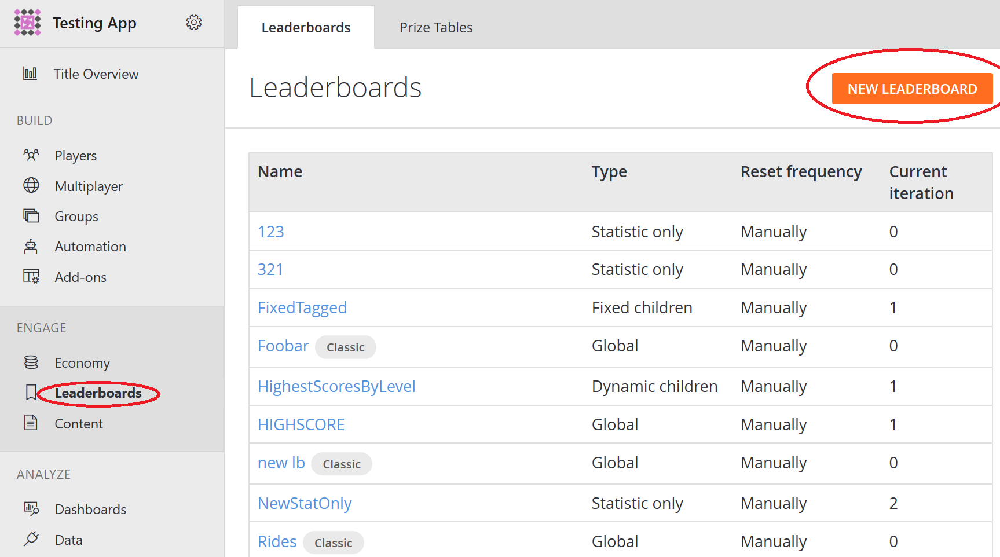
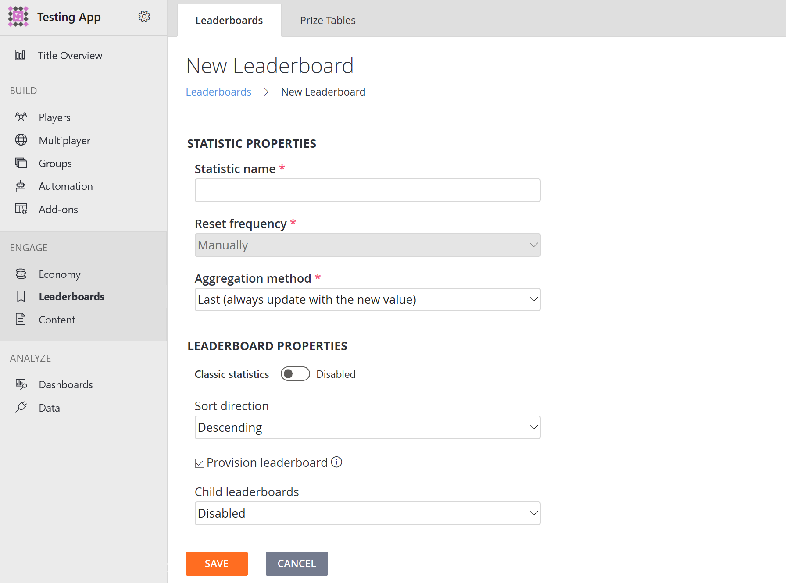

# Leaderboards v2 QuickStart 

> [!IMPORTANT]
> This feature is currently in **Private Preview**.  
>
> This documentation is provided to give you an early look at an upcoming feature and to allow you to provide feedback while it is still in development.  
>
> Access to this feature is restricted to select titles that PlayFab actively reaches out to.

## Creating a new leaderboard

### In the Game Manager:

 

* Go to **Leaderboards** in the menu to the left.
* Select **NEW LEADERBOARD**.
  
 
  
  
* Configure your new leaderboard the way you want.

    - **"Statisitc name"** is the name of your new leaderboard. Note that you won't be able to edit the name once the leaderboard is created.
    -** "Reset frequency" **is how often you want your leaderboard to automatically reset. It is currently greyed out because our v2 doesn't support automatic reset yet.
    -** "Agrregation method"** applies to the values in your new leaderboard.
    - Toggle **"Classic statistics"** to make it a v1, or "Classic" leaderboard.
      - If enabled, "Sort direction" and "Child leaderboards" fields will disappear as they are not features supported in v1.
    - **"Sort direction"** allows you to rank your leaderboard in either acsending or descending order.
    - **"Child leaderboards"** allows you to choose between *Dynamic* and *Fixed*, with the differences mentioned under **Child Leaderboards** secion above. Note that you won't be able to change this setting once you create your leaderboard.
* Click **SAVE**.
  

### Making API calls
Alternatively, you can also create a new leaderboard by calling the `CreateStatisticDefinition` API. 

```Java
    private static void createNewLeaderboard() {
        // First, create the request
        PlayFabLeaderboardsModels.CreateStatisticDefinitionRequest createStatisticDefinitionRequest = new PlayFabLeaderboardsModels.CreateStatisticDefinitionRequest();
        
        // Configure your request
        createStatisticDefinitionRequest.Name = "New Leaderboard";

        // Create a new leaderboard with your configured request        
        PlayFabLeaderboardsAPI.CreateStatisticDefinition(createStatisticDefinitionRequest);

    }
```

Sample Response

```
HTTP/1.1 200 OK
Content-Type: application/json; charset=utf-8
```

