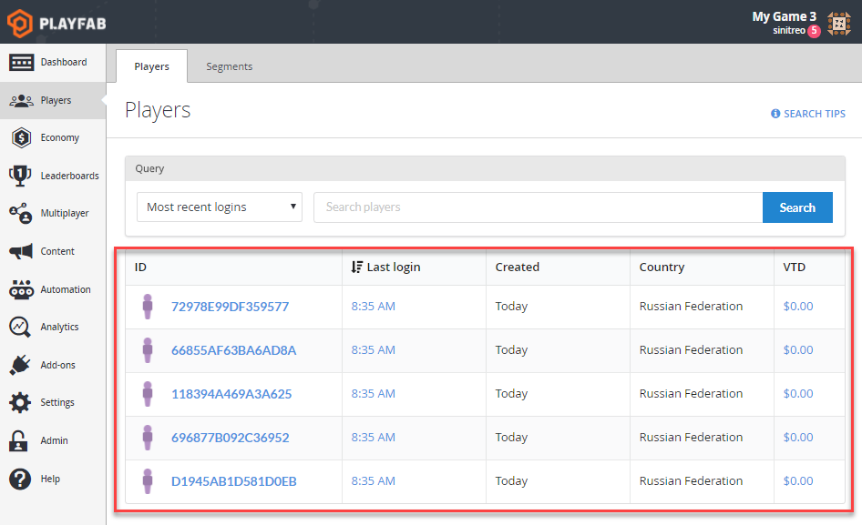
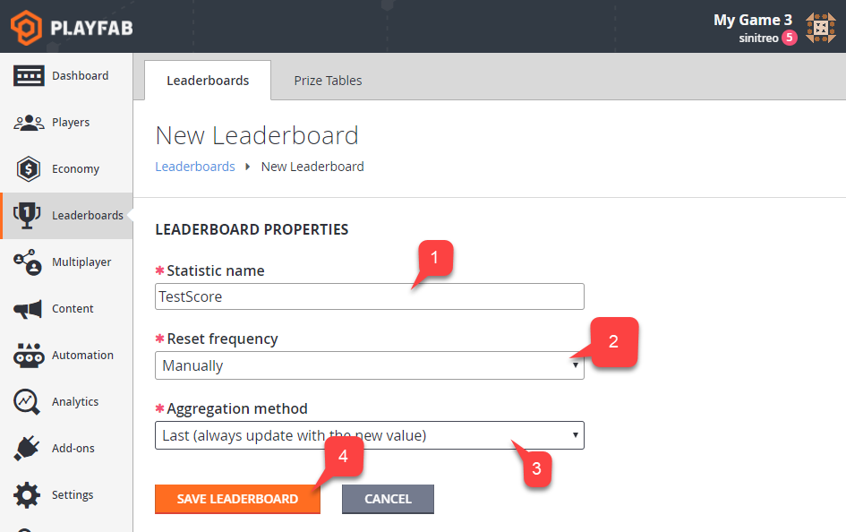
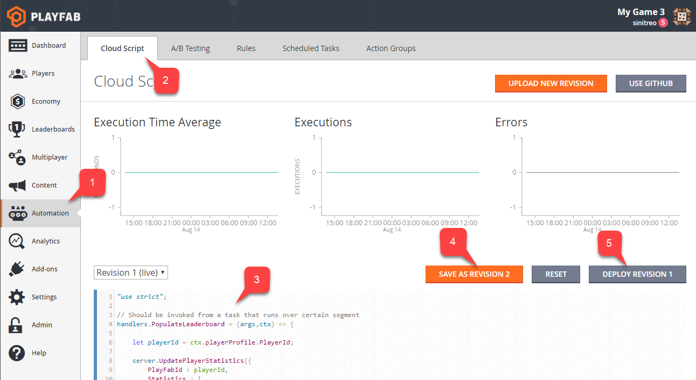
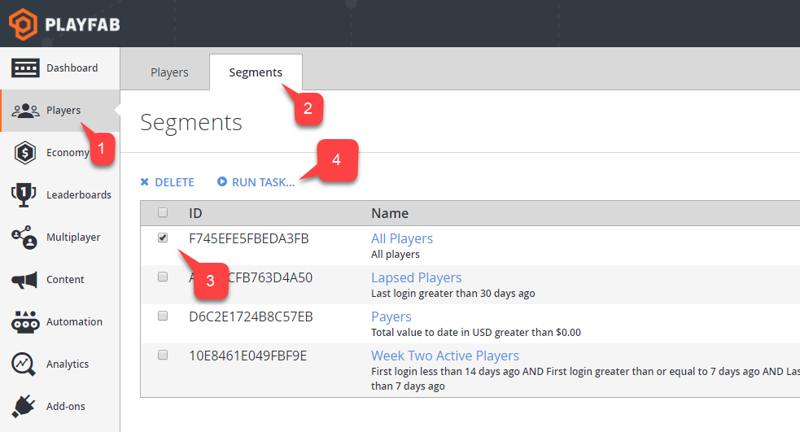
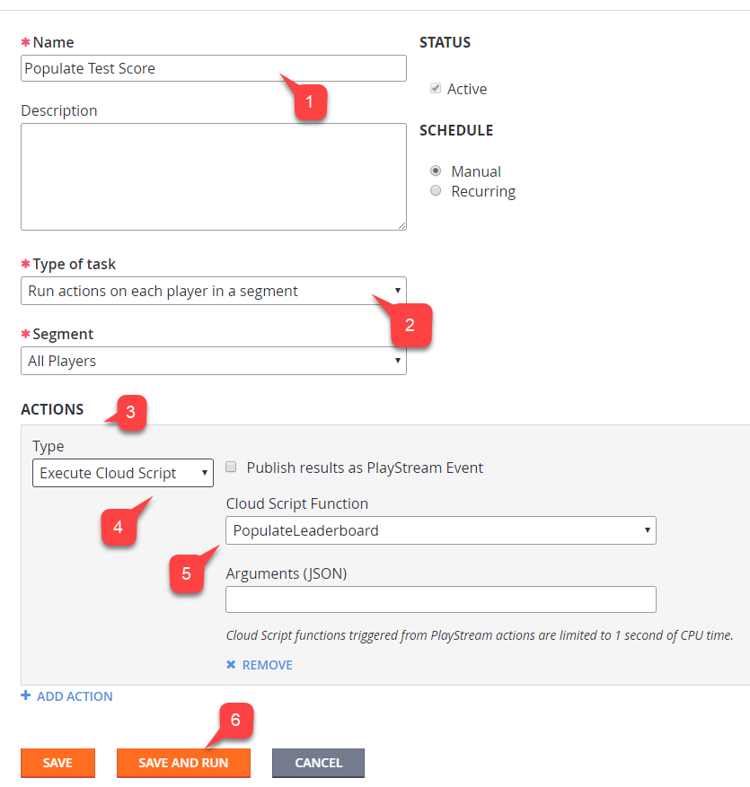
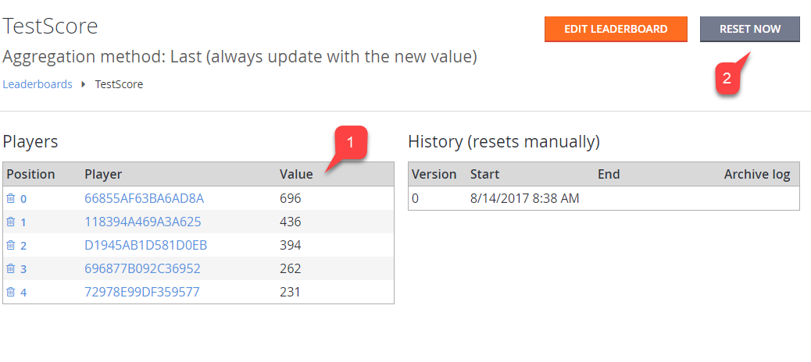
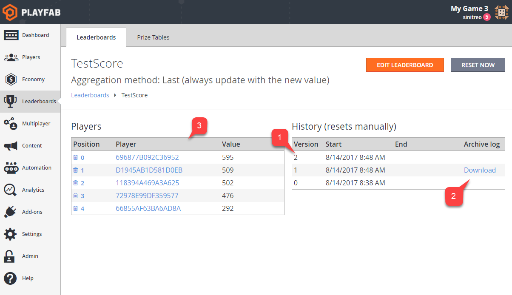
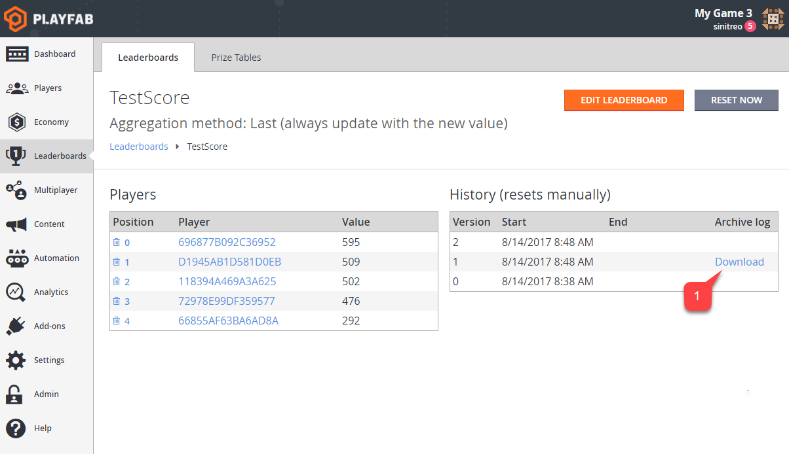
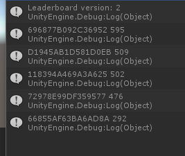

# Accessing archived tournament results

This tutorial illustrates how you can access archived leaderboard states.

Each leaderboard can be reset manually or automatically - meaning statistic values will be removed for all the players, leading to a *clear* state, and the leaderboard version will be implemented.

Before that happens, however, PlayFab creates a snapshot of all the leaderboard statistic values for each player. This allows you to access this *archived* version of the leaderboard.

> [!NOTE]
> All titles allow you to access the most recently archived version of a leaderboard, and this gives you the current and most previous versions. For example, if your current leaderboard version is **3**, you may access only version **3** and archived version **2**.

## Initial setup

Before using this guide, please make sure that you have some players already registered for the title. The following screenshot shows 5 players artificially registered using the [LoginWithCustomID](xref:titleid.playfabapi.com.client.authentication.loginwithcustomid) API call.

  

## Defining and simulating a leaderboard

In this step, we will create a leaderboard for our test purposes. Then we will simulate the leaderboard iteration process by populating and resetting the leaderboard several times.

Open Game Manager:

1. Navigate to the **Leaderboards** section.
2. Select the **New Leaderboard** button, as shown below.

To configure the new leaderboard:

1. Set the **Statistic** name to **TestScore**.
2. Keep the **Reset Frequency** as **Manually**.
3. Leave the default **Aggregation** method.
4. Submit by selecting **Save Leaderboard**.

  

You will end up on the new **Leaderboards** page which will render blank data (see below).

  

## Begin test section

> [!IMPORTANT]
> The following section is an example of how to populate test data for the purpose of this example. Your *real* game will populate this data in a more natural way.

Our next step is simulating some data for our leaderboard. The quickest way to do this is to create a CloudScript handler, which will set random statistics for a given player. We will invoke this handler for every player over the All Players segment.

As a result, each player will get a random statistic value, which is a *good enough* approximation of a real world scenario.

Let's start with defining our CloudScript (refer to the code comments for further information).

```javascript
// Should be invoked from a task that runs over certain segment
handlers.PopulateLeaderboard = (args,ctx) => {
    // When handler is executed as a task over the segment
    // we can extract individual player id using the next line:
    let playerId = ctx.playerProfile.PlayerId;

    // Use player id and update player statistics as follows:
    server.UpdatePlayerStatistics({
        PlayFabId : playerId,
        Statistics : [
            {
                "StatisticName": "TestScore",
                "Value": getRandomInRange(100,1000)
            }
        ]
    });
}

// Utility method to generate random number
let getRandomInRange = (min, max) => {
    return Math.round(Math.random() * (max - min) + min);
}
```

Let's upload the CloudScript. Using Game Manager:

1. Navigate to the **Automation** tab.
2. Then navigate to the **CloudScript** sub-tab.
3. Insert the **CloudScript** code.
4. Select **Save as Revision**.
5. Finally, **Deploy Revision**.

  

Next, we need to define a task to execute our CloudScript over a specific segment:

1. Navigate to the **Players** tab.
2. Then, navigate to the **Segments** sub-tab.

By default, **PlayFab** generates an **All Players** segment for you. This segment is specifically useful when you need all players registered in your title (which is exactly our case).

3. Select the **All Players Segment**.
4. Finally, select **Run Task...**.

> [!NOTE]
> If you have no All Players segment in the list, please, refer to our [Player Segmentation](../../analytics/segmentation/quickstart.md) quickstart to create one.

  

To configure the task:

1. Set up the **Name**.
2. Make sure the type of task is set to **Run actions on each Player in a Segment**.
    - In addition, verify that **All Players**  is selected under **Segment**.
3. Add a new **Action**.
4. Select **Execute CloudScript** under **Type**.
5. Then select the **PopulateLeaderboard** handler under **CloudScript Function**.
6. Finally, select the **Save and Run** button.

  

- Make sure the execution result is **Successful**.

  

## End of Test Section

### Populate Test data

1. Navigate to the **Leaderboards** tab again.
2. Select our **Leaderboard**.

  

1. You will see that your **Leaderboard** was populated with random values.
2. Reset the **Leaderboard**.

  

This will create a snapshot of all the data we currently have, and then it will *nullify* statistic values on every player and increment the version.

- Once your leaderboard is reset, run the CloudScript task again.
- Repeat this 2-3 times, then reset and repopulate.

You will end up with several **Leaderboard** versions **(1)**:

- **Current version data** will be displayed in the table to the left **(3)**.
- **Archived data** will be available for previous versions **(2)**.
- Only the latest version will be available. This applies to all titles.

  

### Accessing archived data using Game Manager

You can access archived results directly from the **Leaderboard** page:

1. Navigate to the **Leaderboards** tab.
2. Select the **Leaderboard** you need.

  

1. If your **Leaderboard** contains archived revisions, you will be able to download **JSON** data using the download link shown in the screenshot below.

  

### Accessing archived data using API

The following code allows you to pull the latest (current) version of the leaderboard.

```csharp
PlayFabClientAPI.GetLeaderboard(new GetLeaderboardRequest()
{
    StatisticName = "TestScore",
}, result =>
{
    Debug.Log("Leaderboard version: "+result.Version);
    foreach (var entry in result.Leaderboard)
    {
        Debug.Log(entry.PlayFabId+" "+entry.StatValue);
    }
}, FailureCallback);
```

The result will look like the example provided below.

  

Alternatively, you may specify a version of the leaderboard you want to load.

```csharp
PlayFabClientAPI.GetLeaderboard(new GetLeaderboardRequest()
{
    StatisticName = "TestScore",
    Version = 1
}, result =>
{
    Debug.Log("Leaderboard version: "+result.Version);

    foreach (var entry in result.Leaderboard)
    {
        Debug.Log(entry.PlayFabId+" "+entry.StatValue);
    }
}, FailureCallback);
```

The result will look like the example provided below.

  

All titles allow you to access the *latest* archived version of the leaderboard. Trying to pull an older version will result in an error (see below).

  

The same rules apply for all the Leaderboard requests.

- [GetLeaderboard](xref:titleid.playfabapi.com.client.playerdatamanagement.getleaderboard)
- [GetLeaderboardAroundPlayer](xref:titleid.playfabapi.com.client.playerdatamanagement.getleaderboardaroundplayer)
- [GetFriendLeaderboardAroundPlayer](xref:titleid.playfabapi.com.client.playerdatamanagement.getfriendleaderboardaroundplayer)
- [GetFriendLeaderboard](xref:titleid.playfabapi.com.client.playerdatamanagement.getfriendleaderboard)

Please refer to documentation for the [GetLeaderboardResult](xref:titleid.playfabapi.com.client.playerdatamanagement.getleaderboard#getleaderboardresult) object, to learn about useful properties you may get with the leaderboard data.
