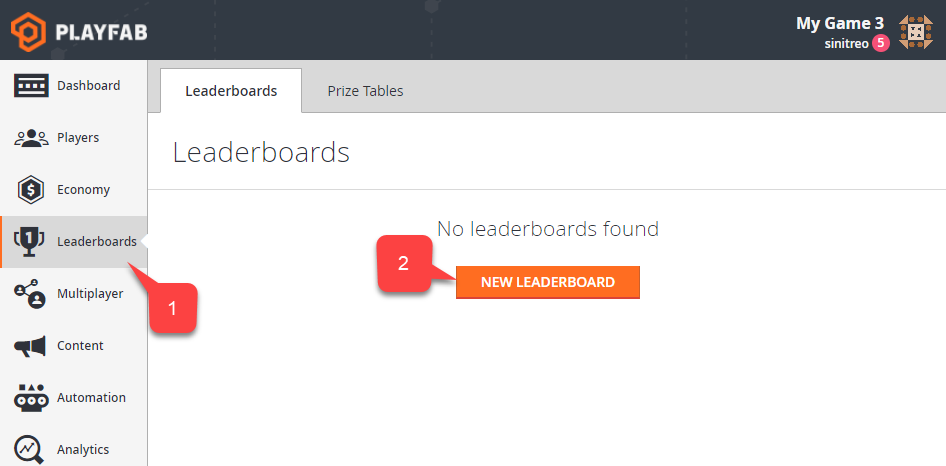

# Accessing Archived Tournament results

This tutorial illustrates how you can access archived **Leaderboard** states.

Each **Leaderboard** can be reset manually or automatically - meaning statistic values will be removed for all the **Players**, leading to a *clear* state and the **Leaderboard** version will be implemented.

Before that happens, however, **PlayFab** creates a snapshot of all the **Leaderboard Statistic** values for each **Player**. This allows you to access this *archived* version of the **Leaderboard**.

> [!NOTE]
> **PlayFab** free tier only allows access to the most recently archived version of a **Leaderboard**, effectively giving you the current and the most previous versions. For example, with a free tier, if your current **Leaderboard** version is **3**, you may only access version **3** and archived version **2**.

## Initial setup

To follow this guide, please ensure that you have some **Players** already registered for the **Title**. The following screenshot shows 5 **Players** artificially registered using the [LoginWithCustomID](xref:titleid.playfabapi.com.client.authentication.loginwithcustomid) **API** call.

  

## Defining and simulating a Leaderboard

In this step, we will create a **Leaderboard** for our test purposes. Then we will simulate the **Leaderboard** iteration process by populating and resetting the **Leaderboard** several times.

Open **Game Manager**:

- Navigate to the **Leaderboards** tab **(1)**.
- Then select the **New Leaderboard** button **(2)** as shown below.

  

To configure the new **Leaderboard**:

- Set the **Statistic** name to **TestScore (1)**.
- Keep the **Reset Frequency** as **Manually (2)**.
- Leave the default **Aggregation** method **(3)**.
- Submit by selecting **Save Leaderboard (4)**.

  

You will end up on the new **Leaderboards** page which will, obviously, render blank data (see below).

  

## Begin Test Section

> [!IMPORTANT]
> The following section is an example of how to populate test data for the purpose of this example. Your *real* game will populate this data in a more natural way.

Our next step is simulating some data for our **Leaderboard**. The quickest way to do this is to create a **CloudScript** handler, which will set random statistics for a given **Player**. We will invoke this handler for every **Player** over the **All Players Segment**.

As a result, each **Player** will get a random **Statistic** value, which is a *good enough* approximation of a real world scenario.

Let's start with defining our **CloudScript** (refer to the code comments for further information).

```javascript
// Should be invoked from a task that runs over certain segment
handlers.PopulateLeaderboard = (args,ctx) => {
    // When handler is executed as a task over the segment
    // we can extract individual player id using the next line:
    let playerId = ctx.playerProfile.PlayerId;

    // Use player id and update player statistics as follows:
    server.UpdatePlayerStatistics({
        PlayFabId : playerId,
        Statistics : [
            {
                "StatisticName": "TestScore",
                "Value": getRandomInRange(100,1000)
            }
        ]
    });
}

// Utility method to generate random number
let getRandomInRange = (min, max) => {
    return Math.round(Math.random() * (max - min) + min);
}
```

Let's upload the **CloudScript**. Using **Game Manager**:

- Navigate to the **Automation (1)** tab.
- Then navigate to the **CloudScript (2)** sub-tab.
- Insert the **CloudScript** code **(3)**.
- Select **Save as Revision (4)**.
- Finally, **Deploy Revision (5)**.

  

Next, we need to define a task to execute our **CloudScript** over a specific **Segment**:

- Navigate to the **Players** tab **(1)**.
- Then, navigate to the **Segments** sub-tab **(2)**.
- By default, **PlayFab** generates an **All Players** segment for you. This **Segment** is specifically useful when you need all **Players** registered in your **Title** (which is exactly our case).
- Select the **All Players Segment (3)**.
- Finally, select **Run Task... (4)**.

> [!NOTE]
> If you have no **All Players Segment** in the list, please, refer to our [Player Segmentation](../../analytics/segmentation/player-segmentation.md) tutorial to create one.

  

To configure the **Task**:

- Set up the **Name (1)**.
- Make sure the type of **Task** is set to **Run actions on each Player in a Segment (2)**.
- In addition, verify that the **All Players Segment** is selected.
- Add a new **Action (3)**.
- Select the **Execute CloudScript** type **(4)**.
- Then select the **PopulateLeaderboard** handler **(5)**.
- Finally, select the **Save and Run** button **(6)**.

  

- Make sure the execution result is **Successful**.

  

## End of Test Section

### Populate Test data

- Navigate to the **Leaderboards** tab **(1)** again.
- Select our **Leaderboard (2)**.

  

- You will see that our **Leaderboard** was populated with random values **(1)**.
- Reset the **Leaderboard (2)**.

  

This will create a snapshot of all the data we currently have, and then it will *nullify* **Statistics** values on every **Player** and increment the version.

- Once your **Leaderboard** is reset, run the **CloudScript** task again.
- Repeat this 2-3 times, then reset and repopulate.

You will end up with several **Leaderboard** versions **(1)**:

- **Current version data** will be displayed in the table to the left **(3)**.
- **Archived data** will be available for previous versions **(2)**.
- With a free tier, only the very previous version will be available.

  

### Accessing archived data using Game Manager

You can access archived results directly from the **Leaderboard** page:

- Navigate to the **Leaderboards** tab **(1)**.
- Select the **Leaderboard** you need **(2)**.

  

If your **Leaderboard** contains archived revisions, you will be able to download **JSON** data using the download link **(1)**.

  

### Accessing archived data using API

The following code allows you to pull the latest (current) version of the **Leaderboard**.

```csharp
PlayFabClientAPI.GetLeaderboard(new GetLeaderboardRequest()
{
    StatisticName = "TestScore",
}, result =>
{
    Debug.Log("Leaderboard version: "+result.Version);
    foreach (var entry in result.Leaderboard)
    {
        Debug.Log(entry.PlayFabId+" "+entry.StatValue);
    }
}, FailureCallback);
```

The result will look like the example provided below.

  

Alternatively, you may specify a version of the **Leaderboard** you want to load.

```csharp
PlayFabClientAPI.GetLeaderboard(new GetLeaderboardRequest()
{
    StatisticName = "TestScore",
    Version = 1
}, result =>
{
    Debug.Log("Leaderboard version: "+result.Version);

    foreach (var entry in result.Leaderboard)
    {
        Debug.Log(entry.PlayFabId+" "+entry.StatValue);
    }
}, FailureCallback);
```

The result will look like the example provided below.

  

Free tier only allows you to access the *very latest* archived version of the **Leaderboard**. Trying to pull an *older* version will result in an error (see below).

  

The same rules apply for all the **Leaderboard** requests.

- [GetLeaderboard](xref:titleid.playfabapi.com.client.playerdatamanagement.getleaderboard)
- [GetLeaderboardAroundPlayer](xref:titleid.playfabapi.com.client.playerdatamanagement.getleaderboardaroundplayer)
- [GetFriendLeaderboardAroundPlayer](xref:titleid.playfabapi.com.client.playerdatamanagement.getfriendleaderboardaroundplayer)
- [GetFriendLeaderboard](xref:titleid.playfabapi.com.client.playerdatamanagement.getfriendleaderboard)

Please refer to documentation for the [GetLeaderboardResult](xref:titleid.playfabapi.com.client.playerdatamanagement.getleaderboard#getleaderboardresult) object, to learn about useful properties you may get with the **Leaderboard** data.
