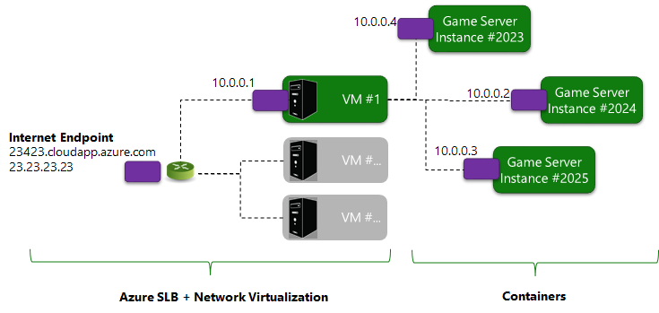

# Connecting Clients to game servers

**Playfab Game Servers** are containerized applications. When **Game Servers** are deployed to **Azure**, their networking environment is virtualized, and the **Game Server** will not have direct access to its **Internet Accessible IP** addresses.

Instead, **Game Servers** using **GetAdaptersInfo** (**Windows**) or **GetIfAddrs** (**Linux**) will observe a single network adapter with non-unique **IP** addresses that have been configured through **Network Address Translation (NAT44)**.

This usage of network virtualization and **NAT** allows **Game Servers** to maintain connections even as underlying **Azure** infrastructure may be changing.

> [!NOTE]
> All **Game Servers** have **IPv4** connectivity - **IPv6** connectivity will be added in the future.

  

You may configure a **Server** deployment to pack multiple **Game Server** instances on a *single* virtual machine. For the most part, this does *not* modify the network environment, as each containerization allows each **Game Server** instance to have independent **IP** addresses and **TCP/UDP** port spaces.

However, *all* instances on a single virtual machine do share the physical network infrastructure, and can create network contention.

While testing high-density configurations, it is important to test that typical contention does not cause unacceptable game play issues.

Different virtual machine sizes and operating systems are provisioned with differing levels of bandwidth. To see the bandwidth provisioned for a specific **SKU**, please see **Azure’s** throughput documentation.

## Connecting game Clients

Typically, **Game Servers** will listen on well-known **UDP** and **TCP** ports selected by the **Game Developer**.

**Clients** then initiate **TCP** or **UDP** flows against **NATed** ports on the **Azure** edge that flows back to the **Game Server** (as shown in the data flow diagram provided below).

  

**Game Servers** are allocated through service-to-service calls through the **Playfab Server API**. Connection information required for **Client** connectivity is passed through these services, and **Clients** typically use **TCP** or **UDP** sockets to drive a direct connection to the **Game Server**.  

## Communicating server addressing information from Playfab to clients

**Game Clients** need the **Internet-facing IP** address of your **Game Servers** to connect to them.

**Clients** also need port forwarding information, to allow well-known ports that the **Server** is listening to, to be addressable through the **Azure** network virtualization apparatus.

When you allocate a **Game Server** the response information provides:

- The **Public IPv4** address.
- A mapping of developer-provided ports (by name) to the **Internet**-facing port.

| Game Server Protocol Name     | Protocol             | Internet-facing Port          |
|:------------------------------|:---------------------|:------------------------------|
| Multiplayer                   | UDP                  | 3098                          |
| Debugger                      | TCP                  | 2322                          |

## Enabling TCP/UDP ports for game servers

The port requirements provided through **Game Manager** or the **Entity API *CreateBuild*** enables **Game Clients** to contact the virtual machine. It also configures the firewall on the resident operating system to enable network traffic on the ports you specify.
