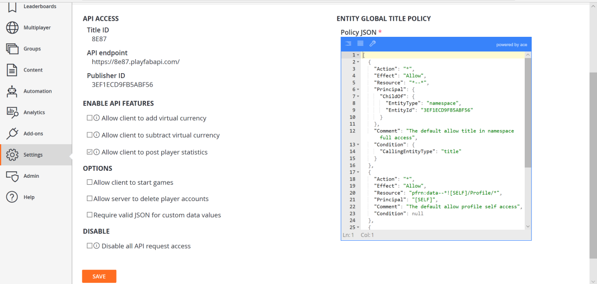

# Tournaments and leaderboards quickstart

This quickstart describes how to have a statistic that keeps track of the players high score, and how to get a leaderboard of the top high scores. This can be utilized for a global leaderboard, or in conjunction with [resettable statistics](using-resettable-statistics-and-leaderboards.md) to reset for a specific event or tournament.

## Prerequisites

Your player is already logged into PlayFab.  

## Step 1 - Create a statistic and associated leaderboard

In the Game Manager:
- Go to **Leaderboards** in the menu to the left.
- Select **NEW LEADERBOARD**.
- Add a **Leaderboard** called **HighScore** in the **Statistic name** field.
- Using the drop-down menu provided, set the **Reset frequency** field to **Manually**.
- Move to the **Aggregation method** field and select **Maximum** (always use the highest value) from the drop-down menu provided.

## Step 2 - Update the statistic with the high score for a player

Before we can use [UpdatePlayerStatistics](xref:titleid.playfabapi.com.client.playerdatamanagement.updateplayerstatistics) from the client, we must enable it in **API Features**.

1. Select **Title settings** off the Settings menu for your title.
2. Select the **API Features** tab.
3. Check the box for **Allow client to post player statistics**.
    NOTE: In general, this option should not be used in a live game, as it gives the client authority over values submitted. This is only valid for cases where there is no concern that players may cheat their statistics. If statistics need to be secure, they should only be updated via a server authoritative operation, such as a Cloud Script or custom game server.
4. Click the **SAVE** button at the bottom of the screen.

  

### C# code example - SubmitScore

In this code example we will have a `SubmitScore` function that would be called at the end of a game.

```csharp

public void SubmitScore(int playerScore) {
    PlayFabClientAPI.UpdatePlayerStatistics(new UpdatePlayerStatisticsRequest {
        Statistics = new List<StatisticUpdate> {
            new StatisticUpdate {
                StatisticName = "HighScore",
                Value = playerScore
            }
        }
    }, result=> OnStatisticsUpdated(result), FailureCallback);
}

private void OnStatisticsUpdated(UpdatePlayerStatisticsResult updateResult) {
    Debug.Log("Successfully submitted high score");
}

private void FailureCallback(PlayFabError error){
    Debug.LogWarning("Something went wrong with your API call. Here's some debug information:");
    Debug.LogError(error.GenerateErrorReport());
}
```

### Step 3 - Request the leaderboard for the high score

In order to get the leaderboard of the top high scores of all players that have played the game, you will make a call to [GetLeaderboard](xref:titleid.playfabapi.com.client.playerdatamanagement.getleaderboard).

### C# code example - RequestLeaderboard

In this code example we will have a `RequestLeaderboard` function that would be called to get the leaderboard, and will pass the results to a function of `DisplayLeaderboard`, which would populate the experience in your game that shows the high scores.

```csharp
//Get the players with the top 10 high scores in the game
public void RequestLeaderboard() {
    PlayFabClientAPI.GetLeaderboard(new GetLeaderboardRequest {
            StatisticName = "HighScore",
            StartPosition = 0,
            MaxResultsCount = 10
    }, result=> DisplayLeaderboard(result), FailureCallback);
}


private void FailureCallback(PlayFabError error){
    Debug.LogWarning("Something went wrong with your API call. Here's some debug information:");
    Debug.LogError(error.GenerateErrorReport());
}
```
