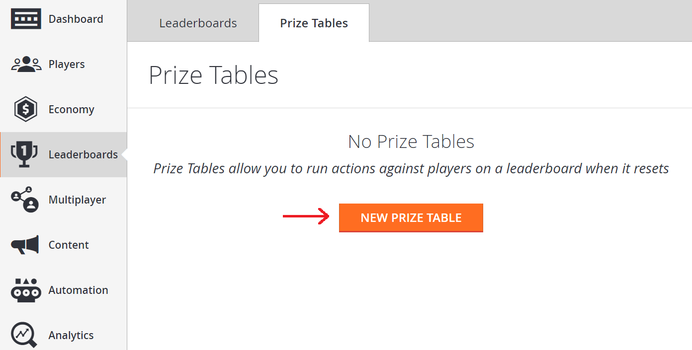
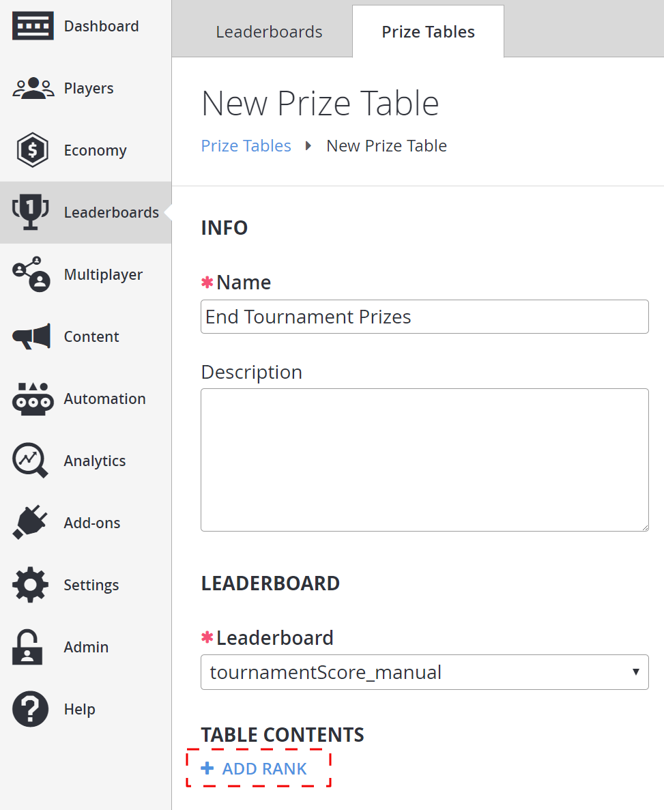
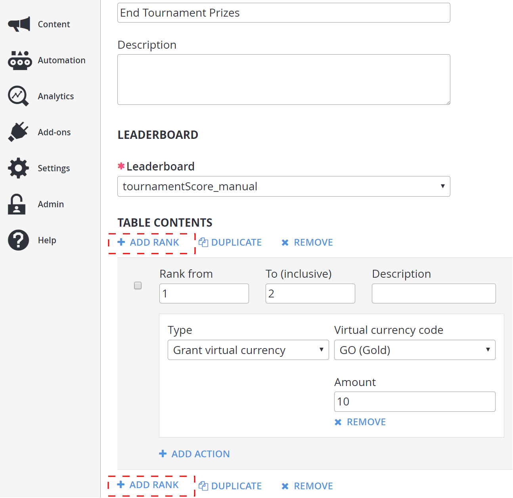
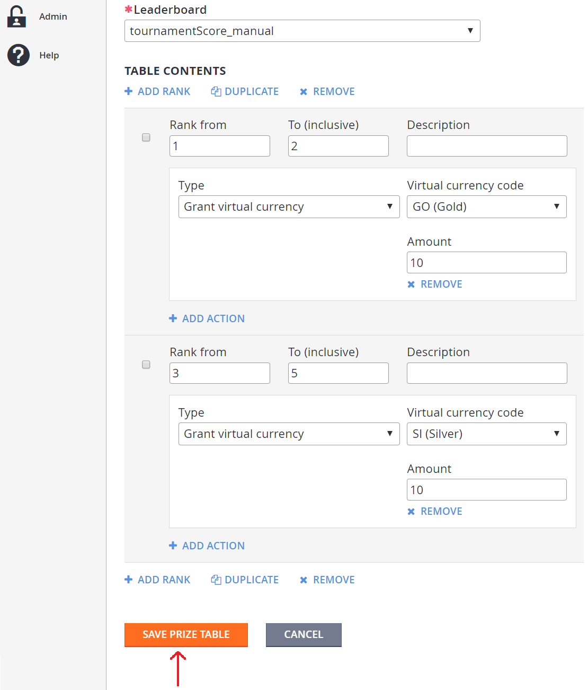
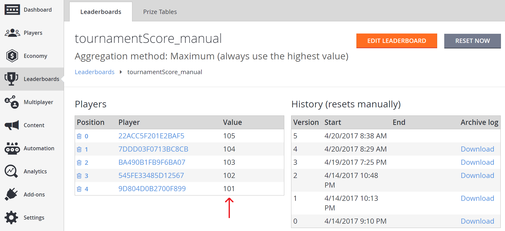
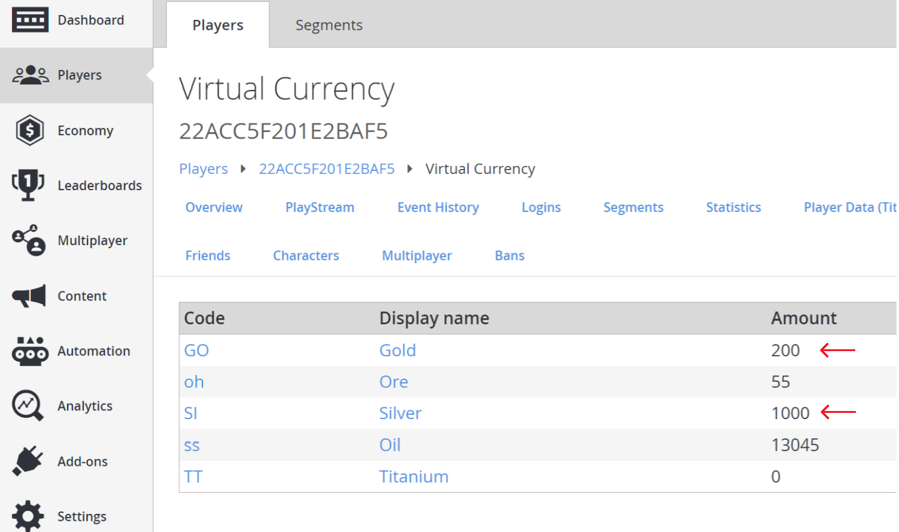
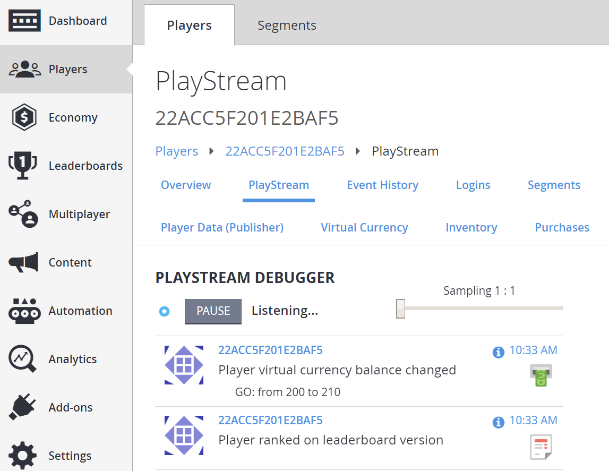
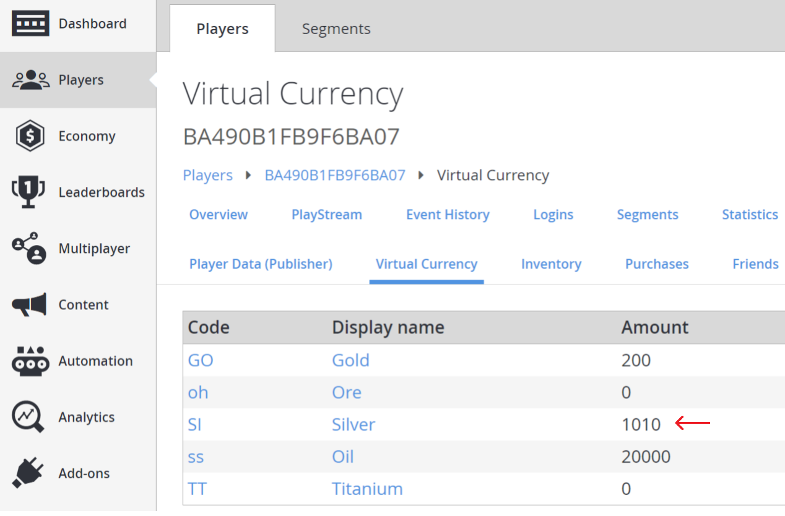

# Using prize tables

This tutorial walks you through how to create a prize table that triggers a set of actions on a group of players within a range of ranks, in a [Resettable Leaderboard](using-resettable-statistics-and-leaderboards.md).

In particular, this is a way to trigger emails, send push notifications, grant [Inventory Items](../../data/playerdata/player-inventory.md) and [Virtual Currency](../../economy/tutorials/currencies.md), or execute a [CloudScript](../../automation/cloudscript/writing-custom-cloudscript.md) function at the reset of a leaderboard.

In this example, we show you how to create prize table end tournament prizes, which grants virtual currency to 5 players based on their rank in a leaderboard after a reset is performed.

## Requirements

> [!IMPORTANT]
> This is an *advanced* tutorial. Please make sure that all requirements shown below have been met, or you will *not* be able to complete this tutorial.

- Basic knowledge of how to create a player will be necessary, as there will need to be players in a leaderboard before it can perform any actions on those players.
- It is also worthwhile to read the [Game Manager quickstart](../../../gamemanager/quickstart.md) if you are unfamiliar with the Game Manager, as it is the place where prize tables are created.
- In order to use Prize Tables, you must have general knowledge of how resettable leaderboards work. Please read about leaderboards in our tutorial [Using Resettable Statistics and Leaderboards](using-resettable-statistics-and-leaderboards.md).
- Additionally, virtual currencies must be set up. Please read our tutorial about [Currencies](../../economy/tutorials/currencies.md) and set up two currencies with the following parameters:
  - **Currency code**: GO
  - **Display name**: Gold
  - **Initial deposit**: 200
  - **Currency code**: SI
  - **Display name**: Silver
  - **Initial deposit**: 1000

## Step 1 - Create a leaderboard

In the Game Manager:

- Go to **Leaderboards** in the menu to the left.
- Select **New Leaderboard**.
- Add a **Leaderboard** called **tournamentScore_manual** in the **Statistic name** field.
- Using the drop-down menu provided, set the **Reset frequency** field to **Manually**.
- Move to the **Aggregation method** field and select **Maximum (always use the highest value)** from the drop-down menu provided.

  

## Step 2 - Create a prize table for the leaderboard

Now that a leaderboard has been created, a prize table can be associated with it. Go to:

- **Leaderboards** in the menu to the left.
- Select the **Prize Tables** tab.
- Select the **NEW PRIZE TABLE** button to be taken to the **New Prize Table** view.

  

In the **New Prize Table** view:

- Move to the **INFO** area, and enter the **Name** for the **New Prize Table**, entitled  **End Tournament Prizes**.
- Choose **tournamentScore_manual** from the **Leaderboard** drop-down menu.

In order for this Prize Table to perform some action, ranks will need to be set. To do this:

- Select **+ ADD RANK** under the **TABLE CONTENTS** section.
- A **Rank** form will appear.

  

In the **Rank** form:

- Verify that the **Rank from** field has a value of **1**.
- Verify that the **To (inclusive)** field has a value of **2**.
- In the **Type** drop-down menu, choose **Grant virtual currency**.
- In the **virtual currency code** drop-down menu, choose **GO (Gold)** with an amount of **10**.

  

Now, we'll add a second rank range:

- Select **+ADD RANK** under the **TABLE CONTENTS** section (there is also a *second* one at the bottom, that also works).
- In the **Rank** form that appears, make sure that the **Rank from** field has a value of **3** and the **To (inclusive)** field has a value of **5**.
- In the **Virtual currency code** drop-down, choose **SI** (**Silver**) with an amount of **10**.

  

## Step 3 - Populate the leaderboard with a player

A leaderboard and prize table associated with it has now been created. The next step is to populate the leaderboard with players.

To create players, we will use [LoginWithCustomID](xref:titleid.playfabapi.com.client.authentication.loginwithcustomid). Then, we will use the players to populate the leaderboard with [UpdatePlayerStatistics](xref:titleid.playfabapi.com.client.playerdatamanagement.updateplayerstatistics).

Before we can use [UpdatePlayerStatistics](xref:titleid.playfabapi.com.client.playerdatamanagement.updateplayerstatistics), we must enable it in API Features.

- Select **Settings** in the menu on your left.
- Select the **API Features** tab.
- Check the box for **Allow client to post player statistics**.
- Then select the **SAVE API FEATURES** button at the bottom of the screen.

  

### C# code example

The following **C#** code example creates 5 players, and logs them in using [LoginWithCustomID](xref:titleid.playfabapi.com.client.authentication.loginwithcustomid).

It then populates the leaderboard you created earlier (`tournamentScore_manual`) with the 5 players with values of: **105**, **104**, **103**, **102**, and **101** using [UpdatePlayerStatistics](xref:titleid.playfabapi.com.client.playerdatamanagement.updateplayerstatistics).

```csharp
// Note: This is a recursive function. Invoke it initially with no parameter
public void CreatePlayerAndPopulateLeaderboard(int playerIndex = 5) {
    if (playerIndex <= 0) return;
    const string leaderboardName = "tournamentScore_manual";
    PlayFabClientAPI.LoginWithCustomID(new LoginWithCustomIDRequest {
        CustomId = playerIndex.ToString(),
        CreateAccount = true
    }, result => OnLoggedIn(result,playerIndex,leaderboardName), FailureCallback);
}

private void OnLoggedIn(LoginResult loginResult, int playerIndex, string leaderboardName) {
    Debug.Log("Player has successfully logged in with " + loginResult.PlayFabId);
    PlayFabClientAPI.UpdatePlayerStatistics(new UpdatePlayerStatisticsRequest {
        Statistics = new List<StatisticUpdate> {
            new StatisticUpdate {
                StatisticName = leaderboardName,
                Value = playerIndex + 100
            }
        }
    }, result=> OnStatisticsUpdated(result,playerIndex), FailureCallback);
}

private void OnStatisticsUpdated(UpdatePlayerStatisticsResult updateResult, int playerIndex) {
    Debug.Log("Successfully updated player statistic");
    // Recursively invoke for next player
    CreatePlayerAndPopulateLeaderboard(playerIndex - 1);
}

private void FailureCallback(PlayFabError error){
    Debug.LogWarning("Something went wrong with your API call. Here's some debug information:");
    Debug.LogError(error.GenerateErrorReport());
}
```

### Check results of the C# code example

To check that there are 5 players populated in the leaderboard with the correct values:

- Select **Leaderboards** from the menu on the left.
- On the **Leaderboards** tab, go back to the **Leaderboard** list view.
- Select **tournamentScore_manual**, and there should be 5 **Players** with the values of **105**, **104**, **103**, **102**, and **101**.

  

## Step 4 - Check player's initial currencies

Before checking anything:

- Return to **Players** in the menu to the left from step 2.
- Go to the **Players** tab, and find a player that was put into the **tournamentScore_manual** **Leaderboard** in step 3.
- Select the **Player ID**, and the **Virtual Currency** tab for that player.
- Record the values of the **GO** (**Gold**) and **SI** (**Silver**) **Currencies** for that player.

Before checking anything, go back to the test **Players** from step 2.

- Go to **Players** and find one that was put into **tournamentScore_manual Leaderboard** in step 3.
- Select the **Player ID** and the **Virtual Currency** tab for that player.
- Record the values of the **GO** (**Gold**) and **SI** (**Silver**) currencies for that player.
- Now do this for the remaining 4 of the 5 players that were put in the **tournamentScore_manual Leaderboard** in step 3.
- Make sure that you record the values of their **GO** (**Gold**) and **SI** (**Silver**) currencies (these will be important for confirmation that the Prize Table worked after resetting).

  

## Step 5 - Reset the leaderboard to grant rewards

Now go to **Leaderboards**.

- Go back to the **Leaderboards** list view.
- Select **tournamentScore_manual**.
- Make a note of the positions of the **Players** on the **Leaderboard** (these are *zero indexed*, so position **0** will be *first place*).

- Select the **RESET NOW** button.
- Select **RESET** button to confirm the reset of the **Leaderboard**
- This will clear the **Players** list.


- Select the **RESET NOW** button at the top of the screen.
- When prompted to **Reset this Leaderboard now?**, select the **RESET** button to confirm the reset.
- This will clear the **Players** list.


## Step 6 - Test that the prize table works

To see if the Prize Table worked, the players in the leaderboard can be checked to see if they were granted the correct amounts of currency. This can be quickly seen in a player's PlayStream Debugger.

To see this in the PlayStream Debugger:

- Select **Players** from the menu on your left.
- The **PlayStream** tab will show a **Player** ranking on a **Leaderboard** event, followed by a **Virtual Currency** update.



Now, let's manually check if the players received the correct currencies:

- Select **Players** from the menu on your left.
- On the **Players** tab, move to the **Virtual Currency** area of the screen.
- Verify that the currency was granted correctly.
- This should be *one more* than the amount recorded earlier.
- Notice that **Players** in leaderboard positions **0** or **1** gained **10 gold** with *no silver being awarded*.
- Meanwhile, **Players** in positions **2**, **3**, and **4** were granted **10 silver** and *no gold*.
- This matches the actions set up for the prize table.




Another way of checking that the **Virtual Currency** was granted correctly is:

- Go into **Players**.
- Look at the **Event History**.
- This will show a **player_virtual_currency_balance_changed** event with specific details on amounts that changed for the **Virtual Currency** granted.


