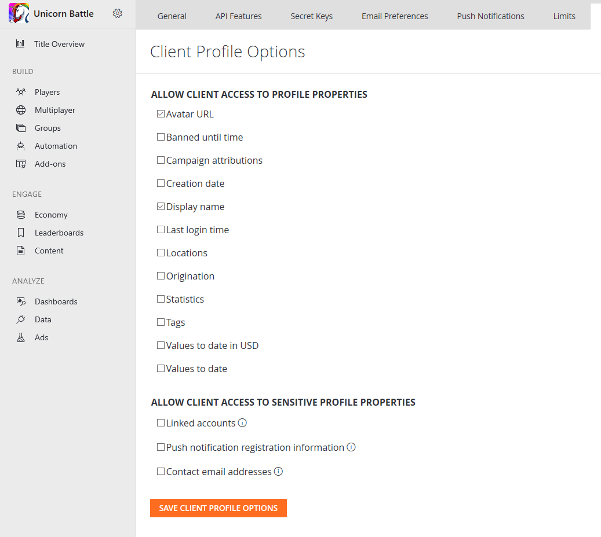

# Using the profile for advanced leaderboards

With PlayFab, you usually construct leaderboards using the following API methods:

- [**GetFriendLeaderboard**](xref:titleid.playfabapi.com.client.playerdatamanagement.getfriendleaderboard)
- [**GetFriendLeaderboardAroundPlayer**](xref:titleid.playfabapi.com.client.playerdatamanagement.getfriendleaderboardaroundplayer)
- [**GetLeaderboard**](xref:titleid.playfabapi.com.client.playerdatamanagement.getleaderboard)
- [**GetLeaderboardAroundPlayer**](xref:titleid.playfabapi.com.client.playerdatamanagement.getleaderboardaroundplayer)

The result is a list of [**PlayerLeaderboardEntry**](xref:titleid.playfabapi.com.client.playerdatamanagement.getleaderboard#playerleaderboardentry) objects that contain only basic information about the player, and their relation to the current leaderboard.

However, PlayFab also allows you to use [**PlayerProfileViewConstraints**](xref:titleid.playfabapi.com.server.accountmanagement.getplayerprofile#playerprofileviewconstraints), to gain additional information about each player.

> [!NOTE]
> This example assumes you already have some leaderboard data to play with. Please refer to our [Accessing Archived Tournament Results](accessing-archived-tournament-results.md) tutorial, for a method to generate some test data.

## Configuring player profile view constraints

By default, the Client API may only fetch the display name from another player profile. In this example, we will allow *all* players to access additional information about *other* players in the leaderboard.

Navigate to your title Game Manager:

1. Select the **Settings** icon in the menu to the left.
2. Select **Title settings**
3. Then select the **Client Profile Options** tab.
4. Verify that the **DisplayName** is selected.
5. Make sure that the **Avatar URL** is selected.
6. Submit your changes by selecting the **Save Client Profile Options** button.

  

## Testing

The previous step allows client code to use `DisplayName` and `AvatarUrl` profile constraints.

The following sample shows how to fetch and print a leaderboard using any mentioned Profile data. Please refer to the code comments for further information.

```csharp
private static async Task DoReadLeaderboard()
{
    // Get Leaderboard Request
    var result = await PlayFabClientAPI.GetLeaderboardAsync(new GetLeaderboardRequest()
    {
        // Specify your statistic name here
        StatisticName = "TestScore",
        // Override Player Profile View Constraints and fetch player DisplayName and AvatarUrl
        ProfileConstraints = new PlayerProfileViewConstraints()
        {
            ShowDisplayName = true,
            ShowAvatarUrl = true
        }
    });

    // Start printing the leaderboard
    Console.WriteLine("=== LEADERBOARD ===");

    if (result.Error != null)
    {
        // Handle error if any
        Console.WriteLine(result.Error.GenerateErrorReport());
    }
    else
    {
        // Traverse the leaderboard list
        foreach (var entry in result.Result.Leaderboard)
        {
            // Print regular leaderboard entry information
            Console.WriteLine($"{entry.Position + 1} {entry.PlayFabId} {entry.StatValue}");

            // Additionally print display name and avatar url that comes from player profile
            Console.WriteLine($"    {entry.Profile.DisplayName} | {entry.Profile.AvatarUrl}");
        }
    }
}
```

> [!NOTE]
> The individual Profile fields are *only* available if the client explicitly asks for them using Profile Constraints. Also be aware that if certain profile constraint are *not* allowed in the Game Manager - and your client requests them - the API call will fail with a corresponding error. The result will look similar to the example provided below.

  

Using this technique, you can fetch a handful of Profile information, including other statistic values.
