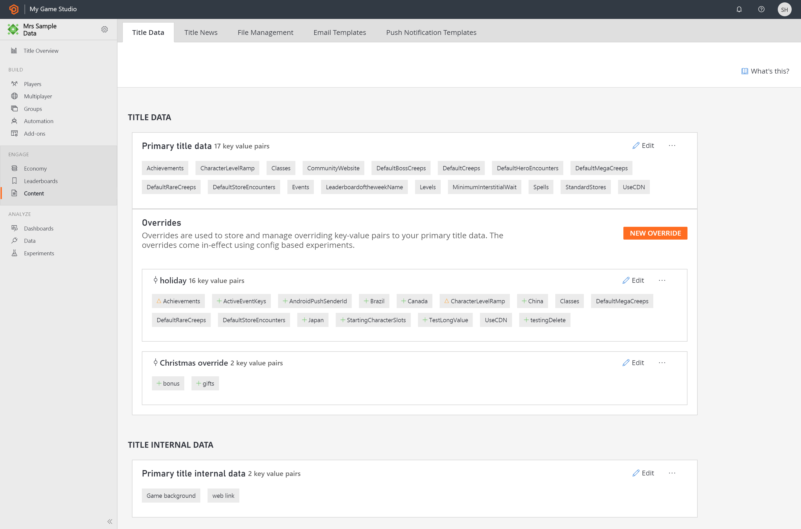

# Title Data

Title Data is a set of key/value pairs that you can use to manage configuration for your game remotely. You can set this data in Game Manager, or via [APIs](/rest/api/playfab/admin/title-wide-data-management?view=playfab-rest&preserve-view=true). This is commonly referred to as Primary Title Data. 

*Internal* Title Data is a special set of Title Data that cannot be accessed by clients directly, and can be used for storing configuration that is _only_ available to services you control.

> [!NOTE]
> Title Data values are copied and distributed to potentially _hundreds_ of machines in the PlayFab server cluster. As part of this process, Title Data is cached, and changes may take up to fifteen minutes to refresh in those caches. Title Data is best suited for _Global Constant/Static Data_ and is not suitable or reliable as Global Variables.

## Title Data Overrides
Title Data Overrides are sets of key/value pairs which are stored and managed to override the Primary Title Data. This override set of key/value pairs persist as an additive operation. Using Override, one can:
-	**Add** a new key-value pair, by naming a key-value pair that isn’t included in the default data.
-	**Change** an existing key-value pair by naming a key-value pair that’s already in the default data. This new data will replace the existing key-value data.
-	**Remove** an existing key-value pair by including an existing key but with an empty value.

When viewing the Override, each of these key-value pairs is represented as a +, , or -. 

Override Title Data could be called a subset of Primary Title Data, allowing to update the remote configuration of the game without the need to deploy a new build.

> [!NOTE]
> This override set of key/value pairs comes in-effect only using [Experiments](../../data-analytics/learn-data/experiments/index.md) for now. 
If the player belongs to an experiment variant which contain title data overrides, the overrides are applied automatically on server side and returned with the title data on client side.
> Title Data Override values may take up to one minute to refresh and persist. 

## Links

- [Title Data quickstart](quickstart.md)
- [Title Data Tutorials](tutorials.md)