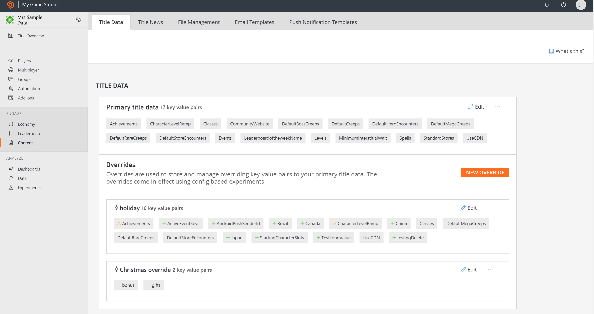

# Title Data quickstart

Title data is the set of plain text key-value pairs, used for storing and managing the game’s configuration data remotely on the server. It keeps the title wide configuration variables accessible and organized which can be retrieved on the client-side.

This QuickStart describes how to programmatically create and use title data.

This an important topic because storing a game's configuration data remotely on the server - where it can be changed at any time - is one of the most basic reasons to use a service like PlayFab.

## Getting title data

### From the game client

Use [GetTitleData](xref:titleid.playfabapi.com.client.title-widedatamanagement.gettitledata) from the `PlayFabClientAPI` to get the KVPs for a specific title. The following code example displays the values of all of the title data.

```csharp
public void ClientGetTitleData() {
    PlayFabClientAPI.GetTitleData(new GetTitleDataRequest(),
        result => {
            if(result.Data == null || !result.Data.ContainsKey("MonsterName")) Debug.Log("No MonsterName");
            else Debug.Log("MonsterName: "+result.Data["MonsterName"]);
        },
        error => {
            Debug.Log("Got error getting titleData:");
            Debug.Log(error.GenerateErrorReport());
        }
    );
}
```

### From the game server

Use [GetTitleData](xref:titleid.playfabapi.com.server.title-widedatamanagement.gettitledata) from the `PlayFabServerAPI` to get the KVPs for a specific Title. The following code example displays the values of all of the Title Data.

```csharp
public void ServerGetTitleData() {
    PlayFabServerAPI.GetTitleData( new GetTitleDataRequest(),
        result => {
            if (result.Data == null || !result.Data.ContainsKey("MonsterName")) Debug.Log("No MonsterName");
            else Debug.Log("MonsterName: " + result.Data["MonsterName"]);
        },
        error => {
            Debug.Log("Got error getting titleData:");
            Debug.Log(error.GenerateErrorReport());
        });
}
```

## Setting title data

It is unlikely that title data will change very frequently. For most situations, you should use your title data for static data that is mostly unchanged for the life of the title.

You can set title data by using the Game Manager, or by a server API function. 

### Setting title data using Game Manager

To add Primary Title Data using Game Manager to a title, perform the following steps.
1.	Open the title in **Game Manager**.
2.	Select **Content**, then **Title Data**.
3.	Select **New Title Data**
4.	In the new title data page, enter a value for the **Key** and a value for the **Value**. Both the **Key** and the **Value** are stored as strings.
5.	Use the **Save** button to save the new data item.


### Setting title data by calling the server API in C#

The [SetTitleData](xref:titleid.playfabapi.com.server.title-widedatamanagement.settitledata) API is a server API that you must call from a dedicated server. You can only set one title data KVP in each call to `SetTitleData`.

```csharp
public void SetTitleData() {
    PlayFabServerAPI.SetTitleData(
        new SetTitleDataRequest {
            Key = "MonsterName",
            Value = "Dorf"
        },
        result => Debug.Log("Set titleData successful"),
        error => {
            Debug.Log("Got error setting titleData:");
            Debug.Log(error.GenerateErrorReport());
        }
    );
}
```
### Setting title data overrides using Game Manager

An override is also a set of JSON key-value pairs and ideally should be purposed to possess the delta change required in the key-values pairs of the Primary Title Data. The delta change could comprise of the key-value pairs when compared to Primary Title data as new key-value, change in an existing key’s value or deletion of a key (with NULL as an input of the value). 

To add overrides to the primary title data, perform the following steps.
1.	Open the title in **Game Manager**.
2.	Select **Content**, then **Title Data**.
3.	Select **New Override**.
4.	Enter the Override Label, plus, enter a value for the **Key** and a value for the **Value**. Both the Key and the Value are stored as strings.
5.	Use the **Save** button to save the new Title Data Override.

> [!NOTE]
> This override set of key/value pairs comes in-effect only using [Experiments](../../data-analytics/learn-data/experiments/index.md) for now. 
If the player belongs to an experiment variant which contain title data overrides, the overrides are applied automatically on server side and returned with the title data on client side.
> Title Data Override values may take up to one minute to refresh and persist. 




## Internal title data

Similarly to User Data, title data has internal storage that is hidden from the client. This data can also be set in the Game Manager, or via a server API.

### Getting internal title data by calling the server API in C#

```csharp
public void GetTitleInternalData()
{
    PlayFabServerAPI.GetTitleInternalData( new GetTitleDataRequest(),
        result => {
            if (result.Data == null || !result.Data.ContainsKey("PlayFab")) Debug.Log("No PlayFab");
            else Debug.Log("PlayFab: " + result.Data["PlayFab"]);
        },
        error => {
            Debug.Log("Got error getting titleData:");
            Debug.Log(error.GenerateErrorReport());
        }
    );
}
```

### Setting internal title data by calling the server API in C#

```csharp
public void SetTitleInternalData() {
    PlayFabServerAPI.SetTitleInternalData(
        new SetTitleDataRequest {
            Key = "PlayFab",
            Value = "{ \"Status\": \"Secretly Awesome\" }"
        },
        result => { Debug.Log("Set titleData successful"); },
        error =>
        {
            Debug.Log("Got error setting titleData:");
            Debug.Log(error.GenerateErrorReport());
        });
}
```

## See also

- [Using Publisher Data](../../features/titledata/using-publisher-data.md)
- [Player Data Quickstart](../../features/playerdata/quickstart.md)
- [CloudScript Quickstart](../automation/cloudscript/quickstart.md)
