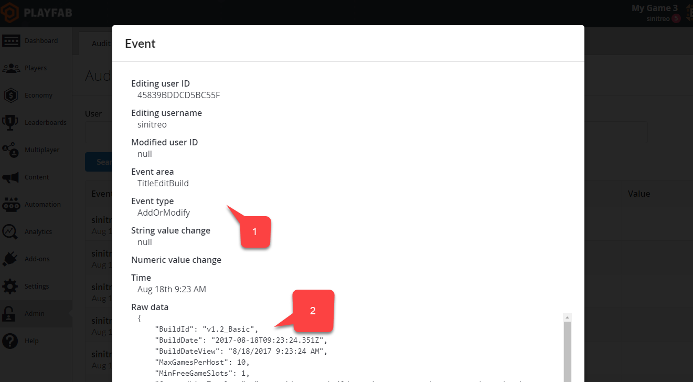

# Audit logs

Audit logs allow you to observe and analyze the history of important changes made to your title by you or other developers. You are able to detect both important changes and destructive actions, and react accordingly.

## Accessing audit logs

On the **Audit History** page, select any entry in the log to view the complete details. You can also navigate through the **Logs** using the **SEARCH** button.

- The **Event time** column exposes information about the time and the author of the change.

- The **Log type** column gives you a clue about the kind of change that was made.

- The **String change** and **Value** columns represent short details of the change.

- The **View** column allows you to access a full **JSON** description of the change.

  

The **View** column displays a button to access the JSON body of the change. JSON is displayed in a modal window.

It contains:

1. The same data as the table.
2. Plus a raw JSON body specific for each change type.

