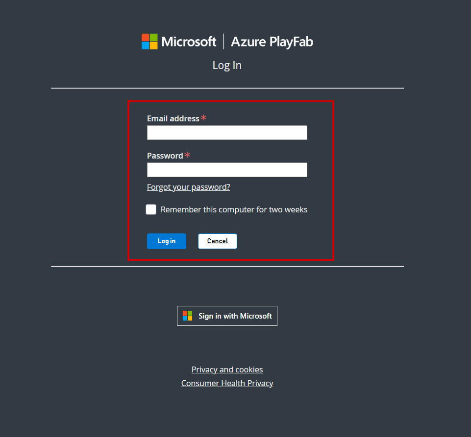
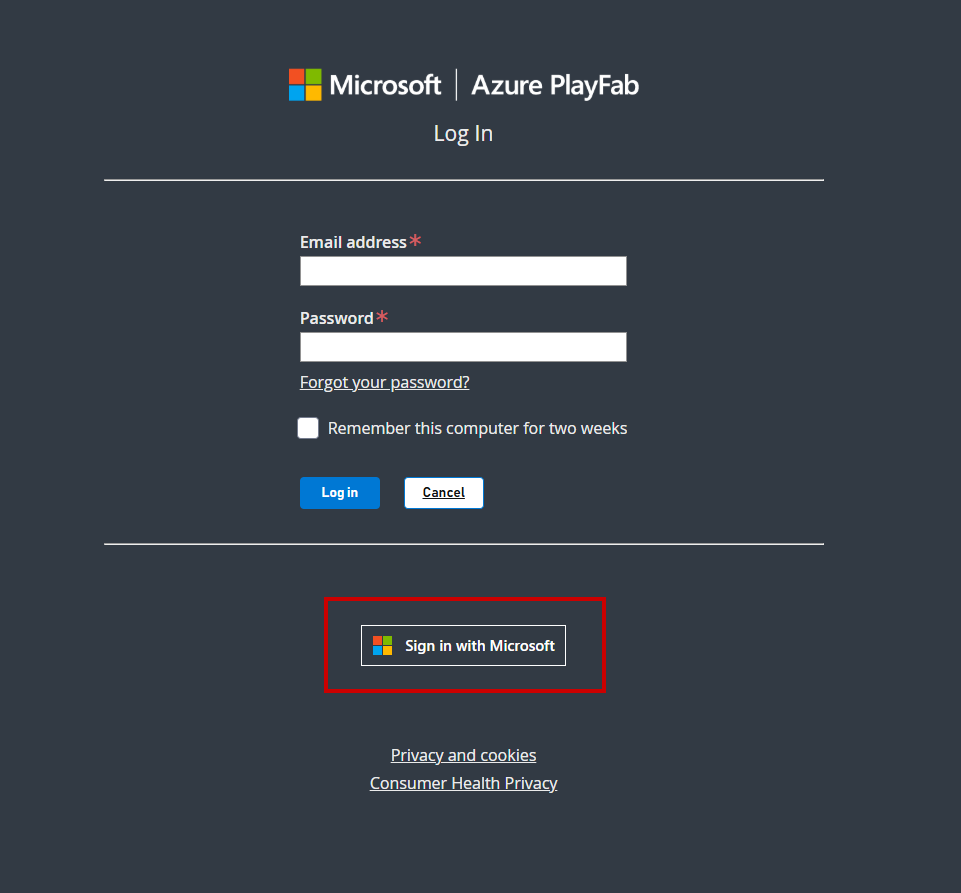
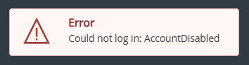

# Signing into Game Manager

> [!IMPORTANT]
> Starting of April 30, 2025, Game Manager is retiring support for [legacy PlayFab authentication](https://developer.microsoft.com/en-us/games/articles/2024/05/changes-to-developer-authentication-for-playfab/) for developer accounts, requiring users to migrate their accounts to a Microsoft account. Users can learn more about the self-service migration tool on our [blog.](https://developer.microsoft.com/en-us/games/articles/2025/02/playfab-developer-account-self-service-migration-tool-now-available/)

Game Manager allows users to use their Microsoft or legacy PlayFab authentication accounts to access their studios and titles. If you're having issues logging into your account, it might be due to which account type you're trying to sign into. 

> [!NOTE]
> It's possible to have both a PlayFab authenticated account and a Microsoft account using the same email. If you don't see the appropriate studios and titles in one account, try the other sign in method to see if an account exists. 

## Legacy PlayFab Authenticated Account
If using an email and password, you might have a legacy PlayFab authenticated account. Use the main dialogue box to sign in by using your email and password. 

For users who recently migrated from their legacy PlayFab account to a Microsoft account, use the "Sign in with Microsoft" button to sign into Game Manager.

## Microsoft Account
For Microsoft account users, select the "Sign in with Microsoft" button and complete the sign in process. 

Once logged in, you are redirected to the My Studios and Titles page. 

## Still can't sign in? 
If you still can't sign in, [contact us](https://playfab.com/contact/). 

## FAQ

### What is a PlayFab authenticated account and why migrate to a Microsoft account? 
- A PlayFab authenticated account is the legacy account system that utilized email and password. To improve security of PlayFab's services, new PlayFab developer accounts creation was disabled on July 29, 2024. By migrating to a Microsoft account, game developers will be able to utilize one identity throughout all of Microsoft Gaming's developer portals. 

### I don't see my studios and titles after migrating? 
- If you don't see your studios and titles after running the self-service migration tool, your account may be under a different Microsoft account. Sign out of your current Microsoft account and try signing into a different Microsoft account. 
- If you still don't see your studio and titles, [contact us](https://playfab.com/contact/). 

### After I attempted account migration, my PlayFab account is disabled and I can't log into my Microsoft account.
- If you encounter an issue where you receive the error message saying AccountDisabled and you can't log into your Microsoft account, [contact us](https://playfab.com/contact/) with both your PlayFab and Microsoft account information.  

    