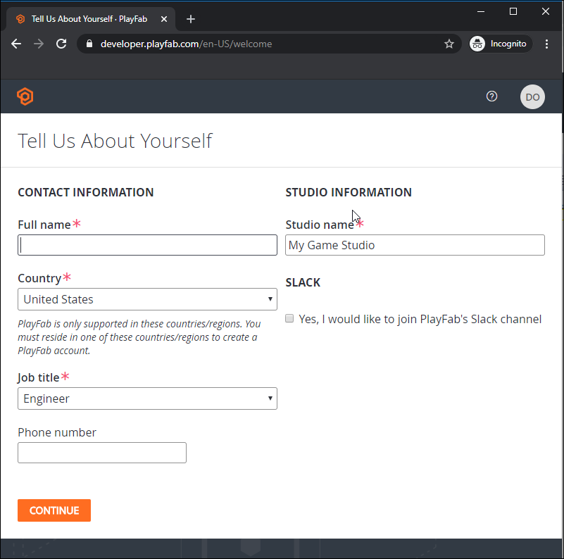
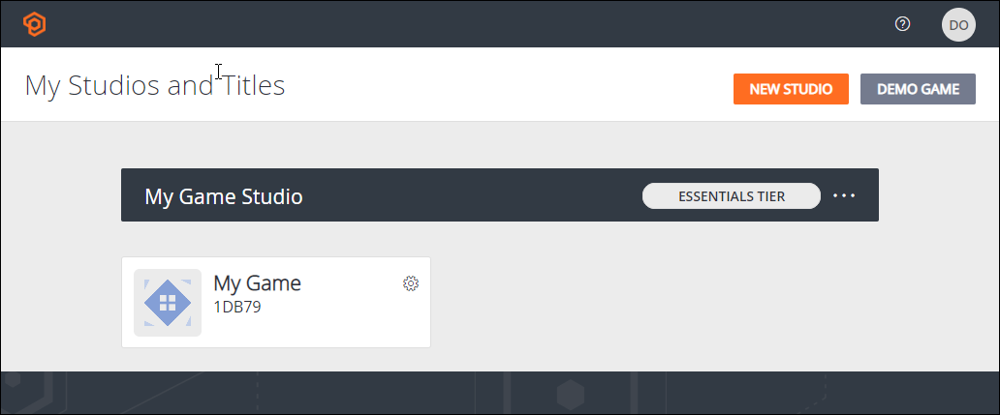

# Quickstart: Game Manager

> [!IMPORTANT]
> As of 8/31/2022, Game Manager is retiring support for browsers using TLS 1.0 or 1.1 and will require any connection to be TLS 1.2 or higher.  If you’re suddenly unable to access Game Manager, check that you’re using a browser that supports TLS 1.2. Make sure your browser is up to date and has 1.2 protocols enabled. This should allow you to regain access, but if you continue to experience issues, let us know through the [Bugs](https://community.playfab.com/spaces/23/index.html) section of our forums.

Get started with PlayFab by using Game Manager to create your PlayFab account, create your Studio, and create your first Title.

## Create a PlayFab account

On the [PlayFab sign up](https://developer.playfab.com/en-us/sign-up) screen, you can create a PlayFab specific account or use your Microsoft account to sign in.

When you've signed in, PlayFab prompts you enter your contact information and studio information. If you haven't finalized the game studio name, you can change it later.

## Create your first game

To create a game, you must, at a minimum, enter a name for the game. You can also specify additional details about your Title, such as the Title genre, monetization mode, target marketplaces, and player mode. The Benchmark comparisons feature uses these properties to display a finer grained view of benchmark data. You can set these options at a later time.

## Your studios and Titles

When you've successfully created your account, studio, and first game, Game Manager opens in the dashboard for your Title.

The next time you sign in, Game Manager opens the **My Studios and Titles** page. From there, you can select a Title to open its dashboard. For a detailed introduction to the features of Game Manager, see [Game Manager reference](reference.md).

Many API calls require a TitleId, which is the string ID found beneath the title of your game. In the following dashboard, the title is "My Game" and TitleId is "F71AC."

## Next steps

- [PlayFab User Roles](playfab-user-roles.md)
