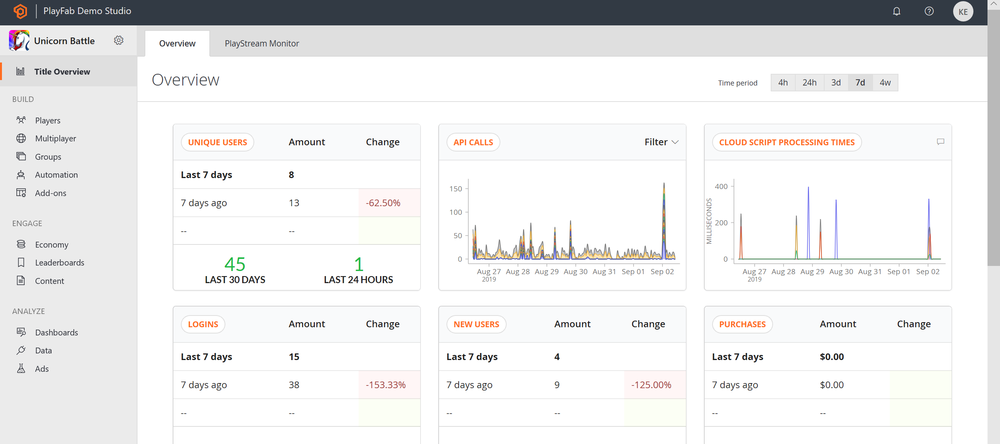
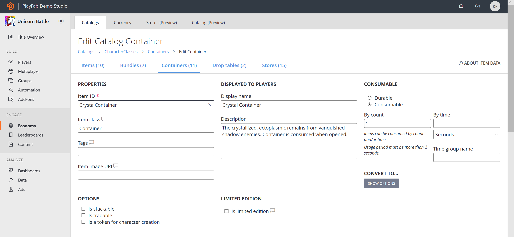
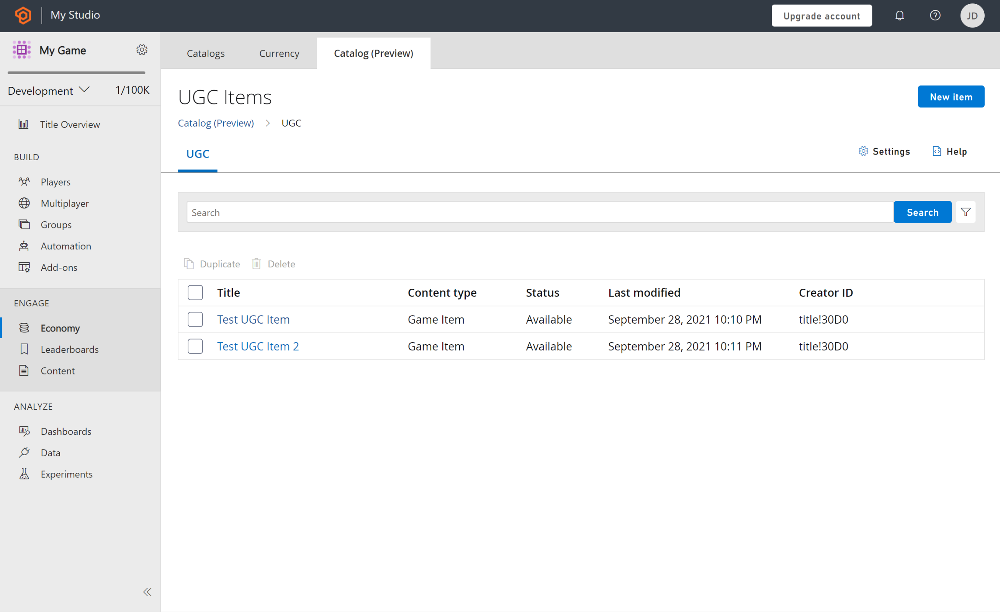
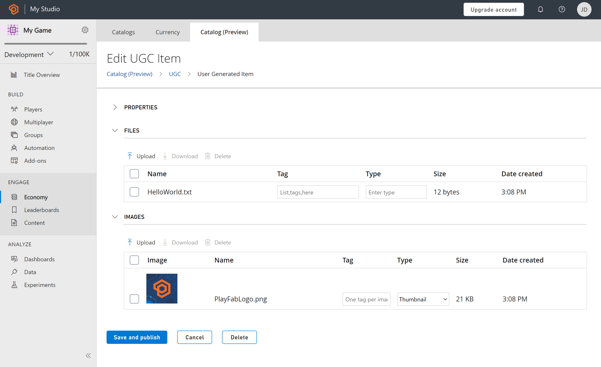
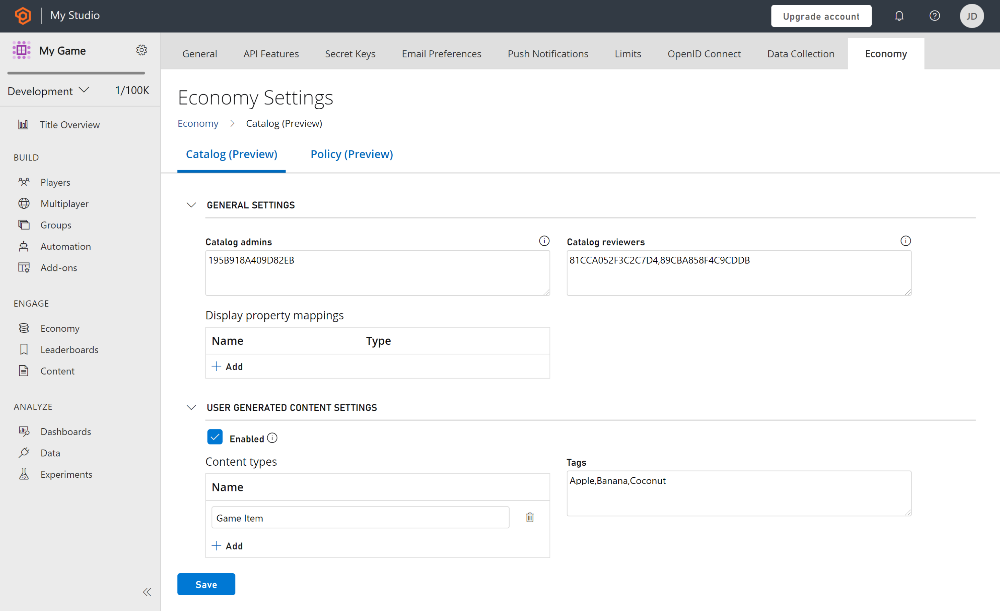
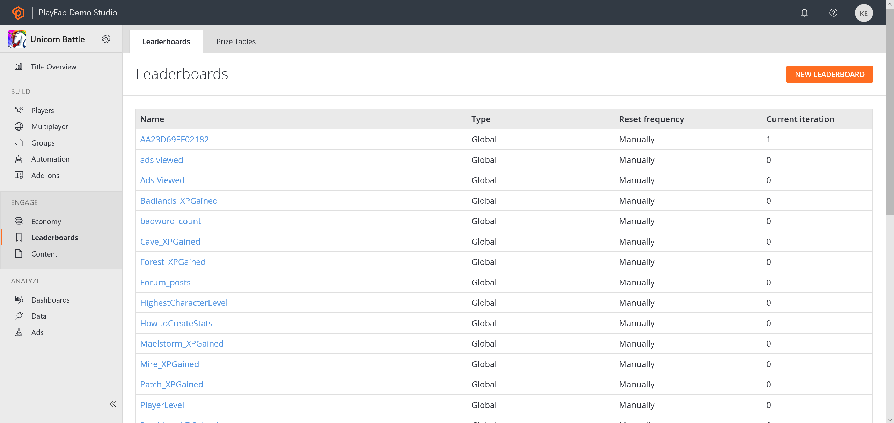
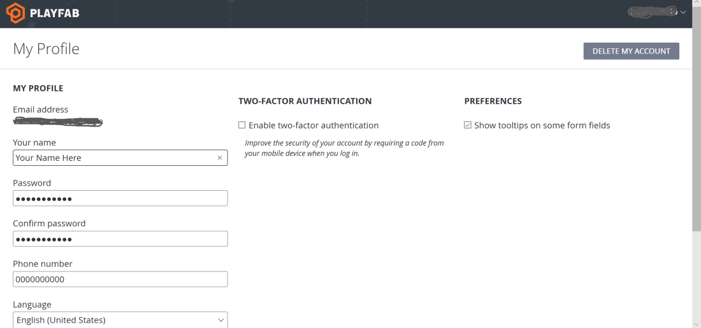
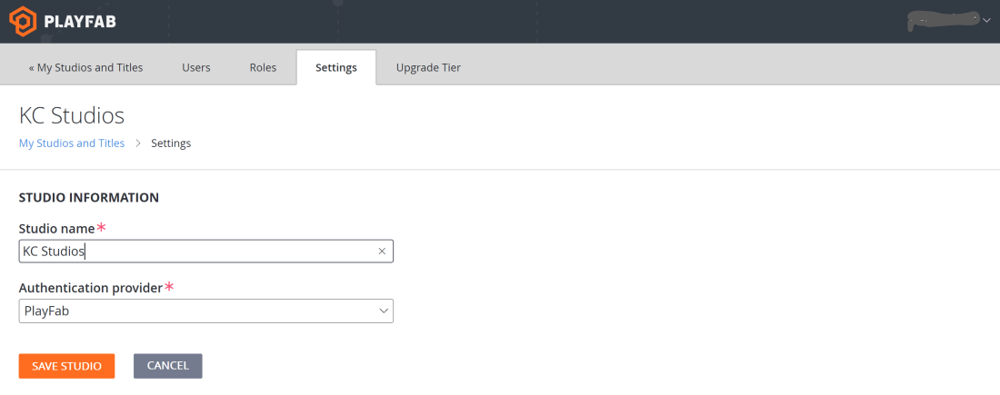
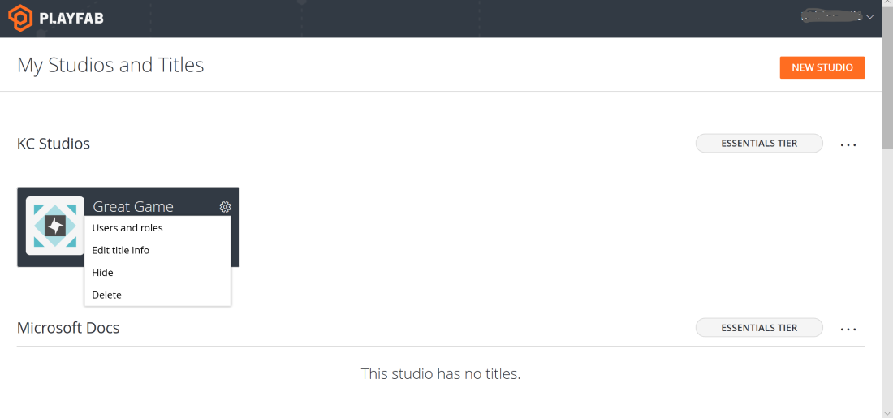
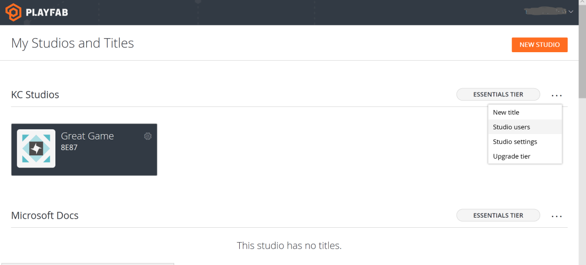

# Game Manager reference

This reference familiarizes you with the high-level aspects of the Game Manager. For more detailed information, you may select your specific topic of interest in the PlayFab documentation that follows.

To get the most value from this topic, you should have created your PlayFab account, logged in, and viewed the Game Manager for your title, even if it's an empty title for now.

The sections provided below offer greater insight on each Game Manager area. Each time you perform an API call or task, view the results in the Game Manager in the appropriate area for that task.

## About Game Manager

Select a title from **My Studios and Titles** to follow along.

Game Manager is split into four major sections:

- Title Overview – Review recent and overarching performance of your Title.
- Build – Foundational elements and tools to configure your game.
- Engage – Facilitate connections with players.
- Analyze – Monitor and act on player behaviors.

## Title Overview

An overview of the recent and less-recent performance of your title.

**Overview** - shows your game's basic statistics and what you may have assigned as Key Performance Indicators (KPIs). In the upper-right, you will find time period toggle buttons, and there are also filters for the tables.

- **4h**: This will load data generated within the last 4 hours.
- **24h**: This will load data generated within the last 24 hours.
- **3d**: This will load data generated within the last 3 days.
- **7d**: This will load data generated within the last 7 days.
- **mtd**: This will load data generated within the current month.

> [!NOTE]
> In Game Manager, all times are displayed in local time.

The tables in the Overview tab allow you to monitor PlayStream events in real time. They include the following:

- **Unique Users**: The average number of unique players logging in per day.
- **API Calls**: Indicates how many API calls were executed within the given time period.
- **CloudScript Processing Times**: Provides the average processing time for your CloudScript functions to execute.
- **LOGINS**: The number of logins recorded for the selected time span.
- **NEW USERS**: New users added in the time period.
- **PURCHASES**: The USD value of real money transactions processed for the selected time span.
- **REPORTS**: The Reports table consolidates several critical categories into a useful format. Specific reports are also available under the **Reports** tab in Analytics.

[Back to About the Game Manager](#about-game-manager)

**PlayStream Monitor** - PlayStream is our latest and greatest addition to the PlayFab platform. It displays title events as they are generated in real time, and you can visualize them at whatever granularity you prefer on the world map. Use the sampling controls to gather more or less events per second.

[Back to About the Game Manager](#about-game-manager)

## Build

Provides the foundational elements and tools to configure your game.

### Players

Players contains settings and data pertaining to your individual players, including player segmentation.

In this section of the Game Manager, a sorted list is presented, and organized by most recent login. Select any of the records to display the Player's Overview. Use the **Search** box to search for players by **ID**, **Username**, **Display Name**, or **Email**.

**Overview** - this detailed screen provides a wealth of insight into the players' activities. The sub-menu contains many links to other player-centric information, as shown below.

Some specific tools your team can use to remedy defrauded players and identify potential abusers are included below.

- **Overview**- View basic details and linked account status.
- **CloudScript** - View and run CloudScript functions.
- **Multiplayer**- View player match history from multiplayer sessions.
- **PlayStream**- View player generated events.
- **Purchases**- View a player's real money purchase history.
- **Statistics**- View and edit player statistics.
- **Logins**- View player login history.
- **Bans**- View player ban history.
- **Characters**- View player-owned characters and edit basic details.
- **Player Data**- View and edit player data records.
- **Segments**- View which segments a player has entered.

### Multiplayer

Multiplayer allows you to configure server hosting and matchmaking.  

**Servers** - Whether you are looking to hosting multi-player matches or just need a secure environment that can reduce many common forms of hacking and abuse, the PlayFab Thunderhead servers work with many architectures and game types. These servers provide an excellent alternative when compared with the overhead of dedicated game servers.

**Matchmaking** - Set up your matchmaking queues by configuring match sizes, servers and statistics.

**Party** - Create and configure the Parties for your title.

> [!NOTE]
> You must be an Indie, Pro, or Enterprise subscriber in order to enable Parties.

**Legacy Multiplayer** - Here you can see your active and archived games, as well as server activity, game builds, and game modes.

Additional information:

- [CloudScript Quickstart](../features/automation/cloudscript/quickstart.md)

[Back to About the Game Manager](#about-game-manager)

### Groups

The Groups section allows you to create and manage groups of players designated by entity type and ID.

### Automation

In the **Automation** area, you can run CloudScript, run A/B tests, assign Rules, and schedule tasks for your game title using server-side logic for your game, including scripting, rules, and tasks. Configure and trigger actions based on events generated by your title.  

### Add-ons

The control center for managing partner integrations.

To configure marketplace integrations for your title: Explore the **Add-ons** section of the **Game Manager** for details on the various add-ons.

  

Setup instructions for each add-on may vary. Additional billing information may also be required.

[Back to About the Game Manager](#about-game-manager)

## Engage

Engage allows you to facilitate connections with players.

### Economy

This section provides all the tools needed to manage the virtual economy of your game.

**Catalogs** - At the center of PlayFab economies is the concept of catalogs. Catalogs are a collection of items, stores, and drop tables.

As an example, the following image shows the primary catalogs for **Unicorn Battle**.

**Items** - An item within the catalog. Items can be of several different types.

**Drop Tables** - Control the item distribution when players open containers and bundles.

**Stores**- A subset of catalog items that can be set to prices that are different than those specified by the catalog.

> [!NOTE]
> Select any catalog item to open a detailed editor for the properties of the item.

**Currency** - Trackers for each currency that can be exchanged for catalog items.

The following example shows the **Edit Currency** page for **Great Game**.

Additional Information:

- [Catalogs](../features/economy/items/catalogs.md)
- [Currencies Tutorial](../features/economy/tutorials/currencies.md)

[Back to About the Game Manager](#about-game-manager)

### User Generated Content

The User Generated Content tab displays all published content for your title. When enabled, all users can create, discover, and consume content.

**UGC Items** - An item within the public catalog. UGC Items can be created by a player, by a title, or on behalf of a player (by a title). UGC Items can contain Files and Images that can be downloaded by another player.

**Settings** - You can configure supported metadata values here (like Content Types and Tags), and specify specific player IDs to receive elevated permissions (to assist with moderation scenarios).

**Policies** - Policies allow you to control the client access to the Economy APIs.

Additional Information:

- [UGC Overview](../features/economy-v2/ugc/index.md)
- [UGC Quickstart](../features/economy-v2/ugc/quickstart.md)

[Back to About the Game Manager](#about-game-manager)

### Leaderboards  

The Leaderboards tab displays all the active leaderboards for your title. PlayFab leaderboards are driven by the statistics you choose to use for your players. You can also configure the reset frequency and aggregation method.

Within a leaderboard, select a **Player Name** to see the player overview.

Select the orange **EDIT LEADERBOARD** button to edit your leaderboard name as well as the reset frequency.

**Prize Tables** - Allows you to create and manage prize tables associated with specific leaderboards. Various items can be configured to be sent to players in the leaderboards, depending on how it is set up.

**Additional information**:

- [Using resettable statistics and leaderboards](../features/social/tournaments-leaderboards/using-resettable-statistics-and-leaderboards.md)
- [Back to About the Game Manager](#about-game-manager)

### Content

The Content section offers tools for engaging with your players.  The content can include news, remote configuration, and files.  

**Title Data** - Here you can configure and store key properties which you can change after your game launches. Title data is accessible from all API sets by all users. Because of this, title data is an ideal place to store your custom title settings. Internal data is hidden from game clients and only available on your game servers.

### Add or edit title data keys

1. Enter text for your **Key** (keys must be unique.
2. Enter text for your **Value** (accepts strings up to 10KB).
3. Save your changes with the orange **SAVE TITLE DATA** button under the data table.

    

#### Remove title data keys

1. Check the box that corresponds to the row(s) that you wish to remove.
2. Select the **X Remove** link in the top-left, above the **User** table.
3. Save your changes with the orange **SAVE TITLE DATA** button under the data table.

**Title News** - Create title news for your game title. As needed, add additional languages.

**File Management** - Create, organize and upload files for your game client via the Content Delivery Network (CDN).
> [!NOTE]
> There are varying time delays, depending on the type of file handling that is required. For detailed information, view the online Help for the File Management tab.

**Email Templates** - Create, configure and manage email templates for game clients.

The following example shows the **Email Templates** tab for *Great Game*.

[Back to About the Game Manager](#about-game-manager)

**Push Notifications Templates** - create and manage new Push Notification templates.

## Analyze

Analyze allows you to monitor and act on player behaviors.

### Dashboards

Dashboards allow you to see Trends, run Reports and perform Diagnostics.

### Data

In the **Data** area you can do a number of things to track and analyze data from your players' activities. There are a number of graphing and reports capabilities that provide the ability to consolidate and visualize the data.

**Trends** - Configure and view trends for a number of statistics for time periods ranging from 7 days to 26 months. The Trends graph shows classic retention - only new players that have returned - for the chosen time period. The 30-day retention report includes both new and returning players.
**Event History** - Search and display a number of different Event History types, depending on the query you create. Use event name, date range, or event values.
**Reports** - Use Reports to view and download a number of different types of reports based on player data and statistical values.

For additional or custom reports, please open a feature request in our [community forums](https://community.playfab.com/spaces/24/index.html).

**Webhooks** - Webhooks allow you to have some or all of your PlayStream events forwarded to any web URL you want. The event data is sent via POST in the request body as JSON.

[Back to About the Game Manager](#about-game-manager)

## About Audit History and Billing

Every action taken within the Game Manager is logged in the Audit History log.

To display the Audit History, select **Title audit history** from the Settings menu for your game title.

On the Audit History page, select any entry in the log to view the complete details. You can also navigate through the **Logs** using the **SEARCH** button.

- The **Event time** column exposes information about the time and the author of the change.
- The **Log type** column gives you a clue about the kind of change that was made.
- The **String change** and **Value** columns represent short details of the change.
- The **View** column allows you to access a full **JSON** description of the change.

**Billing** - On the Billing page you can view your Contact Information and Credit Card information which PlayFab invoicing references for payment.

## About title settings

Access the title settings from the Settings menu.

**General** - Provides basic information that you will use to configure your title such as player display names and the default language for your title.

  

**API Features** - Allows you to configure the API aspects of your title. By default, all options are unchecked, and therefore, not enabled. Enabling these features allows your title to be client-authoritative at the expense of security.

  

Choose your preferred options, and select the **Save** button.

**Secret Keys** - Allows you to create and manage your PlayFab secret keys, the unique identifier for your game when making Admin and server API calls.

> [!IMPORTANT]
> This key should only be shared with trusted members of your development team, since it enables API calls that can affect game data and player accounts. Never share your PlayFab API secret key with anyone; doing so may jeopardize your title's security.

**Email Preferences** - Allows you to configure e-mail settings such as Subscription and Reply-To addresses.
**Push Notifications** - Configure notifications to be sent to android or iOS devices.
**Limits** - Set limits on certain PlayFab features, economic or otherwise in your game.
**Client Profile Options** - Allows you to configure what a Client can or cannot access and configure on their own for the title.

## Other basic actions

### Edit profile settings

1. From the drop-down menu in the upper-right corner of the Game Manager window, select **My Profile**.
2. Specify **Your Name**, a **Password**, add a **Phone number**, set your **Time zone**, and specify whether you want to enable **Two-Factor Authentication**.
3. Select the **Save Profile** button to save your changes and return to the studios page.

> [!NOTE]
> Two-factor authentication improves the security of your developer accounts by requiring a code to be supplied when logging in.

### View PlayFab news

New notifications will be indicated in the little bell icon in the upper-right corner of your window.

1. Select icon to display **News**.
2. View the news from the PlayFab team, ordered by the most recent, first. The news feeds include information on new features, API updates, and service outages.

### Create and edit studios and titles

In this section you learn how to create and manage studios and game titles.

**To add a new studio:**

1. Click the PlayFab icon to display the **My Studios** and **Titles** pages.
2. Click **NEW STUDIO** to create a new studio in the dialog that appears.
3. Enter a **Studio Name** and **Authentication provider**.
4. Save your changes and return to the My Studios and Titles page.

**To edit an existing studio:**

1. Select the elipsis drop-down menu to the right side of your **Studio name**, then select **Studio settings**.

  

2. Make your edits.
3. Select **Save Studio** to return to the **My Studios and Titles** page.

**To add a new title:**

1. Select the drop-down menu to the right side of your Studio's Name, and then select **New title** to display the Create Title page.
2. Enter the details and click the **CREATE TITLE** button.

  

3. Save your changes and return to the My Studios and Titles page.

#### To edit an existing title

1. Select the gear icon on the title name you wish to edit and select **Edit title info**.

  

2. Make your edits.
3. Save your changes and return to the My Studios and Titles page.

### About User Accounts

You can create user accounts that are individual or Admin-level accounts. Admin accounts provide access to one or more sections on one or more titles of a given studio, and of course provide full ability to configure studio and title information.

1. Select the drop-down menu to the far right from your Studio name, and then select **Studio users**.
2. Choose **ADD USER** to display the Add New User page. Check the box if you want to make the user an Admin.
3. To remove accounts in the **Users** page, simply select **Remove**.

If you do not already have a PlayFab Admin account, an e-mail will be sent to the address you provided. Upon confirmation, the new account will have access to the Studio and title.
