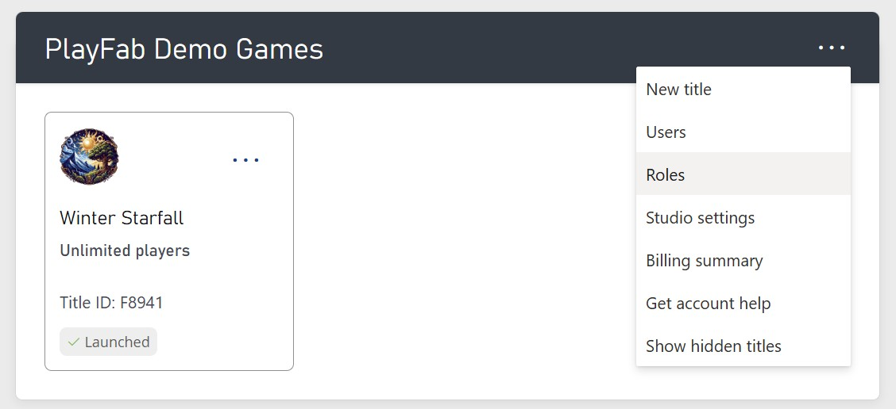
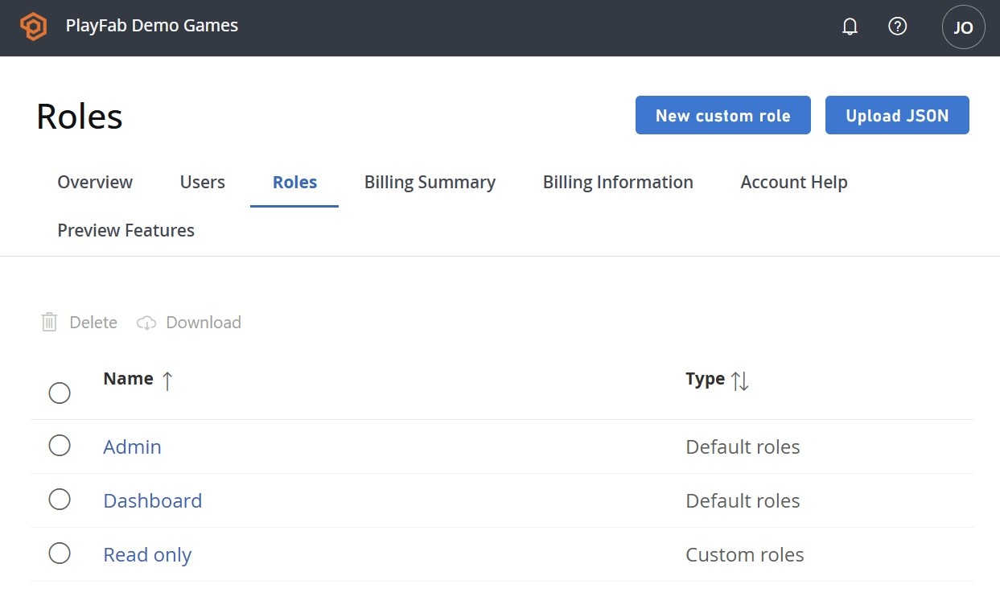
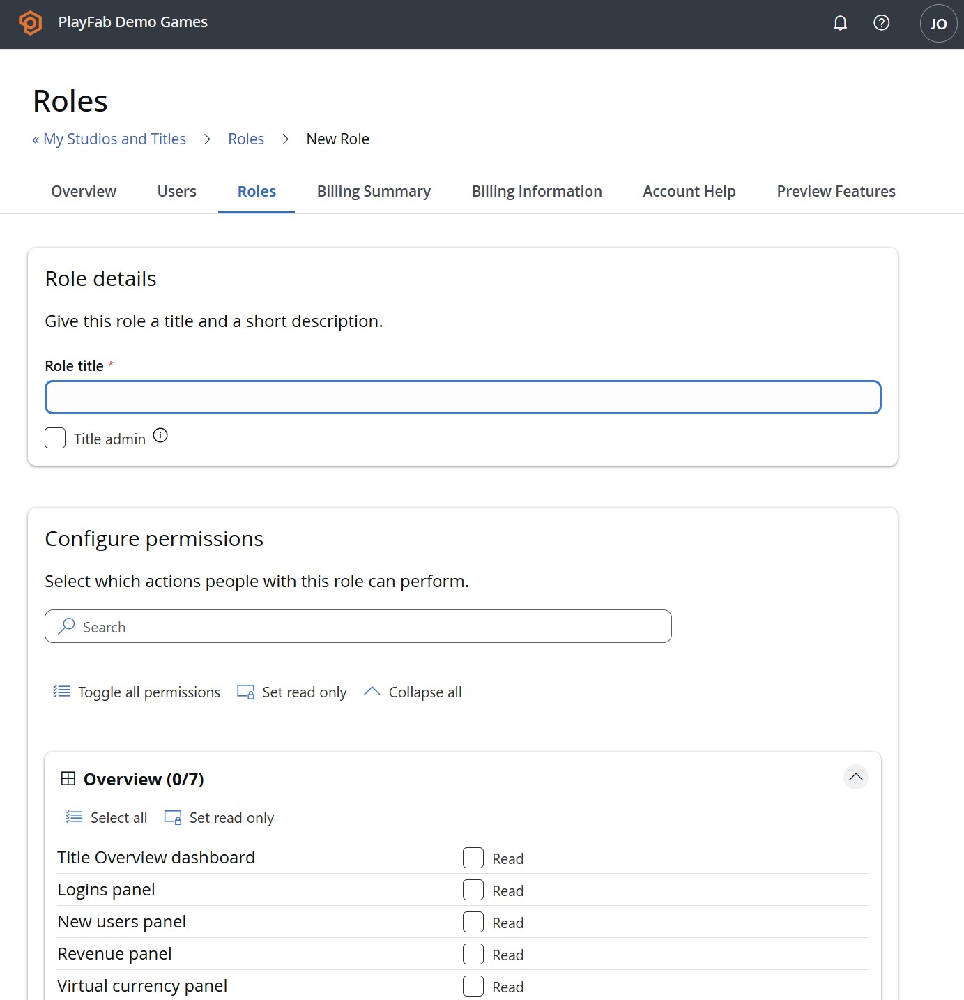
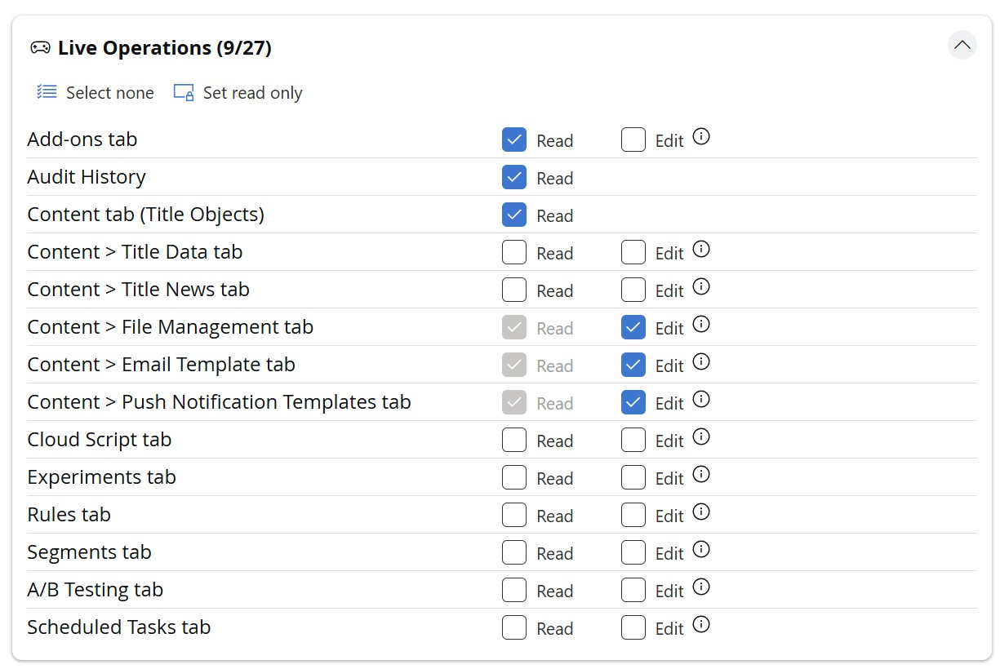
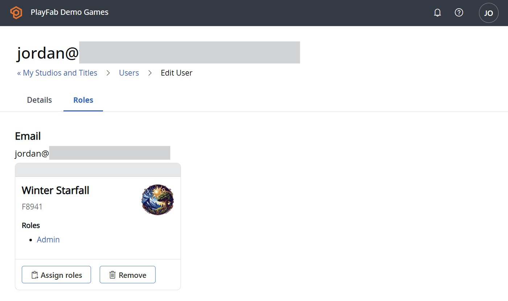
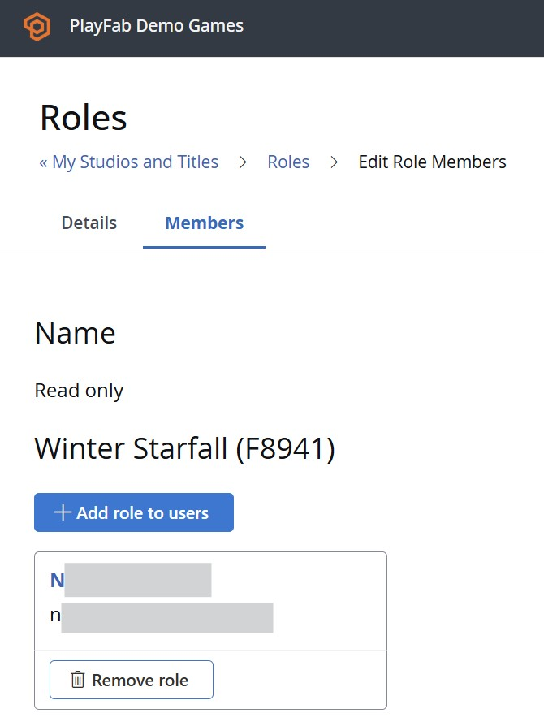

# PlayFab user roles

Roles are how you manage user permissions and navigation in PlayFab's Game Manager. A role is a named collection of permissions that you assign to the people in your studio, on a per-title basis. Define a role once, assign it to as many users as you like, and update everyone's access at once by editing the role.

This article covers the three things you'll do most: creating a role, configuring its permissions, and assigning it to users.

## How roles work

PlayFab uses a fine-grained permissions model with hundreds of individual permissions, so you can decide *exactly* what each person is allowed to do. Areas of Game Manager can be turned off entirely, set to read-only, or opened up for editing.

A few examples of where this comes in handy:

- A Customer Service rep can edit player profiles but never see revenue data.
- A Product Manager can view revenue dashboards but can't upload multiplayer server builds.
- A Data Scientist can read every event and dashboard while having no write access anywhere.

Because permissions live on the role rather than on each individual user, a policy change is a single edit: update the role, and everyone who holds it picks up the change immediately.

Roles are assigned **per title**, and a user can hold **multiple roles** on the same title. So you might give someone both a *Customer Support* role and a *Data Scientist* role, and they'll get the combined permissions of both. The same person can also be a Title Admin on one title, a Product Manager on another, and a Customer Service rep on a third — all within the same studio.

### Built-in roles and admin levels

Every studio comes with three predefined roles:

- **Title Admin** — full permissions for a given title
- **Dashboard** — permission to view the title's dashboard, and nothing else
- **Commercial admin** — permission to view the title's dashboard, edit settings, see Economy payouts, and manage product activation

There's also a special, studio-wide level: **Studio Admin**. Studio Admins can create titles, define and edit roles, and automatically have Title Admin rights on every title in the studio. You need to be a Studio Admin to create roles or assign them to users.

## Creating a role

1. [Sign in to PlayFab](https://developer.playfab.com/) with your developer account.
2. From **My Studios and Titles**, select the **triple-dot (...) menu** to the right of your studio and choose **Roles**.
   
3. You'll see the list of roles that already exist in your studio. Select **New custom role** to start a custom one.
   
4. Under **Role details**, give the role a clear **Role title**. This is what you'll pick from when assigning the role later, so make it descriptive (for example, *Customer Support* or *Build Engineer*).
   
5. If this role should have unrestricted access to the title, check **Title admin**. This grants full permissions for the title and overrides the individual permission selections below.

### Configuring permissions

The **Configure permissions** section is where you choose exactly what the role can do. Permissions are organized into groups such as **Overview**, **Identity**, **Economy**, and more, with a counter on each group (for example, *Overview (0/7)*) showing how many of its permissions are currently selected.

Each permission offers one or more access levels:

- **Read** — view the data or area
- **Edit** — create and modify
- **Delete** — remove

Not every permission has all three. Some areas add their own purpose-built actions, such as **Activate**, **Submit**, or **Review**. When you're unsure what an action covers, hover the **(i)** tooltip next to it for a full description — for instance, the **Review** action on the *Payouts tab* explains that it lets you "Approve and reject payouts."

To move quickly, use the bulk controls:

- **Search** — filter the permission list to find a specific item.
- **Toggle all permissions** — select or clear every permission at once.
- **Set read only** — check just the **Read** boxes across the scope, leaving Edit/Delete off.
- **Collapse all** — hide the contents of every group for a cleaner view.

Each group also has its own **Select all** and **Set read only** so you can configure one area at a time.

When the permissions look right, scroll to the bottom and click **Save Role**.

## Assigning roles to users

You can assign roles two ways: from a user, or from a role.

**From a user:**

1. From **My Studios and Titles**, select the **triple-dot (...) menu** next to your studio and choose **Users**.
2. Open the user you want to update, and select their roles per title. Because roles are scoped to a title, assign the role for each title where the user needs it.
3. Save your changes.

**From a role:**

Open an existing role and select its **Members** tab. There you can pick which users in your studio should hold this role, and for which titles — handy when you're onboarding several people into the same role at once.

## Summary

Roles give you flexible, studio-wide control over who can do what in Game Manager. Define a role, dial in its permissions with the Read/Edit/Delete (and area-specific) controls, and assign it to your team per title. Update the role once, and everyone who holds it stays in sync.
