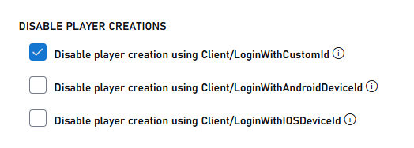
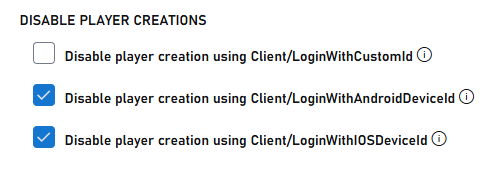

# Setting up Playfab Anonymous Login Authentication

This guide shows you how to implement PlayFab authentication using anonymous login APIs with server-side protection, focusing only on CustomID authentication using HTML5/JavaScript.

## Overview

To enhance security for anonymous login methods, PlayFab provides features to control player account creation. This applies to all anonymous login endpoints including:
- LoginWithCustomID
- LoginWithAndroidDeviceID
- LoginWithIOSDeviceID

> [!NOTE]
> This setting is enabled by default for newly created titles. Existing titles must manually enable it through the steps outlined in the configuration section at the end.

## Prerequisites

Before you begin, make sure you have:

- A unique identifier for the player (CustomID)
- A registered [PlayFab](https://playfab.com/) title
- Your PlayFab title's secret key
- Familiarity with [sign-in basics and best practices](../login/login-basics-best-practices.md)
- A server with a valid domain name to serve static HTML files

> [!NOTE]
> If you need help setting up a server, see the [Running an HTTP server for testing](running-an-http-server-for-testing.md) tutorial. Throughout this guide, we'll assume your domain is `['http://playfab.example'](http://playfab.example)`. 

## Authentication Flow

1. **Server-side Account Creation**:
   - Use `LoginWithCustomID` with the server API to create new players
   - Protected by the title secret key
   - Reference: [Server API - Login With Custom ID](https://learn.microsoft.com/rest/api/playfab/server/authentication/login-with-custom-id)

2. **Client-side Login**:
   - Use `LoginWithCustomID` with the client API to log in existing players
   - Cannot create new accounts when properly configured
   - Reference: [Client API - Login With Custom ID](https://learn.microsoft.com/rest/api/playfab/client/authentication/login-with-custom-id)
## Implementation Steps

### 1. Set Up Your Development Environment

1. Download the JavaScript SDK from the [JavaScript SDK documentation](https://learn.microsoft.com/gaming/playfab/sdks/javascript/)

2. Update the `PlayFabServerApi.js` file in the `PlayFabSdk/src/PlayFab` folder with your credentials:

```javascript
PlayFab.settings = {
    titleId: "<insert your titleId>",
    developerSecretKey: "<developerSecretKey>",
    GlobalHeaderInjection: null,
    productionServerUrl: ".playfabapi.com"
}
```

### 2. Implement the Authentication Flow

Create an HTML file with the following content:

```html
<!DOCTYPE html>
<html>
<head>
    <script src="PlayFabSdk/src/PlayFab/PlayFabServerApi.js"></script>
    <script src="PlayFabSdk/src/PlayFab/PlayFabClientApi.js"></script>
</head>
<body>
    <p>Server LoginWithCustomId Auth Example</p>
    <button onclick="loginWithCustomID()">Log In with CustomId</button>
    <script>
        function loginWithCustomID() {
            var customId = "someId12321";
            createUserWithCustomId(customId);
            PlayFabClientSDK.LoginWithCustomID({
                CustomId: customId,
                TitleId: PlayFab.settings.titleId,
            }, onPlayFabResponse);
        }

        // Server-side account creation
        function createUserWithCustomId(customId) {
            PlayFabServerSDK.LoginWithCustomID({
                CreateAccount: true,
                CustomId: customId,
                TitleId: PlayFab.settings.titleId,
            }, onPlayFabResponse);
        }

        function onPlayFabResponse(response, error) {
            if (response)
                logLine("Response: " + JSON.stringify(response));
            if (error)
                logLine("Error: " + JSON.stringify(error));
        }

        function logLine(message) {
            var textnode = document.createTextNode(message);
            document.body.appendChild(textnode);
            var br = document.createElement("br");
            document.body.appendChild(br);
        }
    </script>
</body>
</html>
```

## Configuring Player Creation Settings

### For Existing Titles

1. Navigate to the PlayFab developer portal and select your title
2. Go to **Settings**
3. Select the **API Features** tab
4. Check the box to prevent new player accounts from being created via anonymous login APIs

  

### For New Titles

> [!WARNING]
> Enabling automatic player creation for anonymous login APIs can compromise security. Only enable this feature temporarily during development or testing. Always disable it before moving to production.

1. Navigate to the PlayFab developer portal and select your title
2. Go to **Settings**
3. Select the **API Features** tab
4. Uncheck the box to allow new player accounts from being created via anonymous login APIs

   

## Further Reading

- [PlayFab Authentication Overview](../authentication/index.md)
- [Login Basics and Best Practices](../login/login-basics-best-practices.md)
- [Running an HTTP Server for Testing](running-an-http-server-for-testing.md)

