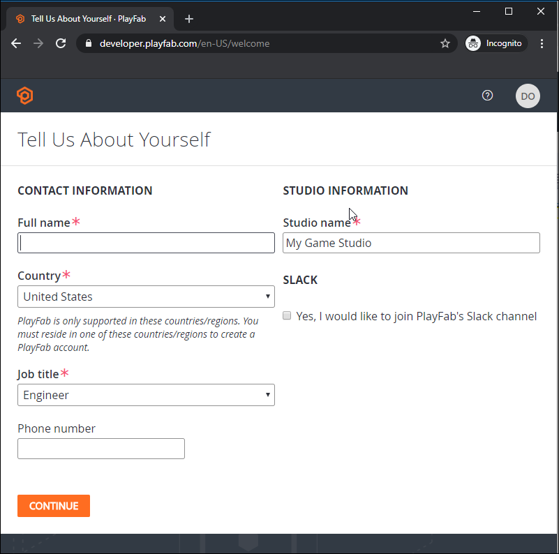
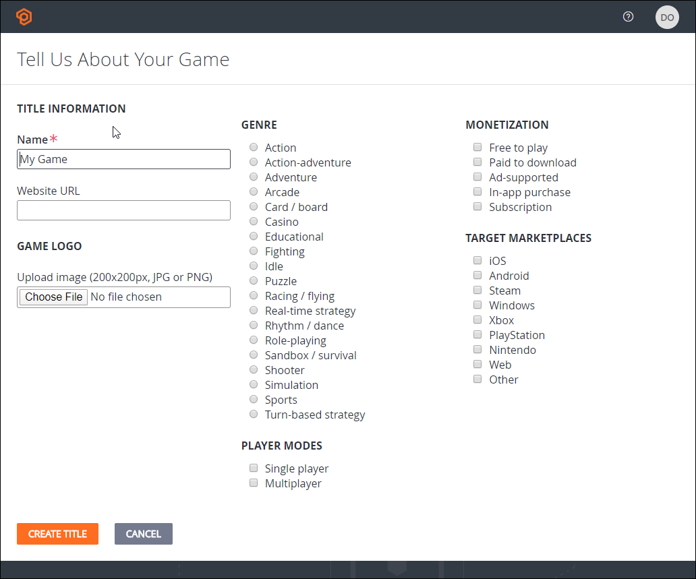
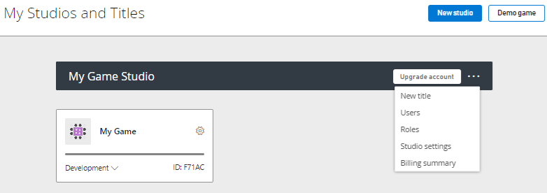

# Game Manager quickstart

Get started with PlayFab by using Game Manager to create your PlayFab account, create your studio, and create your first title.

## Create a PlayFab account

On the [PlayFab sign up](https://developer.playfab.com) screen, you can create a PlayFab specific account or use your Microsoft account to sign in.

When you've signed in, PlayFab prompts you to enter your contact information and studio information. If you haven't finalized the game studio name, you can change it later.

The studio is the administrative grouping for your titles, team members, permissions, billing, and support. By default, the studio also has one namespace that provides cross-title player identity and shared data. For more information, see [PlayFab concepts](../../get-started/concepts.md#studios-namespaces-and-titles).

## Create your first game

To create a title, you must, at a minimum, enter a name for the game. A title is an isolated PlayFab resource for a game or game environment and has its own configuration and player data. You can also specify details such as the title genre, monetization mode, target marketplaces, and player mode. The Benchmark comparisons feature uses these properties to display a finer-grained view of benchmark data. You can set these options later.

## Your studios and titles

When you've successfully created your account, studio, and first title, Game Manager opens the dashboard for your title.

The next time you sign in, Game Manager opens the **My Studios and Titles** page. From there, you can select a title to open its dashboard. For a detailed introduction to the features of Game Manager, see [Game Manager reference](reference.md).

Many API calls require a Title ID, which is the string ID found beneath the title of your game. In the following dashboard, the title is "My Game" and the Title ID is "F71AC."

## Next steps

- [PlayFab User Roles](../../identity/dev-identity/permissions/playfab-user-roles.md)
