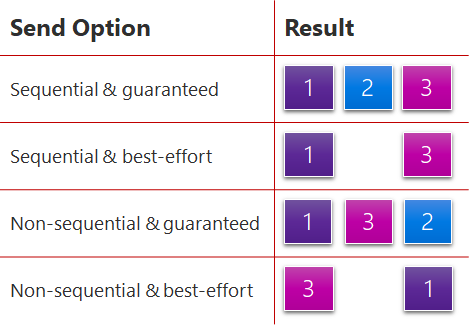

# Configuring transport behavior

PlayFab Party's networking capabilities expand on the User Datagram Protocol (UDP) features of the native platform to provide datagram transport facilities that are ideal for real-time multiplayer games.

While Transmission Control Protocol (TCP) provides reliable streams, and UDP provides unreliable datagrams, you can configure Party’s networking behavior on a per-datagram basis. When you use [PartyLocalEndpoint::SendMessage](reference/classes/PartyLocalEndpoint/methods/partylocalendpoint_sendmessage.md) to transmit a datagram from a local Party endpoint to a remote endpoint, specify [PartySendMessageOptions](reference/enums/partysendmessageoptions.md) to fine-tune the desired transport behavior. 

Capabilities include:

- **Guaranteed delivery**: The `GuaranteedDelivery` flag ensures the message arrives at all targets, implicitly retransmitting data if necessary to mitigate environmental packet loss. This option flag works well when sending important state information that must always reach the destination or else the target should be removed from the network. The default option is `BestEffortDelivery`, which provides UDP-like fire-and-forget behavior.
- **Sequential delivery**: Orders the delivery of the message relative to other messages sent sequentially from this local endpoint to the target endpoint. Use this option flag to send state information that must reach the destination in a particular sequence. Sequential delivery might result in slightly lower network efficiency and a longer wait to receive all packets when there's packet loss or reordering by the environment. Using `SequentialDelivery` with `GuaranteedDelivery` might cause messages to queue on the target endpoint while waiting for previously sent sequential messages to arrive. Queuing can increase perceived latency during environmental packet loss or reordering, but the target endpoint always sees every message in the order sent. This performance trade-off is common to TCP-like protocols and is sometimes called [head-of-line blocking](https://wikipedia.org/wiki/Head-of-line_blocking).
- **Coalescing**: The Party library automatically fragments and reassembles large messages that exceed the maximum size supported by the environment, so callers aren't required to manage fragmentation. If you're sending many small datagrams, coalescing combines them into a single packet to improve bandwidth efficiency at the potential cost of added latency. Sending with the `CoalesceOpportunistically` flag (the default) coalesces the message with other queued messages if any are available, but doesn't wait for more if the message can transmit immediately. Sending with the `AlwaysCoalesceUntilFlushed` flag delays transmission until `PartyLocalEndpoint::FlushMessages` is called, at which point queued messages are coalesced and transmitted.

## Combining delivery and sequencing options

The `GuaranteedDelivery`/`BestEffortDelivery` and `SequentialDelivery`/`NonsequentialDelivery` options are independent and can be combined freely. Each combination produces distinct behavior:

| Delivery | Sequencing | Behavior |
|----------|------------|----------|
| `GuaranteedDelivery` | `SequentialDelivery` | Reliable and ordered. Every message arrives in the order sent. If a message is lost in transit, later sequential messages queue on the receiver until the missing message is retransmitted and delivered. Most susceptible to head-of-line blocking. |
| `GuaranteedDelivery` | `NonsequentialDelivery` | Reliable and unordered. Every message arrives, but each is delivered to the application as soon as it arrives regardless of send order. No head-of-line blocking. |
| `BestEffortDelivery` | `SequentialDelivery` | Unreliable and ordered. Messages are delivered in order, but gaps are permitted. If a message arrives after a later sequential message was already delivered, the late arrival is dropped. The sequence always moves forward. |
| `BestEffortDelivery` | `NonsequentialDelivery` | Unreliable and unordered (the default). Fire-and-forget—each message is delivered as soon as it arrives, with no ordering or delivery guarantees. Lowest latency. |

### Understanding head-of-line blocking

Head-of-line blocking happens when a message at the front of a delivery sequence isn't available yet. Later messages in the same sequence can't be delivered to the application, even though the receiver already has them.

The relevant option for head-of-line blocking is **`SequentialDelivery`**, not `GuaranteedDelivery`. Sequential delivery creates an ordered sequence where earlier messages block later ones. `GuaranteedDelivery` can *exaggerate* the impact because a missing message must be retransmitted rather than skipped, which extends the wait. With `BestEffortDelivery` + `SequentialDelivery`, a gap is skipped and the sequence moves forward, so the blocking window is short.

`NonsequentialDelivery` messages are never blocked by sequential messages. The two delivery modes don't interfere with each other. A retransmitting guaranteed sequential message doesn't delay delivery of a nonsequential message.

### Practical guidance

A common game pattern uses multiple send options simultaneously for different kinds of data:

- **`GuaranteedDelivery` + `SequentialDelivery`** for game-state changes where ordering and completeness matter (for example, inventory updates, match-state transitions).
- **`BestEffortDelivery` + `NonsequentialDelivery`** for fast-changing state where low latency matters more than completeness (for example, player positions, aim direction).

Because sequential and nonsequential messages are independent, a retransmitting state-change message doesn't delay delivery of position updates.

### Multiple independent sequences

Each local endpoint represents an independent sequence space. All sequential messages sent from one local endpoint to a given target endpoint share the same ordering guarantees. Head-of-line blocking within that sequence can only affect other sequential messages in the same sequence.

If you need multiple independent ordered streams between the same two devices—for example, one stream per game subsystem—you can create multiple local endpoints on each device (up to the limit specified in `PartyNetworkConfiguration.maxEndpointsPerDeviceCount` when the Party network is created). Sequential messages sent from different local endpoints have no ordering or delivery relationship with each other.

## Network statistics and local queueing

Depending on the message sending options and network state, Party might locally queue messages before transmission. This local queueing is carefully managed to avoid introducing latency. Queueing is necessary to ensure that Party doesn't flood the player's network and that features like coalescing can be applied.

[PartyNetwork::GetNetworkStatistics](reference/classes/PartyNetwork/methods/partynetwork_getnetworkstatistics.md) collects data on aggregate network performance, including latency to Party relay service. 

[PartyLocalEndpoint::GetEndpointStatistics](reference/classes/PartyLocalEndpoint/methods/partylocalendpoint_getendpointstatistics.md) provides visibility into queuing and packet loss statistics for a specific remote endpoint.
