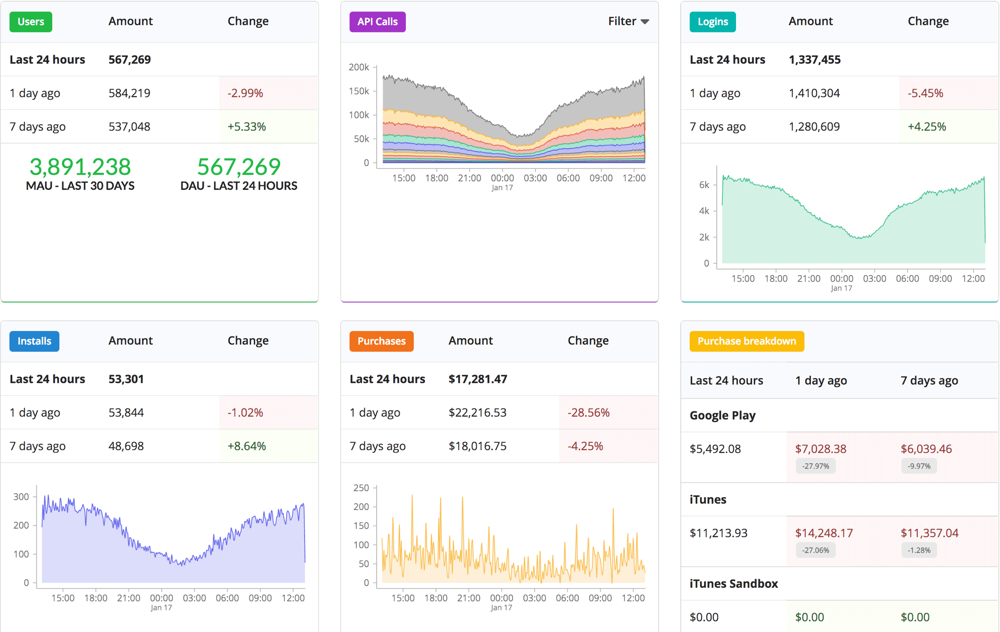
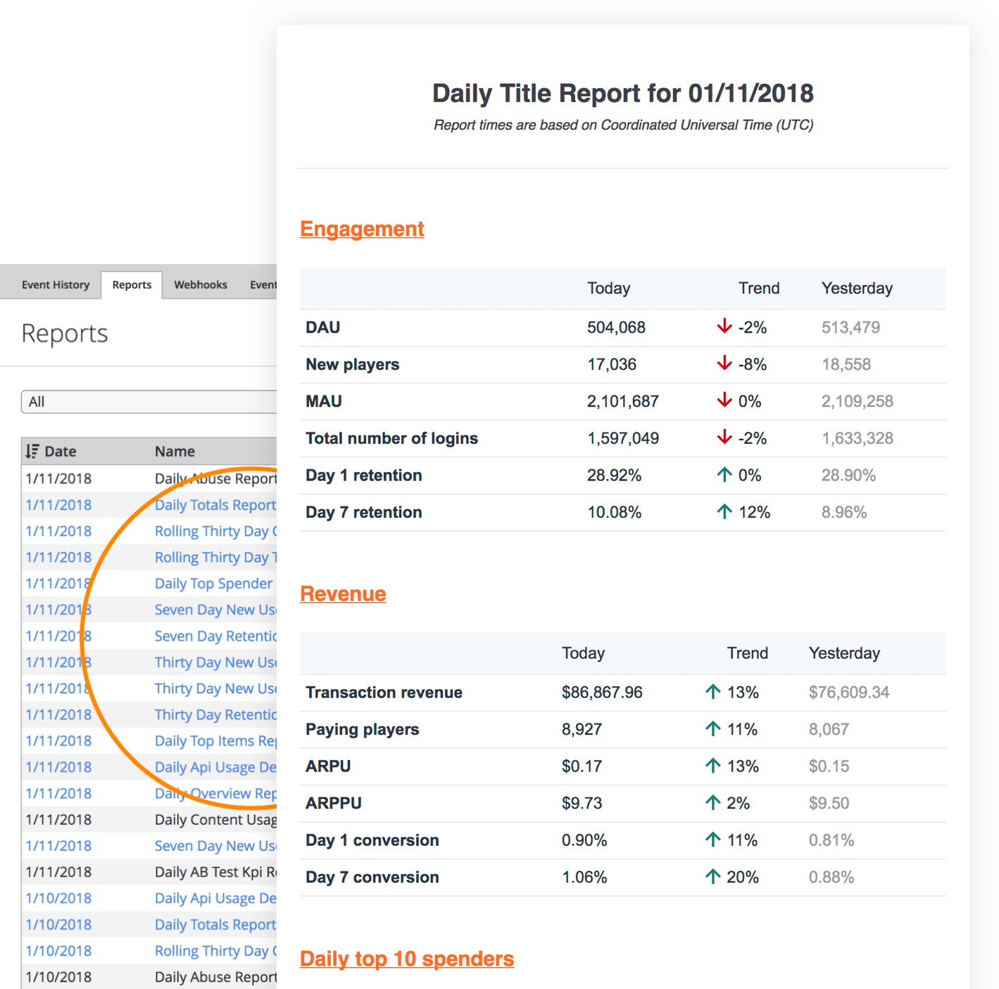

# Getting started for business intelligence

Getting to know your players and their behavioral patterns in your game is critical to increasing retention, engagement and monetization. The goal of this document is to help bring you up to speed on how PlayFab empowers your business intelligence and to quickly dive you into the tool sets that we provide.

In general, you can analyze what players are doing in your game by following their event patterns. Events in PlayFab come from PlayStream Events. PlayStream is an event processing system that unifies the entire data flow from your game into a single event stream. You can then visualize and take actions on that stream in real-time.

## Create a PlayFab Account

Before you can call any **PlayFab API**, you must have a [PlayFab developer account](https://developer.playfab.com/en-us/sign-up). If you already have a **PlayFab** account, you can skip this step.

Once you have a **PlayFab** account, navigate to the **PlayFab** home page, [https://playfab.com](https://playfab.com), and log in.

Since **PlayFab** does not know the **Name** of your game studio or the **Title** of your game, initial values for these fields are assigned.

**Unnamed Studio** is the default name of your game studio, and **Unnamed Title** is the default **Title** of your game, as shown in the following screenshot. You can rename these at any time.

> [!NOTE]
> The **Title ID** is unique to your game, which we call a **Title**. You will use this value when you make **PlayFab API** calls (your **Title ID** will *not* be **BCFE**).

Your first **Title** is auto-generated by us. If you need a new **Title** later, you can create additional **Titles** by selecting **Create a new game** (but don't do this yet).

The current **Title** and **User** can be found in the top right. An **Admin** menu appears when the **User** is selected.

## Open the Game Manager for your title

Before installing your SDK, click on any title and the Game Manager opens for that title. Take the time to familiarize yourself with the various sections in the Game Manager dashboard. For a more detailed overview, visit the [Game Manager quickstart](../features/config/gamemanager/quickstart.md). The PlayFab Game Manager allows you to do whatever you need to with your game title. Once you have a grasp on the aspects of the Game Manager, install the SDK so you can start using APIs.

## Getting to know your players through Game Manager

Real-Time events are amazing, and actionable. However, sometimes you need to do deeper analytics over a period of time to get retention, or a better understanding of how your players are engaging with your game. For this, we offer a variety of solutions and we kick this off by talking about our built-in tools in Game Manager. Game Manager is our online portal to your game title. You can learn more about [Game Manager here](../features/config/gamemanager/quickstart.md). In Game Manager, you can search for events, view reports, and look at specific data about each player and their actions.

Here are some resources to get you started with the Event Viewer:

- [Real-Time Analytics: Core Concepts](../features/analytics/metrics/real-time-analytics-core-concepts.md) - Gives you precise insights into what is going on inside your game.
- [Constructing Event History Searches](../features/analytics/metrics/constructing-an-event-history-search.md) - Illustrates how to construct an Event History Search, the components of a search, and how to use Elastic Search syntax in your queries.
- [Built in Analytic Reports](../features/analytics/reports/quickstart.md) - Gets reports on daily, monthly and rolling overviews. Track retention and conversion reports. View reports on your top spenders and purchases.

## Getting to know your players outside of Game Manager

While PlayFab provides some awesome tools for getting to know your players, sometimes you may need a bit more customization. PlayFab has a number of ways to reach your data outside of our Game Manager tool set. For this we offer several ways to export data into various systems. Here are a few great ways to access your data:

- [S3 Event Archiving](../features/analytics/metrics/s3-event-archiving.md) – PlayFab allows you to archive the entire event flow by using an Amazon S3 Bucket. This guide shows step-by-step how to configure event archiving from scratch.
- Snowflake – See the entire event flow in Showflake, for deep analytics query power.
- [Webhooks](../features/analytics/metrics/webhooks.md) - In complex systems you may want to provide additional event handling on your custom server. PlayFab offers Webhooks to achieve this. Whenever a new event is detected, it can be forwarded to your server by making a POST request to your custom web endpoint, and the event data is passed as the JSON body of the request.
- PlayFab Data warehouse (preview) - The PlayFab Data Warehouse  is a premium PlayFab offering that provides a central repository for your data, whether it's generated from our services or imported from an external source.