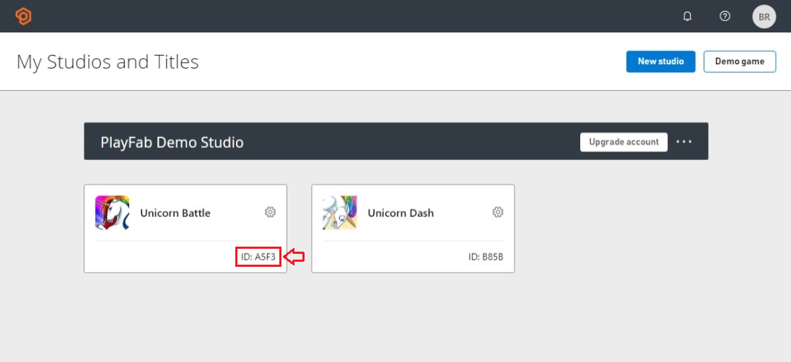

# Getting started for developers

Thank you for either choosing PlayFab as your platform for back-end services and LiveOps or evaluating the PlayFab offering. Welcome!

The first step in adding PlayFab to any Title is adding code to authenticate and log in the player. Logging in the player returns a security token that is needed for all other API calls.

In this topic we show you how to retrieve the **TitleId** for your Title. You can then follow the quickstart guides listed later on in this topic to learn how to use the **TitleId** to log a player in.

> [!NOTE]
> The quickstart guides use a test **TitleId**. When you follow a guide, use a **TitleId** for a Title that you have created in your PlayFab Developer account.

Before you can make your first API call to log a player in, you must create a [PlayFab Developer account](pfab-account.md).

## Retrieving your TitleId

When you create a Title in Game Manager, PlayFab generates a **TitleId** that identifies your Title. When following the guides, use a **TitleId** for a Title that you have created.

For information about using Game Manager and creating a Title, see [Game Manager quickstart](../features/config/gamemanager/quickstart.md).

To retrieve the **TitleId** for your Title, log in to the [Game Manager](https://developer.playfab.com/en-us/login).

On the **My Studios and Titles** screen, locate your Title. The **TitleId** is located just below the name of your Title.

> [!div class="mx-imgBorder"]
>   

### Login and account basics

Now that you have retrieved a Title in Game Manager and retrieved your **TitleId**, you're ready to make API calls.

The starting point for any PlayFab integration is *authentication*. You must authenticate your player to make further API calls.

Here are some resources to help you with the initial authentication of your player:

- [Login basics and Best Practices](../features/authentication/login/login-basics-best-practices.md) – Check this tutorial first to learn about the best practices to use various authentication methods in your Title.
- [Platform-Specific Authentication](../features/authentication/platform-specific-authentication/index.md) – Use these guides to understand the basics of authentication calls into PlayFab.
- [Account Linking tutorial](../features/authentication/login/quickstart.md) - Learn about linking and unlinking different types of accounts to a single player profile.

## Calling the PlayFab API to log in

To allow you to integrate PlayFab into your Title, we provide SDKs, libraries, and extensions for the most popular game engines, frameworks, and platforms.

Visit [PlayFab SDKs, tools, and extensions](~/index?#pivot=documentation&panel=sdks) and choose the appropriate quickstart guide for your preferred environment. The quickstarts walk you through installing your environment, creating a new test project, and making your first API call.

## Using PlayFab services to instrument your Title

Mapping your Title on top of PlayFab is a great start. But there is more power to be harnessed in PlayFab that can help your LiveOps team create better engagement, retention, and monetization mechanics.

Many of these features leverage PlayStream, an event system that drives real time events. This enables you to perform actions on player behaviors. Actions can occur in several ways - using either segmentation or direct rules that are applied to specific events.

Actions might result in a CloudScript being run. Our CloudScript is JavaScript code that lives on a remote server, and you can execute it either from a rule, or directly from a client.

For more information, check out these resources to get you started with Cloud Scripting and Automation on PlayFab:

- [Automation](../index?#pivot=documentation&panel=automation) – A hub for information on CloudScript, Scheduled Tasks, PlayStream and Action & Rules.
- [CloudScript quickstart](../features/automation/cloudscript/quickstart.md) – Get up and running quickly with your first CloudScript call.

> [!TIP]
> To leverage rules in the automation system, write custom events in your Title which creates a PlayStream event. For more information on custom events, see [Custom event overview](../features/analytics/metrics/playstream-events.md#custom-event-overview) in Generating PlayStream events.

## Next steps

Every Title is different, so you will have a unique set of features that you must build every time. It is important to know and understand how to map those features onto PlayFab.

This generally starts with the configuration of your Title. You will want to store variables in PlayFab and pull them down on to game clients. But these are not the only types of configurations that you'll want to make.

Some of the different ways that you can map PlayFab onto a Title are shown below; use these to find the combination of tools that is just right for your Title:

- [Title Data](../features/config/titledata/quickstart.md) – Map variables containing data on PlayFab to data structures in your game clients.
- [Entity Objects](../features/data/entities/quickstart.md) (aka: Player Data) – Store and retrieve data on a per player basis.
- [Catalogs](../features/commerce/items/catalogs.md) (Items) - Very useful for storing configuration data about your Items and potentially being able to sell them as virtual goods.
- [Groups](../features/social/groups/using-shared-group-data.md) – Groups are generally used for things like guilds or clans. Groups are arbitrary and have members, roles and other guild-like features.

Finally, check out each of our feature areas in the links provided below to find the right feature set for your Title:

- [Authentication](../index?#pivot=documentation&panel=authentication)
- [Data](../index?#pivot=documentation&panel=data)
- [Config](../index?#pivot=documentation&panel=config)
- [Automation](../index?#pivot=documentation&panel=automation)
- [Social](../index?#pivot=documentation&panel=social)
- [Commerce](../index?#pivot=documentation&panel=commerce)
- [Multiplayer](../index?#pivot=documentation&panel=multiplayer)
- [Analytics](../index?#pivot=documentation&panel=analytics)
- [Engagement](../index?#pivot=documentation&panel=engagement)
