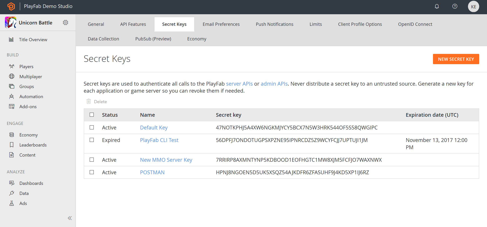
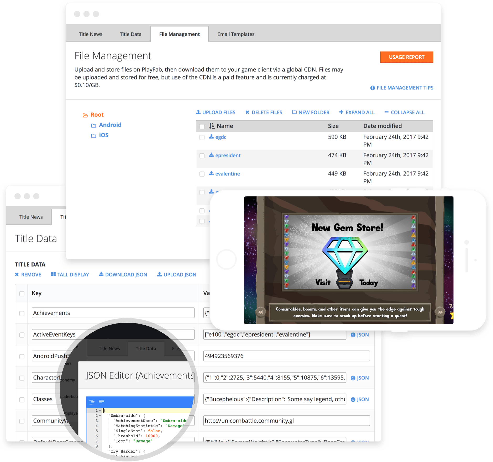

# Getting started for developers

We are excited that you have either chosen PlayFab as your platform for back-end services and Live Ops, or are evaluating the PlayFab offering. The purpose of this section is to shed some light on how PlayFab helps you, as a developer, build your game on PlayFab.

PlayFab offers a wide range of services and has over 280 different APIs that you can leverage to make your game. This can be a lot to take in, so we'll take it slow, starting with the beginnings of making your game and then getting into more advanced features as we go.

## Create a PlayFab Account

Before you can call any PlayFab **API**, you must have a [PlayFab developer account](https://developer.playfab.com/en-us/sign-up). If you already have a PlayFab account, you can skip this step.

Once you have a PlayFab account, navigate to the PlayFab home page, [https://playfab.com](https://playfab.com), and log in.

Since PlayFab does not know the name of your game studio or the title of your game, initial values for these fields are assigned.

 **Unnamed Studio** is the default name of your game studio, and **Unnamed Title** is the default **Title** of your game, as shown in the following screenshot. You can rename these at any time.

> [!NOTE]
> The **Title ID** is unique to your game, which we call a title.  You will use this value when you make PlayFab **API** calls (your title ID will *not* be **BCFE**).

Your first title is auto-generated by us.  If you need a new title later, you can create additional titles by selecting **Create a new game** (but don't do this yet).

The current title and user can be found in the top right. An **Admin** menu appears when the **User** is selected.

## Open the Game Manager for your title

Before installing your **SDK**, click on any title and the Game Manager opens for that title. Take the time to familiarize yourself with the various sections in the Game Manager dashboard. For a more detailed overview, visit the [Game Manager quickstart](../features/config/gamemanager/quickstart.md). The PlayFab Game Manager allows you to do whatever you need to with your game title. Once you have a grasp on the aspects of the Game Manager, install the SDK so you can start using APIs.

## Making your first API call

We have **SDKs** for all major game engines and languages.

Choose an environment from the list below, and follow the link to the appropriate quickstart guide. These guides will walk you through installing your environment, creating a new test project, and making your first **API** call.

Pick your **SDK**:

- [Unity](../sdks/unity3d/quickstart.md)
- [HTML5 (Javascript)](../sdks/javascript/quickstart.md) 
- [Flash (ActionScript3)](../sdks/actionscript/quickstart.md)
- [C#](../sdks/c-sharp/quickstart.md)
- [Cocos2d-x](../sdks/cocos2d-x/quickstart.md) 
- [Xamarin](../sdks/xamarin/quickstart.md) 
- [Node](../sdks/nodejs/quickstart.md) 
- [Java](../sdks/java/quickstart.md) 
- [Defold (Lua)](../sdks/lua/quickstart-defold.md) 
- [Corona (Lua)](../sdks/lua/quickstart-corona.md)  
- [Windows - C++](../sdks/xplatcpp/quickstart-windows.md) 
- [Linux - C++](../sdks/xplatcpp/quickstart-linux.md)  

## Updating your Login mechanism

The first step in adding PlayFab to any game is always logging in the player. Logging in the player returns a security token that is needed for all other **API** calls.

The **quickstart** guides in Step 1 utilize a test **TitleId** - but from *now on*, you should be using your *own*.

Create a **Title** in **Game Manager**, and update your environment with your own **TitleId**.

### Obtaining your TitleId

**TitleId's** are obtained from the Game Manager. If you haven't already, [register for a free **PlayFab** developer account](https://developer.playfab.com/en-us/sign-up), then [login to the **Game Manager**](https://developer.playfab.com/en-us/login).

Once you have logged in, select **Settings**. The **TitleId** for your game should be present in the field below the name.

  

The **SDK** guide that you followed in Step 1 should have included instructions on how to enter your **Title ID**.

## Login and account basics

Now that you're set up to make API calls, the starting point for any PlayFab integration is authentication. You have to authenticate your player to make further API calls. PlayFab offers many methods to authenticate and link your players.

Here are some resources that will help you along that first step for authenticating your player:

- [Login basics and Best Practices](../features/authentication/login/login-basics-best-practices.md) – Check this tutorial first to learn about the best practices to use various authentication methods in your game.
- Authentication Service Helper – Learn how this service can save you valuable time by leveraging building best practices in this Authentication Service for each SDK.
- [Authentication quickstart](../features/authentication/platform-specific-authentication/quickstart.md) – Use this guide to understand the basics of Authentication calls into PlayFab.
- [Account Linking tutorial](../features/authentication/login/linking-unlinking.md) - Learn about linking and unlinking different types of Accounts to a single player profile.

## Next steps

Every game is fairly different. You will have a unique set of features that you are building, and it is important to know and understand how to map those features onto PlayFab. This generally starts with configuration of your game. You will want to store variables in PlayFab and pull them down on to game clients. These are not the only types of configurations that you'll want to make.

Below, you can find a number of different ways that PlayFab maps onto a game and find the right combo tool set that is right for your game:

- [Title Data](../features/config/titledata/quickstart.md) – Map variables containing data on PlayFab to data structures in your game clients.
- [Entity Objects](../features/data/entities/quickstart.md) (aka: Player Data) – Store and Retrieve data on a per player basis.
- [Catalogs](../features/commerce/items/catalogs.md) (Items) - Very useful for storing configuration data about your Items and potentially being able to sell them as virtual goods.
- [Groups](../features/social/groups/using-shared-group-data.md) – Groups are generally used for things like Guilds or Clans. Groups are arbitrary and have members, roles and other guild like features.

<!--  -->

## PlayFab advanced

Mapping your game on top of PlayFab is a great start, but there is more power to be harnessed in PlayFab that can help your LiveOps team create better engagement, retention and monetization mechanics. A majority of these features leverage PlayStream. PlayStream is an event system that drives real-time events that enables you to perform actions on player behaviors. Actions can happen in a number of ways, either via segmentation or via direct rules that are applied to specific events.

Actions might result in a **CloudScript** being run. Our **CloudScript** is **JavaScript** code that lives on a remote server and you can execute it either from a rule or directly from a game client. For more information, check out these resources to get you started with **Cloud Scripting and Automation** on PlayFab:

- [Automation](../index.md?#pivot=documentation&panel=automation) – A hub for information on **CloudScript**, **Scheduled Tasks**, **PlayStream** and **Action & Rules**.
- [CloudScript quickstart](../features/automation/cloudscript/quickstart.md) – Get up and running quickly with your first **CloudScript** call.

> [!TIP]
> To leverage rules in the automation system, [write custom events](../features/automation/playstream-events/quickstart.md#custom-event-overview) in your game which will create a **PlayStream** event.

## Get to know PlayFab features

There is much more you can do with PlayFab. Check out each of our feature areas to find the right feature set for your game:

- [Authentication](../index.md?#pivot=documentation&panel=authentication)
- [Data](../index.md?#pivot=documentation&panel=data)
- [Config](../index.md?#pivot=documentation&panel=config)
- [Automation](../index.md?#pivot=documentation&panel=automation)
- [Social](../index.md?#pivot=documentation&panel=social)
- [Commerce](../index.md?#pivot=documentation&panel=commerce)
- [Multiplayer](../index.md?#pivot=documentation&panel=multiplayer)
- [Analytics](../index.md?#pivot=documentation&panel=analytics)
- [Engagement](../index.md?#pivot=documentation&panel=engagement)
