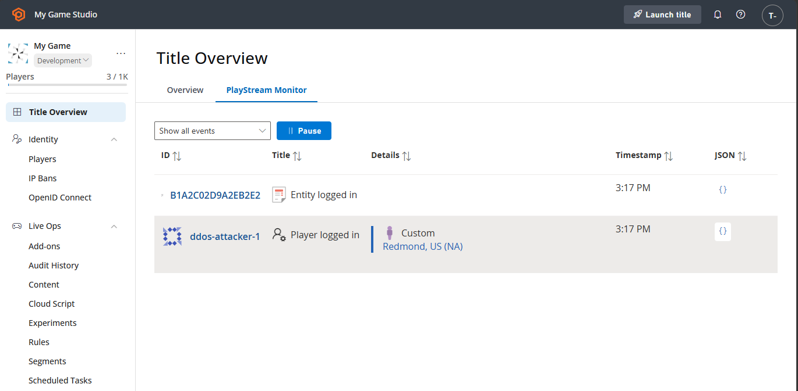
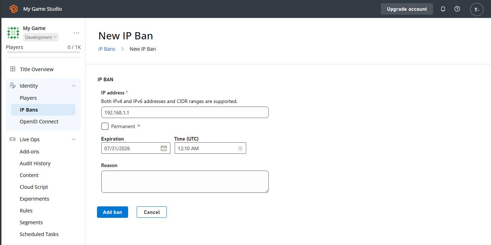
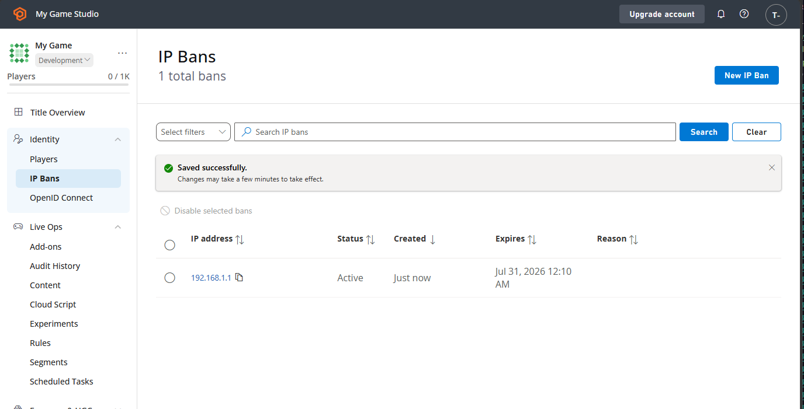
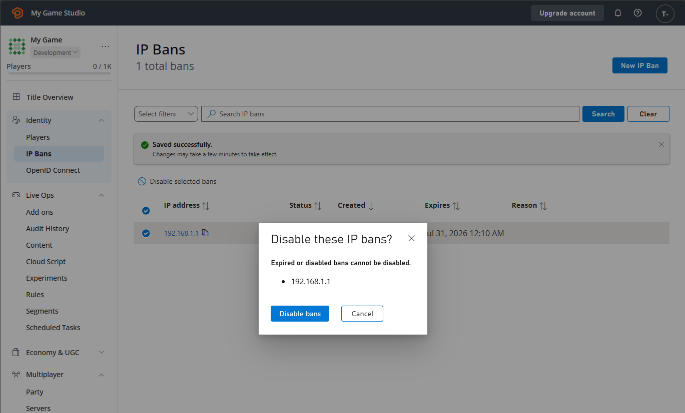
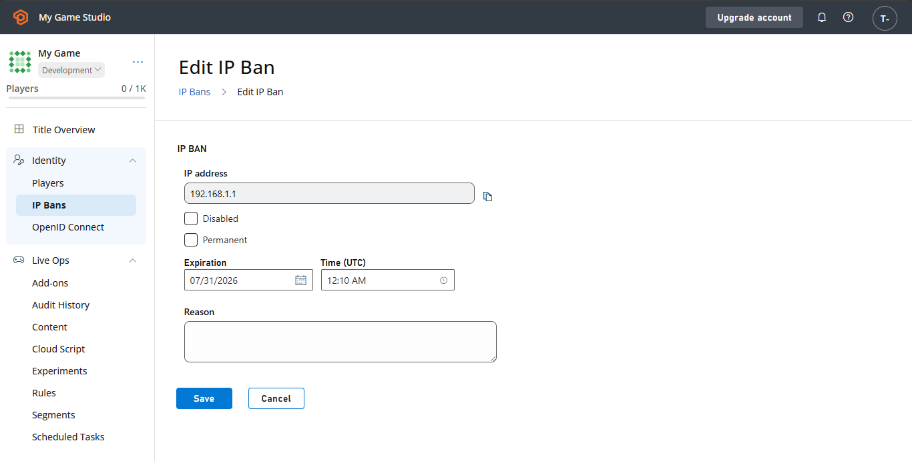

# IP Ban System

The IP ban feature allows you to restrict access to the game from specified IP addresses or ranges. When an IP ban is applied, future authentication attempts made from that IP address or within the banned range will be rejected. IP bans may be permanent or temporary with a specified expiration date, and may be applied to a single IP address or IP range expressed in CIDR notation. An IP ban is scoped to a title and doesn't apply to any other titles in your [namespace](../../live-service-management/game-configuration/entities/index.md).

The following tutorial shows you how to use the IP ban system, using the PlayFab API and Game Manager.

## Identify

You can identify an IP address to ban through the PlayStream Monitor. If you notice suspicious login activity, find a **Player logged in** event and select the curly braces in the **JSON** column to view its details. Copy the address from the **"IPV4Address"** field.

  

> [!NOTE]
> If "Store full user IP addresses" in **Settings > Data Collection** is disabled for your title, the last octet of the IP address will be obfuscated.

## Applying bans

If you deem it necessary, you might create an IP ban. There are two ways to create bans: manually through Game Manager, or programmatically through the [Services SDK](../../sdks/playfab-sdk-intro.md). 

> [!NOTE]
> A title may create IP bans for up to 200 IP addresses or ranges.

### Creating an IP ban from Game Manager

Your community manager might want to apply a ban using Game Manager.

1. Navigate to the IP Bans section.
2. Select **New IP Ban** to display the **New IP Ban** form.
3. Paste the IP address you wish to ban, or type in the CIDR range you wish to ban.
4. Select **Permanent** for a permanent ban, or select an expiration date and time for your ban.
5. Optionally, type in the reason for your ban.
6. Finally, select the **ADD BAN** button.

  

If everything is set correctly, you see a new IP ban in the table with the **"Active"** status.

 

### Managing IP bans from Game Manager

You can manually disable IP bans by selecting them and then selecting **Disable selected bans**. Their status changes to **"Disabled"**.

 

You can edit a ban by selecting the IP address field in the table. This brings you to the **Edit IP Ban** form. Here, you can disable (or re-enable) bans as well as modify the expiration date and reason. Select **Save** to save your changes.



When a ban's expiration date passes, its status becomes **"Expired"**. To reactivate the ban, you must define a new expiration date. Only IP bans with the **"Active"** status prevent logins.

### Creating a ban from a server or service

> [!WARNING]
> Due to their broad-reaching nature and potential high impact to players, we caution against automatically or programmatically creating IP bans.

From a trusted server or service, you can use the [Services SDK](../../sdks/playfab-sdk-intro.md) to create an IP ban through the Admin API. The Admin API requires your title's developer secret key and must not be called from a game client.

```csharp
public async Task CreateIPBanAsync(string ipAddress, DateTime expirationDate)
{
    var response = await PlayFabAdminAPI.CreateIPBanAsync(
        new CreateIPBanRequest
        {
            IPAddress = ipAddress,
            Expires = expirationDate.ToUniversalTime(),
            Reason = "Automatic IP ban"
        });

    if (response.Error != null)
    {
        Debug.LogError(response.Error.GenerateErrorReport());
        return;
    }

    // Handle response.Result.IPBanData
}
```

IP bans applied through the API are also displayed in the table of IP bans for the title in Game Manager.
