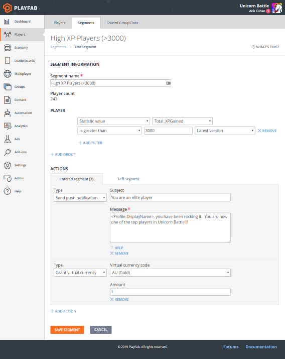

# Segmentation

Segmentation lets you create targeted groups of players based on their player properties. When PlayStream events are processed, your configuration will drive the addition of players into and out of the segments you define.

This all happens in real time - so there should be no perceptual lag, even at large scale. If you can tie an event to the thing you want to use as a differentiating factor, you can make a segment for it, and that segment will apply retroactively to *all* players, based on the data in their profiles.

Let's say that you want to define a segment of players where XP > 3,000, then every player with XP > 3,000 will now be in that segment.

In the example shown below, this particular segment will be evaluated anytime the statistic called **Total_XPGained** changes. If the condition (> 3000) evaluates to **true**, then the player will enter the **High XP Players** segment, and the corresponding action(s) will be triggered.

In this case, it will send a push notification, and grant gold to the player.

> [!NOTE]
> You can also trigger a different custom action(s) when the player leaves a segment, allowing you to make any other changes needed as a result.

There are a variety of basic actions available, including granting an item to the player, granting virtual currency, changing a statistic, banning a player, sending a player an email or sending a Push notification. You can also trigger custom CloudScript to be run instead.
