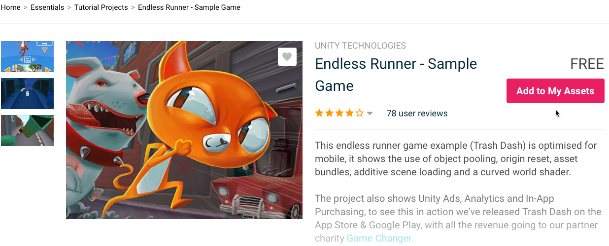
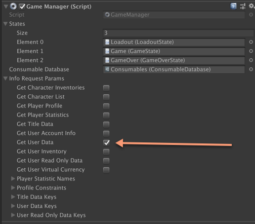
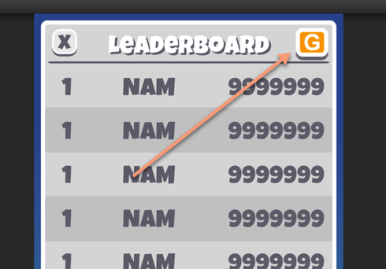
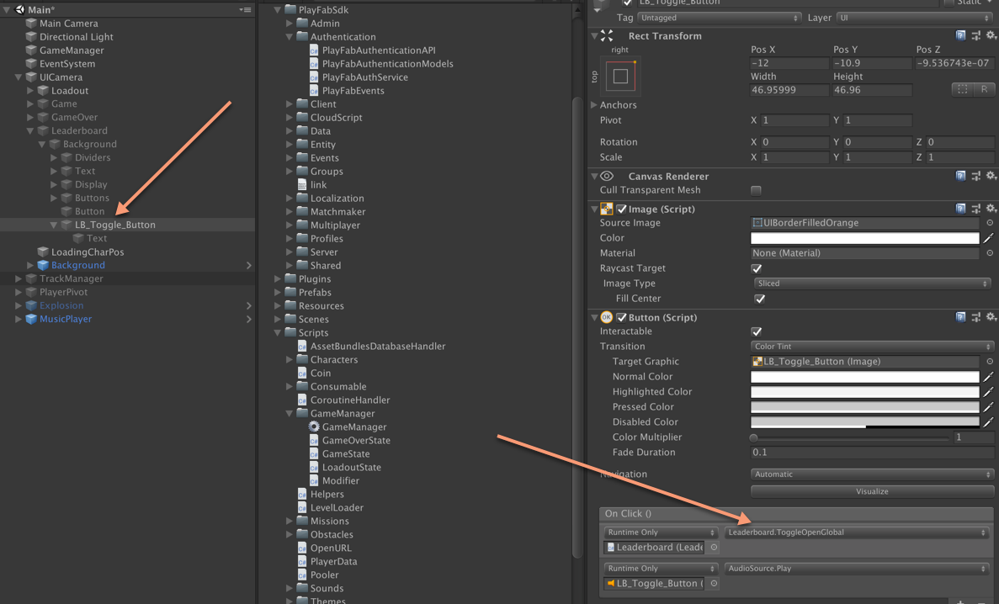

# Adding PlayFab To Endless Runner

The following information will get you up and running with the Unity example game.

## Prerequisites 

- Have the Unity3d game engine installed on your Mac or PC.
- Have access to the Internet.

## Installation process

1. Start a blank Unity project.
2. Navigate to the Unity Asset store in your project **Window --> Asset Store** [here](https://assetstore.unity.com/packages/essentials/tutorial-projects/endless-runner-sample-game-87901).



3. Download and import the sample into your new project.
4. Apply the fix in the [Appendix](#apendix) of this guide.
5. Install the PlayFab Unity Editor extensions.
6. Install the PlayFab SDK using the editor extensions.

## Step-by-step guide

The steps below are required in order to modify the game and to have a successful integration.

### Authentication - difficulty level: easy

In the `GameManager.cs` file located in Assets/Scripts folder, make the following code modifications.

Add two variables:

```C#
private PlayFabAuthService _authService;
public GetPlayerCombinedInfoRequestParams InfoRequestParams;
```

> [!NOTE]
> The 'InfoRequestParams' variable allows you to specify what data you want to receive at user login. These settings are now available on the GameManager `GameObject` in the scene. With these settings we enable the `GetUserData` property, so that we receive all `PlayerData KeyValuePair` at login.



### Modify or add the `Awake()` method

```C#
private void Awake()
{
    _authService = new PlayFabAuthService();
    _authService.InfoRequestParams = InfoRequestParams;
    PlayFabAuthService.OnDisplayAuthentication += OnDisplayAuthentication;
    PlayFabAuthService.OnLoginSuccess += OnLoginSuccess;
    _authService.Authenticate();
}
```

To be able to access `PlayerData` at login, create a new variable in `PlayerData.cs`.

```C#
public static Dictionary<string,UserDataRecord> LoginUserData = new Dictionary<string,UserDataRecord>();
```

To be able to acknowledge if this is a new user or a returning one, create a new variable in `PlayerData.cs`.

```C#
public static bool IsNewUser;
```
> [!NOTE] 
> We will be using both of the above variables later.

Add the `OnLoginSuccess Subscription` handler.

```C#
private void OnLoginSuccess(LoginResult success)
{
    Debug.LogFormat("Player {0} Authenticated Successfully", success.PlayFabId);
    
    //Create in PlayerData to detect new users
    PlayerData.IsNewUser = success.NewlyCreated;
    PlayerData.LoginUserData = success.InfoResultPayload.UserData;
    OnPlayFabEnabled();
    MusicPlayer.StartMusicSystem();
}
```

Add the `OnDisplayAuthentication Subscription` handler.

```C#
private void OnDisplayAuthentication()
{
    _authService.Authenticate(Authtypes.Silent);
}
```

Change the  **OnEnable()** method to **OnPlayFabEnabled()**.

```C#
protected void OnPlayFabEnabled()
```

### Save PlayerData to PlayFab - difficulty level: intermediate

Make the following code changes to the `PlayerData.cs`. This is a bit more complex, because the sample writes all the data in a specific way into a flat local file. The following code changes modify this to use the PlayFab service instead.

We need to make data serializable to JSON. 

> [!NOTE]
> We are only adding `[System.Serializable]` decoration to the method signatures below.

```C#
//Location: PlayerData.cs
[System.Serializable]
public struct HighscoreEntry : System.IComparable<HighscoreEntry>
```

```C#
//Location: Missions.cs
[System.Serializable] 
public class SingleRunMission : MissionBase {}

[System.Serializable] 
public class PickupMission : MissionBase {}

[System.Serializable] 
public class BarrierJumpMission : MissionBase {}

[System.Serializable] 
public class SlidingMission : MissionBase {}

[System.Serializable] 
public class MultiplierMission : MissionBase {}
```

### Create() Save() and Read()

We need to modify three methods (`Create`, `Save` and `Read`). 

Because we are changing where our data is stored, we need to check for new user and existing data for the player in a different way. 

In the authentication steps we introduced new variables for `IsNewUser` and `LoginUserData`. Use the code below in the `Create()` method of `PlayerData.cs` to check for new user validation or pre-existing data for the user. Otherwise, we will use the same logic to create default data settings for the user.

```C#
static public void Create()
{
    if (m_Instance == null)
    {
        m_Instance = new PlayerData();

        //if we create the PlayerData, mean it's the very first call, so we use that to init the database
        //this allow to always init the database at the earlier we can, i.e. the start screen if started normally on device
        //or the Loadout screen if testing in editor
        AssetBundlesDatabaseHandler.Load();
    }

    if (IsNewUser || !LoginUserData.ContainsKey("version"))
    {
        NewSave();    
    }
    else
    {
        m_Instance.Read();
    }
    
    m_Instance.CheckMissionsCount();
}
```

**Concept:** Serialization - We will need to serialize and de-serialize variables stored in PlayerData. PlayFab has a built in custom serializer. To get access to it, use the following code:
```C#
var json = PlayFab.PluginManager.GetPlugin<ISerializerPlugin>(PluginContract.PlayFab_Serializer);
```

### `Save()`

This replaces the current file saving implementation, replacing it with saving the data to JSON Key Value Pairs in **PlayerData**.

Modify the **Save()** method with the code shown below.

**Concept:**  We want to create a structure of key value pairs that we can save to PlayFab.
```C#
var changes = new Dictionary<string, string>();
```
**Concept:** Then we want to add values to it that we can load when we **Read()** from PlayFab.
```C#
changes.Add("version",s_Version.ToString());
```
**Concept:** Once we have serialized all **PlayerData** values, then we want to save that to PlayFab.

```C#
PlayFabClientAPI.UpdateUserData(new UpdateUserDataRequest()
{
    Data = changes
}, null, (error) =>
{
    Debug.Log(error.GenerateErrorReport());
});
```
**Concept:** If we want to eventually migrate to PlayFab leaderboards, we should record the *Rank* of the player as a statistic.
```C#
PlayFabClientAPI.UpdatePlayerStatistics(new UpdatePlayerStatisticsRequest()
{
    Statistics = new List<StatisticUpdate>()
    {
        new StatisticUpdate()
        {
            StatisticName = "rank",
            Value = highscores.First().score
        }
    }
}, null, null);
```

Shown below is the entire **Save()** function with all the values serialized.

```C#
var json = PlayFab.PluginManager.GetPlugin<ISerializerPlugin>(PluginContract.PlayFab_Serializer);
        
var changes = new Dictionary<string, string>();
changes.Add("version",s_Version.ToString());

//TODO: handle currency

changes.Add("consumables", json.SerializeObject(consumables));
changes.Add("characters", json.SerializeObject(characters));
changes.Add("character_accessories", json.SerializeObject(characterAccessories));
changes.Add("themes", json.SerializeObject(themes));

var missionsObj = new List<Hashtable>();
missions.ForEach(m =>
{
    var type = (int) m.GetMissionType();
    missionsObj.Add(new Hashtable()
        {
            {"type", type},
            {"progress", m.progress},
            {"max", m.max},
            {"reward", m.reward},
            {"isComplete", m.isComplete}
        }
    );
});

changes.Add("missions", json.SerializeObject(missionsObj));

var settings = new Dictionary<string, string>()
{
    {"used_character", usedCharacter.ToString()},
    {"used_theme", usedTheme.ToString()},
    {"premium", premium.ToString()},
    {"previous_name", previousName},
    {"licence_accepted", licenceAccepted.ToString()},
    {"ftue_level",ftueLevel.ToString()},
    {"rank",rank.ToString()}
    
};
changes.Add("settings", json.SerializeObject(settings));

var volumeSettings = new Dictionary<string, float>()
{
    {"master_volume", masterVolume},
    {"music_volume", musicVolume},
    {"master_sfx_volume", masterSFXVolume}

};
changes.Add("volume_settings", json.SerializeObject(volumeSettings) );
changes.Add("highScores", json.SerializeObject(highscores));

//Log the highest score to playfab in the rank statistic
PlayFabClientAPI.UpdatePlayerStatistics(new UpdatePlayerStatisticsRequest()
{
    Statistics = new List<StatisticUpdate>()
    {
        new StatisticUpdate()
        {
            StatisticName = "rank",
            Value = highscores.First().score
        }
    }
}, null, null);

PlayFabClientAPI.UpdateUserData(new UpdateUserDataRequest()
{
    Data = changes
}, null, (error) =>
{
    Debug.Log(error.GenerateErrorReport());
});
```

### Read()

Modify the `Read()` method with the following code. This replaces the current file loading implementation, replacing it with loading the data from JSON Key Value Pairs in `PlayerData` to the local variable storage.

Similar to `Save()`, we want to refactor the `Read()` method to de-serialize the data from PlayFab player data.

```C#
//Get our serializer
var json = PlayFab.PluginManager.GetPlugin<ISerializerPlugin>(PluginContract.PlayFab_Serializer);

//Get our data from when we logged in
var data = LoginUserData;
//Parse out the data
s_Version = int.Parse(data["version"].Value);

//Some data might be structured, so we need to use the serializer
var settings = json.DeserializeObject<Dictionary<string,string>>(data["settings"].Value);
```

Shown below is the entire code block for the new `Read()` method which takes data from `PlayerData` and stores it in local variables.

```C#
public void Read()
{
    var json = PlayFab.PluginManager.GetPlugin<ISerializerPlugin>(PluginContract.PlayFab_Serializer);
    
    var data = LoginUserData;
    s_Version = int.Parse(data["version"].Value);
    
    var consumablesObj = json.DeserializeObject<Dictionary<Consumable.ConsumableType, int>>(data["consumables"].Value);
    consumables = consumablesObj ?? new Dictionary<Consumable.ConsumableType, int>();
    
    characters = json.DeserializeObject<List<string>>(data["characters"].Value);
    characterAccessories = json.DeserializeObject<List<string>>(data["character_accessories"].Value);

    var missionObjects = new List<Hashtable>();
    var objectJson = data["missions"].Value;
    var parentObjects = json.DeserializeObject<List<object>>(objectJson);
    
    parentObjects.ForEach(o =>
    {
        var ht = new Hashtable();
        var ja = (JsonArray) o;
        foreach (JsonObject jaObj in ja)
        {
            ht.Add(jaObj["Key"],jaObj["Value"]);                 
        }
        missionObjects.Add(ht);
    });
    
    foreach (var m in missionObjects)
    {
        var type = (MissionBase.MissionType) Convert.ToInt32(m["type"]);
        var mission = MissionBase.GetNewMissionFromType(type);
        mission.progress = (float) Convert.ToDouble(m["progress"]);
        mission.max = Convert.ToInt32(m["max"]);
        mission.reward = Convert.ToInt32(m["reward"]);
        missions.Add(mission);
    }
    
    themes = json.DeserializeObject<List<string>>(data["themes"].Value);

    var settings = json.DeserializeObject<Dictionary<string,string>>(data["settings"].Value);
    usedCharacter = int.Parse(settings["used_character"]);
    usedTheme = int.Parse(settings["used_theme"]);
    premium = int.Parse(settings["premium"]);
    previousName = settings["previous_name"];
    licenceAccepted = bool.Parse(settings["licence_accepted"]);            
    ftueLevel = int.Parse(settings["ftue_level"]);
    rank = int.Parse(settings["rank"]);
    
    var volumeSettings = json.DeserializeObject<Dictionary<string,float>>(data["volume_settings"].Value);
    masterVolume = volumeSettings["master_volume"];
    musicVolume = volumeSettings["music_volume"];
    masterSFXVolume = volumeSettings["master_sfx_volume"];

    highscores.Clear();
    var hsJSON = data["high_scores"].Value;
    var hs = json.DeserializeObject<List<Dictionary<string,object>>>(hsJSON);
    foreach (var kvp in hs)
    {
        highscores.Add(new HighscoreEntry()
        {
            score = Convert.ToInt32(kvp["score"]),
            name = kvp["name"].ToString()
        });
    }
}
``` 

## Global leaderboard - difficulty: easy

The current leaderboard is driven off of your current progress, but it doesn't allow you to compete against others who are playing the same game. Shown below is a quick update that allows you to display a global leaderboard to compete against other players.

Define two new public variables in the `Leaderbaord.cs` file.

```C#
//Used to toggle leaderboards
public Button GlobalButton;
//Used to manage state of the leaderboard
public bool IsGlobalLeaderboard = false;
```

We need a Toggle method that will toggle between the current player-based leaderboard and the Global Competitive Leaderboard, which is pulled from PlayFab.

```C#
public void ToggleOpenGlobal()
{
    if (IsGlobalLeaderboard)
    {
        IsGlobalLeaderboard = false;
        Populate();
    }
    else
    {
        //This is the PlayFab API used to get the leaderboard called "rank"
        PlayFabClientAPI.GetLeaderboard(new GetLeaderboardRequest()
        {
            StatisticName = "rank",
            MaxResultsCount = 10
        }, (result) =>
        {
            IsGlobalLeaderboard = true;
            PopulateGlobal(result.Leaderboard); 
        }, (error) =>
        {
            Debug.Log(error.GenerateErrorReport());
        });
    }
}
``` 

We also need code to populate the Global Leaderboard. 

```C#
private void PopulateGlobal(List<PlayerLeaderboardEntry> resultLeaderboard)
{
    playerEntry.transform.SetAsLastSibling();
    
    //clear all entries and set data.
    for(int i = 0; i < entriesCount; ++i)
    {
        HighscoreUI hs = entriesRoot.GetChild(i).GetComponent<HighscoreUI>();
        entriesRoot.GetChild(i).gameObject.SetActive(true);

        if (i >= resultLeaderboard.Count)
        {
            hs.playerName.text = string.Empty;
            hs.number.text = string.Empty;
            hs.score.text = string.Empty;
        }
        else
        {
            var lbEntry = resultLeaderboard[i];
            hs.playerName.text = !string.IsNullOrEmpty(lbEntry.DisplayName) ? lbEntry.DisplayName : lbEntry.PlayFabId;
            hs.number.text = lbEntry.Position.ToString("00");
            hs.score.text = lbEntry.StatValue.ToString("000");
        }
    }
}
```

We need to add some new UI to the existing leaderboard.  To keep this simple, we will add a button to toggle between global and player leaderboards.

First we will add the button: 



Then we need to hook the button up to the Toggle method.



## PlayFab telemetry - difficulty level: easy

It is important to embed a lot of telemetry into your game, so you can later or real-time analyze player behavior. We will add a small bit of telemetry, but in a real scenario you would want to write more events to PlayFab. Remember, more telemetry is better for your business and LiveOps solution.

To write telemetry we will use `WritePlayerEvent`, so that we can see when a player has started a run and what *level* or *theme* they are playing.

1. Open `TrackManager` under Assets/Scripts/Tracks.
2. Search for the `Begin()` method.
3. Insert the code shown below at the end of the function, just below the line `StartCoroutine(WaitToStart());`.

```C#
//Write a telemetry event when we start a run.
PlayFabClientAPI.WritePlayerEvent(new WriteClientPlayerEventRequest()
{
    EventName = "run_started_event",
    Body = new Dictionary<string, object>()
    {
        {"started", DateTime.UtcNow},
        {"track_theme", m_CurrentThemeData.themeName}
    }		
}, null, null);		
```

## Conclusion

In this guide, you have learned how to add authentication as an identity solution to a game, using the new `PlayFabAuthService`. You have also learned how to modify a game to persist player state to a player's data in PlayFab. You can also quickly integrate a competitive leaderboard and write some player behavior telemetry. These are core building blocks to integrate PlayFab into a game. You can now apply these same principles to other games.

### <a name="apendix"></a>Appendix

We had to make some slight changes to the `MusicPlayer.cs` file so that the MusicPlayer would grab the values after we logged in. In order to do that, we needed to explicitly call to initialize the music system.

Here is what was done:

- We changed the `Start()` method to `StartMusicSystem()`, so that Unity would not set the values of MasterVolume, MusicVolume and MasterSFXVolume. 
- We also made this a static variable, and changed all the method calls to use `s_instance.[method]`. The `s_instance` variable was already defined to make the MusicPlayer class a singleton.  

Replace the `Start()` method with the code shown below in `MusicPlayer.cs`.

```C#
public static void StartMusicSystem()
{
    PlayerData.Create ();

    if (PlayerData.instance.masterVolume > float.MinValue) 
    {
        s_Instance.mixer.SetFloat ("MasterVolume", PlayerData.instance.masterVolume);
        s_Instance.mixer.SetFloat ("MusicVolume", PlayerData.instance.musicVolume);
        s_Instance.mixer.SetFloat ("MasterSFXVolume", PlayerData.instance.masterSFXVolume);
    }
    else 
    {
        s_Instance.mixer.GetFloat ("MasterVolume", out PlayerData.instance.masterVolume);
        s_Instance.mixer.GetFloat ("MusicVolume", out PlayerData.instance.musicVolume);
        s_Instance.mixer.GetFloat ("MasterSFXVolume", out PlayerData.instance.masterSFXVolume);

        PlayerData.instance.Save ();
    }

    s_Instance.StartCoroutine(s_Instance.RestartAllStems());
}
```
