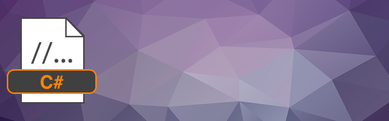

# C#

This C# SDK is used in the .NET environment, including Common Language Runtime (CLR). It is frequently used in cross-platform iOS and Android app titles created using the free, open-source Xamarin platform. This SDK is also used in games and apps coded in native C# for the Windows platform.

If you have questions about the SDK or need help in resolving issues, go to [PlayFab forums](https://community.playfab.com/index.html) > **API and SDK**.

## Download links

- [C# PlayFab SDK GitHub repo](https://github.com/PlayFab/CSharpSDK)
- [NuGet package for C# PlayFab SDK](https://www.nuget.org/packages/PlayFabAllSDK/)
- [Quick download link for C# PlayFab SDK](https://aka.ms/playfabCsharpsdkdownload)

This SDK is auto-generated using our open-sourced tool&mdash;[SDKGenerator](../sdkgenerator/index.md). We generally build SDKs every other week to stay current with the latest API changes.

## Key components in this SDK

This C# PlayFab SDK package consists of three different API combinations.

1. PlayFabClientSDK - Contains only client libraries. This is designed for integration on your game client.
2. PlayFabServerSDK - Contains only server and admin APIs. This is designed for integration on your custom logic server or build process
3. PlayFabSDK - Contains all APIs in one SDK (client, server, and admin), as well as, a unit-test project.

## When not to use this SDK

The C# PlayFab SDK should not be used if there is a more specific SDK that is suited for your project.

Specific PlayFab SDK is available for:
* [Unity PlayFab SDK GitHub repo](https://github.com/PlayFab/UnitySDK)

For a full list of the different PlayFab SDKs, see [Azure PlayFab SDK](../playfab-sdk-intro.md).

## Using the SDK

This native C# project can be used in these two ways.

- Admin tools for maintaining your game
  - Usually, you will want to make synchronous calls back-to-back.
  - Each API call will lock the program while it's executing, but that's not an issue for this type of program.
  - See the comment about `loginTask.Wait()` in the example code below. This is how you'll usually make API calls.

- An actual game coded in native C#
  - You need to take advantage of the async nature of API calls, and the C# async/await feature keywords. For more information about asynchronous programming, see [Asynchronous Programming with async and await (C#)](/dotnet/csharp/async).

## Add SDK to your project

- [Quickstart to add C# client SDK](quickstart.md)

Alternatively, you can install the NuGet package into your Visual Studio project using the NuGet Package Manager. For instructions, see [Install and use a package in Visual Studio](/nuget/quickstart/install-and-use-a-package-in-visual-studio). For more information, see [Getting started with NuGet](/nuget/what-is-nuget).
