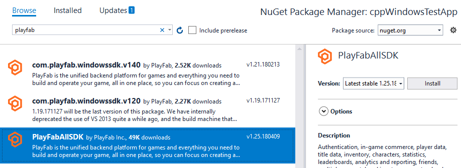

# Quickstart - PlayFab Client library for C# and Xamarin

Get started with the PlayFab Client library for C# and Xamarin. Follow steps to install the package and try out example code for a basic task.

This quickstart helps you make your first PlayFab API call in the using the Client library for C# and Xamarin.

[API reference documentation](../../api-references/index.md) 

## Requirements

- A [PlayFab developer account](https://developer.playfab.com/en-us/sign-up).  
- An installation of [Visual Studio](https://visualstudio.microsoft.com/).

## Xamarin project setup

1. Open Visual Studio and Select **Create a new project**.
2. Select **Mobile App (Xamarin.Forms)** and then select **Next**.
3. Name your app GettingStartedXamarin and select **Create**.
4. For this quickstart uncheck **Android** and **iOs**, then check **Windows (UWP)"
3. Install NuGet package for **PlayFabAllSDK**.

  
  
## Set up your first API call

This guide provides the minimum steps to make your first PlayFab API call, without any GUI or on-screen feedback. Confirmation will be done with an on-screen text widget.

1. In the Visual Studio  **Solution Explorer**, open the **GettingStartedXamarin > App.xaml > App.xaml.cs** file.
2. Replace the contents of App.xaml.cs with following sample code:

```csharp
using System;
using System.Threading.Tasks;
using PlayFab;
using PlayFab.ClientModels;
using Xamarin.Forms;

namespace App2
{
    public partial class GettingStartedXamarin : Application
    {
        private readonly Label _myLabel;
        private string _myLabelText = "Logging into PlayFab...";

        public App()
        {
            _myLabel = new Label { HorizontalTextAlignment = TextAlignment.Center, Text = _myLabelText };

            // The root page of your application
            MainPage = new ContentPage
            {
                Content = new StackLayout { VerticalOptions = LayoutOptions.Center, Children = { _myLabel } }
            };

            LogIntoPlayFab();
            Device.StartTimer(TimeSpan.FromMilliseconds(16), Tick);
        }

        private bool Tick()
        {
            lock (_myLabelText)
            {
                _myLabel.Text = _myLabelText;
            }
            return true;
        }

        private void LogIntoPlayFab()
        {
            PlayFabSettings.staticSettings.TitleId = "";
            var request = new LoginWithCustomIDRequest { CustomId = "GettingStartedGuide", CreateAccount = true };
            var loginTask = PlayFabClientAPI.LoginWithCustomIDAsync(request);
            loginTask.ContinueWith(OnLoginComplete);
        }

        private void OnLoginComplete(Task<PlayFabResult<LoginResult>> task)
        {
            var newLabel = "Unknown failure";
            if (task.Result.Result != null)
            {
                newLabel = "Congratulations, you made your first successful API call!";
            }
            if (task.Result.Error != null)
            {
                newLabel = "Something went wrong with your first API call.\n"
                    + "Here's some debug information:\n"
                    + task.Result.Error.GenerateErrorReport();
            }
            lock (_myLabelText)
            {
                _myLabelText = newLabel;
            }
        }
    }
}

```

## Finish and execute

1. To run the project, select **Debug** and then select **Start Debugging**.

> [!NOTE]
> The first time you run a UWP program, it can take a long time to load.

2. When the project loads, you'll see the following text:

    "Congratulations, you made your first successful API call!"

At this point, you can start making other API calls, and building your title.

For a list of all available client API calls, see [PlayFab API References](../../api-references/index.md).
