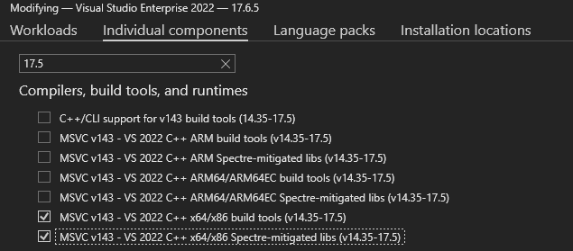

# Quickstart: Win32

Get started with the PlayFab Services SDK for Win32. Follow these steps to include the libraries in your project and try out the sample code for basic PlayFab functionality.

This quickstart helps you make your first PlayFab API call using the Win32 SDK. Before continuing, make sure you've completed the steps in [Quickstart: Game Manager](../../gamemanager/quickstart.md), which ensure you have a PlayFab account and are familiar with the PlayFab Game Manager.

## Requirements

- A [PlayFab developer account](https://developer.playfab.com).  
- [Visual Studio 2022](https://visualstudio.microsoft.com/) installed.

## Project setup

Download the PlayFab SDK to your project from the [PlayFab SDK Release Page](https://github.com/PlayFab/PlayFabCSdk/releases/latest).

Import PlayFabServicesSDK.Win32.props to your project. You can do this manually in the project file or by opening the Property Manager window in Visual Studio, right clicking on the project, and choosing __Add Existing Property Sheet__.

### Troubleshooting

If you have issues linking the SDK in your project, you may need to install 17.5 build tools and libs via the Visual Studio Installer. Click __Modify__ for VS2022, and install these two components.



## Init and Logging in

### Headers

Include __PFServices.h__ to get access to all included PlayFab functionality:

```cpp
#include <playfab/services/PFServices.h>
```

### Initialization

PlayFab initialization requires two function calls: __PFServicesInitialize__ and __PFServiceConfigCreateHandle__. The result of this initialization is a __PFServiceConfigHandle__. You provide this handle to a subsequent login call, directing the call to the correct title in the PlayFab backend.

```cpp
    HRESULT hr = PFServicesInitialize(nullptr); // Add your own error handling when FAILED(hr) == true

    PFServiceConfigHandle serviceConfigHandle{ nullptr };

    hr = PFServiceConfigCreateHandle(
            "https://ABCDEF.playfabapi.com",    // PlayFab API endpoint - obtained in the Game Manager
            "ABCDEF",                           // PlayFab Title id - obtained in the Game Manager
            &serviceConfigHandle);
```

### Logging in

Once you have a __PFServiceConfigHandle__, you can use it to make a player login call. In the SDK, use a __PFAuthenticationReLoginWith\*Async__ method like __PFAuthenticationLoginWithSteamAsync__. This function allows you to log in a player to PlayFab using a __SteamTicket__.

After making a login call, you can check the status of the call with __XAsyncGetStatus__. The status starts as __E_PENDING__ and changes to __S_OK__ after the call completes successfully. If the call fails for some reason, the status reflects that failure. Error handling on all PlayFab Services calls works this way.

Along with an __S_OK__ result, you get back a __PFEntityHandle__. You use this handle to make subsequent PlayFab calls as the logged in player. It includes any material required to authenticate with the PlayFab service as that player.

```cpp
    PFAuthenticationLoginWithSteamRequest request{};
    request.createAccount = true;
    request.steamTicket = steamTicket; // A ticket obtained from Steam

    XAsyncBlock async{};
    HRESULT hr = PFAuthenticationLoginWithSteamAsync(serviceConfigHandle, &request, &async); // Add your own error handling when FAILED(hr) == true
    hr = XAsyncGetStatus(&async, true); // This is doing a blocking wait for completion, but you can use the XAsyncBlock to set a callback instead for async style usage

    std::vector<char> loginResultBuffer;
    PFAuthenticationLoginResult const* loginResult;
    size_t bufferSize;
    hr = PFAuthenticationLoginWithSteamGetResultSize(&async, &bufferSize);
    loginResultBuffer.resize(bufferSize);

    PFEntityHandle entityHandle{ nullptr };
    hr = PFAuthenticationLoginWithSteamGetResult(&async, &entityHandle, loginResultBuffer.size(), loginResultBuffer.data(), &loginResult, nullptr);
```

## Service Calls

After logging the player in, you can now make calls to the PlayFab backend. Here's an example of a call to get files stored in PlayFab for the current player.

### Getting the EntityKey

One thing that can be useful for some calls to PlayFab is knowing the __PFEntityKey__ of the player. Once you have a __PFEntityToken__, you can retrieve a __PFEntityKey__ with __PFEntityGetEntityKey__.

```cpp
    PFEntityKey const* pEntityKey{};
    std::vector<char> entityKeyBuffer;
    size_t size{};
    HRESULT hr = PFEntityGetEntityKeySize(entityHandle, &size); // Add your own error handling when FAILED(hr) == true

    entityKeyBuffer.resize(size);
    hr = PFEntityGetEntityKey(entityHandle, entityKeyBuffer.size(), entityKeyBuffer.data(), &pEntityKey, nullptr);
```

### Calling GetFiles

All PlayFab calls follow a similar pattern of preparing the request object, making the call (using the __PFEntityHandle__ from login), creating an object to receive the response, and then calling a __GetResult__ function to fill the newly created container. 

```cpp
    XAsyncBlock async{};
    PFDataGetFilesRequest requestFiles{};
    requestFiles.entity = pEntityKey;

    HRESULT hr = PFDataGetFilesAsync(entityHandle, &requestFiles, &async); // Add your own error handling when FAILED(hr) == true
    hr = XAsyncGetStatus(&async, true); // This is doing a blocking wait for completion, but you can use the XAsyncBlock to set a callback instead for async style usage

    size_t resultSize;
    hr = PFDataGetFilesGetResultSize(&async, &resultSize);

    std::vector<char> getFilesResultBuffer(resultSize);
    PFDataGetFilesResponse* getFilesResponseResult{ nullptr };
    hr = PFDataGetFilesGetResult(&async, getFilesResultBuffer.size(), getFilesResultBuffer.data(), &getFilesResponseResult, nullptr);
```

## Clean up

When your game is ready to shut down or you need to clean up PlayFab for some other reason, ensure you close all open handles and call __PFServicesUninitializeAsync__.

```cpp
    PFEntityCloseHandle(entityHandle);
    entityHandle = nullptr;

    PFServiceConfigCloseHandle(serviceConfigHandle);
    serviceConfigHandle = nullptr;

    XAsyncBlock async{};
    HRESULT hr = PFServicesUninitializeAsync(&async); // Add your own error handling when FAILED(hr) == true
    hr = XAsyncGetStatus(&async, true); // This is doing a blocking wait for completion, but you can use the XAsyncBlock to set a callback instead for async style usage
```

## Async API pattern

The PlayFab Services SDK follows the [Asynchronous Programming Model](/gaming/gdk/_content/gc/system/overviews/async-programming-model) implemented in the GDK. This programming model involves the use of Tasks and Task Queues provided by the [XAsync library](/gaming/gdk/_content/gc/system/overviews/async-libraries/async-library-xasync). This model is consistent with other GDK functions and extensions (such as the Xbox Services API). While it does introduce some complexity, it also brings a high degree of control over asynchronous operations.

This example shows how to make an asynchronous call to __PFDataGetFilesAsync__.

```cpp
    auto async = std::make_unique<XAsyncBlock>();
    async->callback = [](XAsyncBlock* async)
    {
        std::unique_ptr<XAsyncBlock> asyncBlockPtr{ async }; // take ownership of XAsyncBlock

        size_t resultSize;
        HRESULT hr = PFDataGetFilesGetResultSize(async, &resultSize);
        if (SUCCEEDED(hr))
        {
            std::vector<char> getFilesResultBuffer(resultSize);
            PFDataGetFilesResponse* getFilesResponseResult{ nullptr };
            PFDataGetFilesGetResult(async, getFilesResultBuffer.size(), getFilesResultBuffer.data(), &getFilesResponseResult, nullptr);
        }
    };

    PFDataGetFilesRequest requestFiles{};
    requestFiles.entity = m_pEntityKey;
    HRESULT hr = PFDataGetFilesAsync(m_entityHandle, &requestFiles, async.get());
    if (SUCCEEDED(hr))
    {
        async.release(); // at this point, the callback will be called so release the unique ptr
    }

```

## Error handling

Completed **XAsync** operations return HTTP status codes. An error status code manifests as a failure **HRESULT** such as **HTTP_E_STATUS_NOT_FOUND** when calling **XAsyncGetStatus()** or one of the **PF*Get()** APIs.

To see detailed error messages returned by the service see the next section on debugging. These detailed error messages can be useful during development to better understand how the PlayFab service reacts to requests from the client.

## Debugging

The easiest way to see the results and debug any calls in the PlayFab Services SDK is to enable [Debug Tracing](./tracing.md). Enabling debug tracing allows you to both see the results in the debugger output window and hook the results into your game's own logs.

## Reference

[API reference documentation](../../api-references/c/pfauthentication/pfauthentication_members.md)
