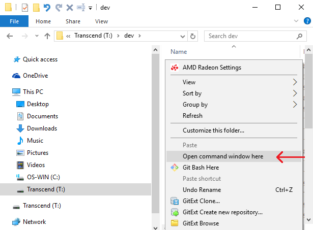
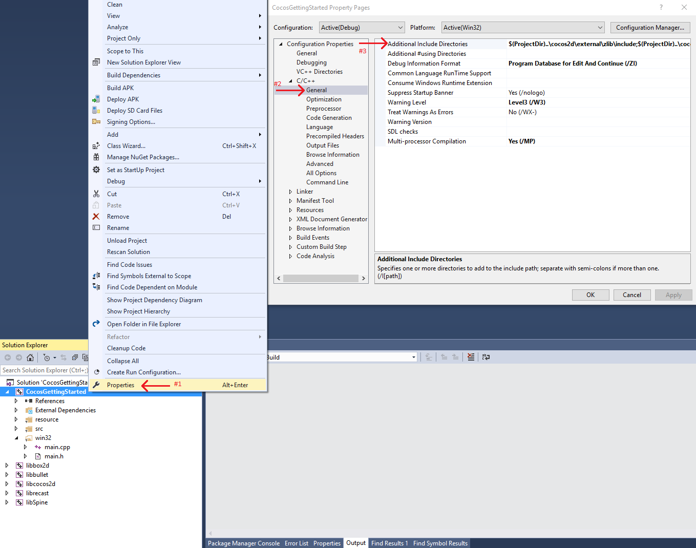

# Cocos2D-x quickstart

This quickstart assists you in making your first PlayFab API call in the Cocos2d-x engine.

Before you can call any PlayFab API, you must have a [PlayFab developer account](https://developer.playfab.com/en-us/sign-up). 

## Cocos2d-x project setup

OS: This guide is written for Windows 10, using Visual Studio 2015. Cocos works on most modern OSs and environments. The installation instructions are similar, but different for each combination.

If you are building for other platforms, the files you need are the same, but you will need to do the project setup yourself. Visual Studio 2013 will have identical steps, but the screenshots provided here will look a bit different from yours.

1. Download and install Cocos2d-x
    - [https://www.cocos2d-x.org/download](https://www.cocos2d-x.org/download)
    - Setting up Cocos2d-x requires some familiarity. Check out their docs site:
      - [https://docs.cocos2d-x.org/cocos2d-x/en/en/](https://docs.cocos2d-x.org/cocos2d-x/v3/en/)
      - Note the [Cocos Prerequisites](https://docs.cocos2d-x.org/cocos2d-x/v3/en/installation/prerequisites.html)
      - Visual Studio 2013 or 2015 are also required.

2. Once you have Cocos2d-x configured, create a project using the Cocos CLI:
    - Navigate to a location where you wish to store your Cocos project
    - Open a command window in your parent folder (Cocos CLI will create the actual project directory)
      - Hold down your **Shift** key, and right-click in the empty white space of the Explorer window.

        

    - In the new console window enter this command:
      - `cocos new CocosGettingStarted -l cpp`
        - Make sure your target sub-directory (**CocosGettingStarted**) does not already exist - This command will fail if the folder already exists.
        - If you get a message that "'cocos' is not recognized as an internal or external command", you have not configured the cocos installation correctly (Go back to the Cocos windows installation guide).
        - If successful, there will be a new folder **CocosGettingStarted**. This guide will refer to that directory location as `{CocosGettingStarted}`.

    - Successful output should appear similar to the example provided below.

```output
> Copy template into C:\dev\CocosGettingStarted
> Copying Cocos2d-x files...
> Rename project name from 'HelloCpp' to 'CocosGettingStarted'
> Replace the project name from 'HelloCpp' to 'CocosGettingStarted'
> Replace the project package name from 'org.cocos2dx.hellocpp' to 'org.cocos2dx.CocosGettingStarted'
> Replace the Mac bundle id from 'org.cocos2dx.hellocpp' to 'org.cocos2dx.CocosGettingStarted'
> Replace the iOS bundle id from 'org.cocos2dx.hellocpp' to 'org.cocos2dx.CocosGettingStarted'
```

3. Download PlayFab Cocos2d-xSdk: [Cocos2D-x SDK (C++)](https://aka.ms/playfabCsharpsdkdownload). Save and extract it to a temporary location {PlayFabCocos}
    - Open the following folder in Windows Explorer: {PlayFabCocos}/PlayFabClientSDK
    - Open the following folder in a second Windows Explorer: {CocosGettingStarted}/Classes

4. Copy paste all files from {PlayFabCocos}/PlayFabClientSDK to {CocosGettingStarted}/Classes

5. In Visual Studio, Load `{CocosGettingStarted}/proj.win32/CocosGettingStarted.sln`.

6. We want to add the PlayFab files to the Cocos project.

7. In Visual Studio, Solution Explorer panel, expand to the folder: Solution/CocosGettingStarted/src

8. Open a Windows Explorer window at {CocosGettingStarted}/Classes

    - Select all files in {CocosGettingStarted}/Classes, EXCEPT AppDelegate.h, AppDelegate.cpp, HelloWorldScene.h, HelloWorldScene.cpp

    - Drag and drop all of those files from Explorer, onto the Visual Studio Solution/CocosGettingStarted/src folder we found above. If you experience problems, you can drag and drop each file one at a time, *just be careful and get all of them*.

    - You should see these files in your VS project:

      

PlayFab uses several Cocos libraries that have to be manually added to the dependencies list.

  - Open the **Properties** window for your CocosGettingStarted project (as shown below).

    

  - Replace the Additional Include Directories with this:

      `$(ProjectDir)..\cocos2d\external\zlib\include;$(ProjectDir)..\cocos2d\external\curl\include\win32;$(EngineRoot)cocos\audio\include;$(EngineRoot)external;$(EngineRoot)external\chipmunk\include\chipmunk;$(EngineRoot)extensions;..\Classes;..;%(AdditionalIncludeDirectories);$(_COCOS_HEADER_WIN32_BEGIN);$(_COCOS_HEADER_WIN32_END);..\cocos2d`

> [!NOTE]
> We are adding curl and zlib, which are libraries that come with Cocos, but are not enabled by default.

Your CocosGettingStarted project should now compile (and even run), but we are not yet making any PlayFab API calls.

Installation complete!

## Set up your first API call
  
This guide provides the minimum steps to make your first PlayFab API call. Confirmation is visible in the app.

1. In Visual Studio, inside of the Solution/CocosGettingStarted/src folder, Open HelloWorldScene.h and replace the contents with this:
    - In Visual Studio, inside of the **Solution/CocosGettingStarted/src** folder, Open `HelloWorldScene.h` and replace the contents with those shown below.

```cpp
#ifndef __HELLOWORLD_SCENE_H__
#define __HELLOWORLD_SCENE_H__

#include "cocos2d.h"
#include "PlayFabClientDataModels.h"
#include "PlayFabError.h"

class HelloWorld : public cocos2d::Layer
{
public:
    static std::string statusMsg;
    static cocos2d::Scene* createScene();
    static cocos2d::Label* testReportLabel;
    virtual bool init();
    void update(float) override;
    void menuCloseCallback(cocos2d::Ref* pSender);
    CREATE_FUNC(HelloWorld);

    static void HelloWorld::OnLoginSuccess(const PlayFab::ClientModels::LoginResult& result, void* customData);
    static void HelloWorld::OnLoginFail(const PlayFab::PlayFabError& error, void* customData);
};

#endif // __HELLOWORLD_SCENE_H__
```

2. Immediately next to that, open `HelloWorldScene.cpp`, and replace the contents with this:

```cpp
#include "HelloWorldScene.h"
#include "PlayFabClientAPI.h"
#include <PlayFabSettings.h>

USING_NS_CC;

std::string HelloWorld::statusMsg;
cocos2d::Label* HelloWorld::testReportLabel;

Scene* HelloWorld::createScene()
{
    auto scene = Scene::create(); // 'scene' is an autorelease object
    auto layer = HelloWorld::create(); // 'layer' is an autorelease object
    scene->addChild(layer); // add layer as a child to scene
    return scene; // return the scene
}

bool HelloWorld::init()
{
    if (!Layer::init())
        return false;

    Size visibleSize = Director::getInstance()->getVisibleSize();
    Vec2 origin = Director::getInstance()->getVisibleOrigin();

    auto closeItem = MenuItemImage::create("CloseNormal.png", "CloseSelected.png", CC_CALLBACK_1(HelloWorld::menuCloseCallback, this));
    closeItem->setPosition(Vec2(origin.x + visibleSize.width - closeItem->getContentSize().width / 2, origin.y + closeItem->getContentSize().height / 2));

    auto menu = Menu::create(closeItem, NULL);
    menu->setPosition(Vec2::ZERO);
    this->addChild(menu, 1);
    this->scheduleUpdate();

    testReportLabel = Label::createWithTTF("", "fonts/Marker Felt.ttf", 14);
    this->addChild(testReportLabel, 1);

    statusMsg = "Login pending...";
    PlayFab::PlayFabSettings::titleId = "144";
    PlayFab::ClientModels::LoginWithCustomIDRequest request;
    request.CustomId = "GettingStartedGuide";
    request.CreateAccount = true;
    PlayFab::PlayFabClientAPI::LoginWithCustomID(request, OnLoginSuccess, OnLoginFail, nullptr);

    return true;
}

void HelloWorld::menuCloseCallback(Ref* pSender)
{
    Director::getInstance()->end();
#if (CC_TARGET_PLATFORM == CC_PLATFORM_IOS)
    exit(0);
#endif
}

void HelloWorld::update(float delta)
{
    Size visibleSize = Director::getInstance()->getVisibleSize();
    Vec2 origin = Director::getInstance()->getVisibleOrigin();

    testReportLabel->setPosition(Vec2(origin.x + visibleSize.width / 2, origin.y + visibleSize.height / 2));
    testReportLabel->setString(statusMsg);
}

void HelloWorld::OnLoginSuccess(const PlayFab::ClientModels::LoginResult& result, void* customData)
{
    statusMsg = "Congratulations, you made your first successful API call!";
}


void HelloWorld::OnLoginFail(const PlayFab::PlayFabError& error, void* customData)
{
    statusMsg = "Something went wrong with your first API call.\n";
    statusMsg += "Here's some debug information:\n";
    statusMsg += error.GenerateErrorReport();
}
```

These files take the existing HelloWorldScene that is part of the new-Cocos-project template, and modify them to include your first PlayFab API call.

## Finish and execute

1. Build and Execute your Cocos Project: Dropdowns -> Debug -> Start Debugging.
2. This may prompt you to build. Select **Yes**.

3. You should see a screen that says:

    **Congratulations, you made your first successful API call!**

4. Now, you can start making other api calls, and building your game.  
For a list of all available client API calls, see our [PlayFab API References](../../api-references/index.md) documentation.
  
Happy coding!

## Deconstruct the code

This optional last section describes each part of source code above, in detail.

- `HelloWorldScene.h`
  - This is only trivially modified from the default `HelloWorldScene.h` generated by Cocos.
  - Specifically, it defines some Cocos GUI we are using, and the prototype for `OnLoginSuccess` and `OnLoginFail`.
  - Everything else is just standard Cocos Engine functions.

- `HelloWorldScene.cpp`
  - `createScene()` is a standard Cocos Engine function.
  - `init()`
    - Normal Cocos Gui stuff: `closeItem` and `testReportLabel`.
    - `PlayFab::PlayFabSettings::titleId = "xxxx";`
      - Every PlayFab developer creates a title in Game Manager. When you publish your game, you must code that titleId into your game. This lets the client know how to access the correct data within PlayFab. For most users, just consider it a mandatory step that makes PlayFab work.

    - `PlayFab::ClientModels::LoginWithCustomIDRequest request;`
      - Most PlayFab API methods require input parameters, and those input parameters are packed into a request object.
      - Every API method requires a unique request object, with a mix of optional and mandatory parameters.
        - For `LoginWithCustomIDRequest`, there is a mandatory parameter of `CustomId`, which uniquely identifies a player and `CreateAccount`, which allows the creation of a new account with this call.
      - For login, most developers will want to use a more appropriate login method.
        - See the PlayFab Login documentation for a list of all login methods, and input parameters. Common choices are:
          - `LoginWithAndroidDeviceID`
          - `LoginWithIOSDeviceID`
          - `LoginWithEmailAddress`

    - `PlayFab::PlayFabClientAPI::LoginWithCustomID(request, OnLoginSuccess, OnLoginFail, nullptr);`
      - This begins the async request to `LoginWithCustomID`, and will invoke the `OnLoginSuccess` or `OnLoginFail` function when complete.

  - `update(float delta)`
    - Simply setting the `statusMsg` variable does not update the on-screen text.
    - This function sets the GUI text to match the contents of `statusMsg` every tick (not very efficient).

  - `OnLoginSuccess(result, customData)`
    - When the success callback is called, the result object of many API callbacks will contain the requested information.
    - `LoginResult` contains some basic information about the player, but for most users, login is simply a mandatory step before calling other APIs.

  - `OnLoginFail(error, customData)`
    - If the error-function is called, your API call has failed.
    - API calls can fail for many reasons, and you should always attempt to handle failure.
    - Why API calls fail (In order of likelihood)
      - `PlayFabSettings.TitleId` is not set. If you forget to set titleId to your title, then nothing will work.
        - In Cocos, the curl library will probably just crash your game if you fail to set titleId correctly.
      - Request parameters. If you have not provided the correct or required information for a particular API call, then it will fail. See `error.errorMessage`, `error.errorDetails`, or `error.GenerateErrorReport()` for more info.
      - Device connectivity issue. Cell phones lose/regain connectivity constantly, and so any API call at any time can fail randomly, and then work immediately after. Going into a tunnel can disconnect you completely.
      - PlayFab server issue. As with all software, there can be issues. See our release notes for updates.
      - The internet is not 100% reliable. Sometimes the message is corrupted or fails to reach the PlayFab server.
    - If you are having difficulty debugging an issue, and the information within the error callback is not sufficient, please visit us on our forums.

  - customData is a void-pointer which can be used in any way to establish context.
    - In C++, it is harder to maintain the context of an API call, so we added the `customData` parameter, which can relay any object to the callback, which can be used however you like to establish context.
    - Thus, if you make API calls to retrieve inventory, you can pass a player, or inventory pointer as `customData`, and update the inventory on that object, in the callback.
