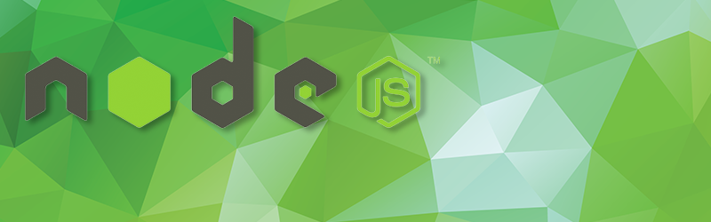

# NodeJS

Our Node.js SDK provides everything you need to access the PlayFab API. This includes models, methods, an HTTP wrapper for sending and receiving web requests, and JSON serialization.

This SDK is auto-generated using our open-sourced tool&mdash;[SDKGenerator](../sdkgenerator/index.md). We generally build SDKs every other week to stay current with the latest API changes.

This SDK can also be obtained via the `npm install playfab-sdk` command.

## Download links

- [NodeJS PlayFab SDK GitHub repo](https://github.com/PlayFab/NodeSDK)
- [Quick download link for NodeJS PlayFab SDK](https://aka.ms/playfabnodejssdkdownload)
- [Install via NPM](https://www.npmjs.com/package/playfab-sdk): `npm install playfab-sdk`

## Licenses

- [Node Unit license](nodeunit-license.md)