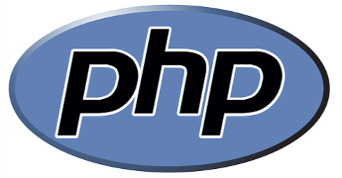

# PHP

PHP is a popular general-purpose scripting language that works particularly well for server-side web development. Our PHP SDK provides everything you need to access the PlayFab API. 

For a list of prerequisites, and instructions on how to set up a project using the PlayFab PHP SDK, see the [PHP quickstart](quickstart.md).

This SDK was auto-generated by our [SDKGenerator](../sdkgenerator/index.md). We generally build SDKs weekly, to remain current with the latest API changes.

Download Links:

- [Download Source Code](https://github.com/PlayFab/PhpSdk)