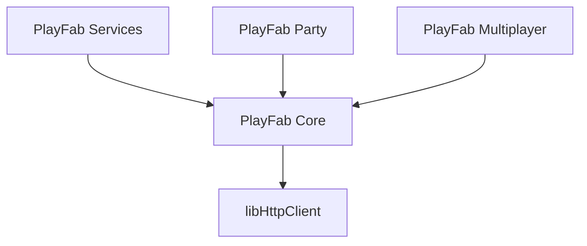

# PlayFabSDK (Public Preview)

The PlayFab SDK has been redesigned to provide improved end-to-end interoperability and a uniform integration pattern across components to simplify client integration work.

The release of the standalone [PlayFab Services C/C++ SDK](https://learn.microsoft.com/en-us/gaming/playfab/sdks/c/) in 2023
began PlayFab's move towards a modern SDK experience; providing a new authentication system with automatic token refresh,
memory allocation management, and thread handling control. However, current standalone SDKs, such as PlayFab Party and PlayFab
Multiplayer, don't integrate smoothly with the new SDK patterns.

The new PlayFab SDK builds upon the foundation of our standalone SDKs, enhancing and unifying them to streamline integration,
provide a uniform, modern SDK experience, and improve interoperability across different components.

Once this SDK reaches general availability, we will continue
supporting titles that have adopted our standalone SDKs, but all new investments will build on the unified SDK and we
will recommend that all new titles choose the unified SDK or the specific components within that apply to their project.

> [!WARNING]
> Access to public preview functionality is provided for prerelease integration, testing, and feedback only. While we will support development efforts through all existing support channels and programs, releasing a title that uses this SDK is not recommended or supported until we reach general availabilty. Such release is currently scheduled for the second half of 2025, but subject to change at Microsoft's sole discretion.

## Supported platforms
- Windows, Xbox (GDK), Linux, macOS, iOS, Android - [Releases](https://github.com/PlayFab/PlayFabSDK/releases)

#### NDA-required repos - [More information](https://learn.microsoft.com/en-us/gaming/playfab/features/multiplayer/networking/request-access-for-sdks-samples)
- [PlayStation®4](https://dev.azure.com/PlayFabPrivate/PS4/_git/PlayFabSDK.PS4)
- [PlayStation®5](https://dev.azure.com/PlayFabPrivate/PS5/_git/PlayFabSDK.PS5)
- [Nintendo Switch](https://dev.azure.com/PlayFabPrivate/Switch/_git/PlayFabSDK.Switch)

“PlayStation” is a registered trademark or trademark of Sony Interactive Entertainment Inc.

## Supported engines
- Unreal
- Unity

## Packaging
The PlayFab SDK ships as a single archive (.zip) that contains the necessary headers and binaries for the
[libHttpClient](https://github.com/microsoft/libHttpClient),
[PlayFab Core and Services](https://learn.microsoft.com/en-us/gaming/playfab/sdks/playfab-sdk-intro),
[PlayFab Party](https://learn.microsoft.com/en-us/gaming/playfab/features/multiplayer/networking/party-sdks), and
[PlayFab Multiplayer](https://learn.microsoft.com/en-us/gaming/playfab/features/multiplayer/lobby/lobby-matchmaking-sdks/lobby-matchmaking-sdks)
C/C++ component libraries.

```
PlayFabSDK_<platform>.zip/
├── bin/
│   ├── libHttpClient.<dll|pdb|so|etc.>
│   ├── PlayFabServices.<dll|pdb|so|etc.>
│   ├── PlayFabCore.<dll|pdb|so|etc.>
│   ├── Party.<dll|pdb|so|etc.>
│   └── PlayFabMultiplayer.<dll|pdb|so|etc.>
└── include/
    ├── httpClient/
    ├── playfab/
    │   ├── core/
    │   ├── httpClient/
    │   ├── multiplayer/
    │   ├── party/
    │   └── services/
    ├── XAsync.h
    ├── XAsyncProvider.h
    └── XTaskQueue.h
```

## Component library integration
The PlayFab SDK is broken down into several component libraries with clearly defined dependencies so you can integrate just the components required for your title.

- ### [libHttpClient](https://github.com/microsoft/libHttpClient)
    - libHttpClient is an open-source, cross-platform HTTP/WebSocket abstraction intended for use with Xbox and PlayFab
    C/C++ SDKs. It primarily allows you to integrate platform-specific implementations for asynchronous APIs
    with thread-specific data return, controlled memory allocation, and retry mechanisms.
    - In the PlayFab SDK, libHttpClient is implemented as the underlying HTTP/WebSocket mechanisms for PlayFab Core,
    Services, and Multiplayer.
    - Titles are _required_ to integrate the libHttpClient component library as a dependency for other component libraries.
    - Titles can _optionally_ use libHttpClient's platform-abstracted
    [XTaskQueue](https://learn.microsoft.com/en-us/gaming/gdk/_content/gc/reference/system/xtaskqueue/xtaskqueue_members)
    implementation, for [dedicated control](https://learn.microsoft.com/en-us/gaming/gdk/_content/gc/system/overviews/async-libraries/async-library-xtaskqueue)
    over which threads work is done on, and how frequently that work is completed, regardless of target platform.
- ### [PlayFab Core](https://learn.microsoft.com/en-us/gaming/playfab/sdks/playfab-sdk-intro)
    - PlayFab Core is the base component library for all other PlayFab components. Titles are required to integrate PlayFab Core
    in order to use any PlayFab component libraries.
    - PlayFab Core offers public APIs for handling PlayFab login, authentication, entity management,
    service configuration, telemetry, logging, and error handling.
- ### [PlayFab Services](https://learn.microsoft.com/en-us/gaming/playfab/sdks/playfab-sdk-intro)
    - PlayFab Services provides all of the PlayFab features not explicitly called out in one of the other components,
    including LiveOps, economy, and progression.
- ### [PlayFab Party](https://learn.microsoft.com/en-us/gaming/playfab/features/multiplayer/networking/party-sdks)
    - PlayFab Party is a low-latency, cross-platform chat and data communications solution.
- ### [PlayFab Multiplayer](https://learn.microsoft.com/en-us/gaming/playfab/features/multiplayer/lobby/lobby-matchmaking-sdks/lobby-matchmaking-sdks)
    - PlayFab Multiplayer supports matchmaking for helping players find each other in a game and lobby services for creating temporary groups of players.

### Component library dependency graph


## Changes from standalone SDKs
The major changes included in the unified PlayFab SDK should be familiar to those already using the standalone [PlayFab Services C/C++ SDK](https://learn.microsoft.com/en-us/gaming/playfab/sdks/c/). The following material serves as a refernce to the changes first introduced there and as documentation for how these changes affect the other SDK components within the unified SDK, including Party and Multiplayer.

- ### [Authentication]()
- ### [Async model]()
- ### [Memory management]()
- ### [Tracing]()

## Release Versioning
Releases will be semantically versioned, starting with v2.0.0. All releases can be found in the [PlayFabSDK GitHub repo](https://github.com/PlayFab/PlayFabSDK/releases/).
