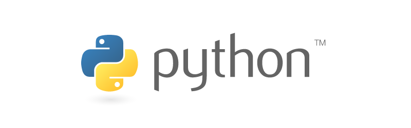

# Python

Python is a general purpose scripting language that is great for automation and server-side coding. Our Python SDK is compatible with Python 3, and provides everything you need to access the PlayFab API.

>[!NOTE]
> You will need Python 3 installed on your machine to use this SDK.

This SDK was auto-generated by our [SDKGenerator](../sdkgenerator/index.md). We generally build SDKs every week, to remain current with the latest API changes.

Download Links:

- [Download Source Code](https://github.com/PlayFab/PythonSdk)
- [Download PlayFab SDK](https://pypi.org/project/playfab/)