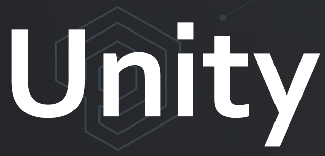

# Unity3D (C#)

Our Unity3d PlayFab SDK provides everything you need to access the PlayFab API. This includes models, methods, an HTTP wrapper for sending and receiving web requests, and JSON serialization.

This SDK is auto-generated using our open-sourced tool&mdash;[SDKGenerator](../sdkgenerator/index.md). We generally build SDKs every other week to stay current with the latest API changes.

Check out our [Editor Extensions](https://github.com/PlayFab/UnityEditorExtensions), for the easiest and fastest way to get started using PlayFab in Unity. This tool provides a UI for managing SDK settings, as well as an automatic SDK upgrade with the ability to stay current with the latest APIs.

PlayFab Party seamlessly integrate multiplayer networking and voice/text chat into Unity games. To get started, see [Party Unity Plugin](https://github.com/playfab/PlayFabPartyUnity). 

## Download links

- [Unity PlayFab SDK GitHub repo](https://github.com/PlayFab/UnitySDK)
- [Quick download link: Unity Editor Extensions for PlayFab SDK](https://aka.ms/PlayFabUnityEdEx)
- [Quick download link: Unity PlayFab SDK](https://aka.ms/playfabunitysdkdownload)

## Licenses

- [Unity3D licenses](license.md)