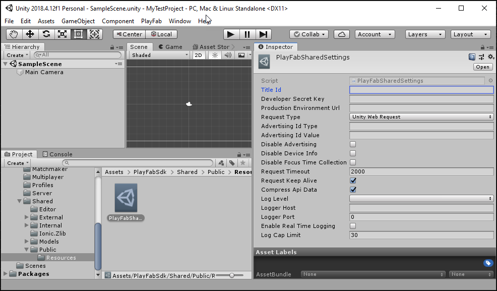

# Installing the PlayFab SDK for Unity

You have two options when installing the PlayFab Unity 3D SDK:

- Install the PlayFab Unity Editor Extensions Asset Package. Then use Editor Extension to install the PlayFab Unity 3D SDK and configure your Unity Project.

    PlayFab Editor Extensions is a stand-alone Unity plug-in that streamlines getting started with PlayFab.

    When a supported SDK is installed, additional service menus are available. These menus provide access to SDK configurations. These configuration settings are saved in a combination of places to ensure that the data persists throughout Unity compilations and deployments. For more information about the PlayFab Editor Extensions, see the readme in the [PlayFab/UnityEditorExtensions](https://github.com/PlayFab/UnityEditorExtensions/) GitHub repo.
- Install the PlayFab Unity 3D SDK directly without using PlayFab Unity Editor Extensions. When you use this installation method, you configure your Unity Project directly by setting properties property values in your code.

This content assumes you that you have a [PlayFab developer account](https://developer.playfab.com/en-us/sign-up) and an existing Unity Project.

## Install the PlayFab Unity Editor Extensions and the PlayFab SDK

1. Download the [PlayFab Unity Editor Extensions Asset Package](https://aka.ms/PlayFabUnityEdEx).
2. Open your Unity Project.
3. Navigate to where you downloaded the file and double-click on the `PlayFabEditorExtensions.UnityPackage` file to open the **Import Unity Package** dialog in the Unity Editor.

   
4. To import the PlayFab Unity Editor Extensions into your project, select **Import**.
5. When the import has completed, the PlayFab Unity Editor Extensions panel should open automatically. If you've already created a PlayFab developer account, select the **Log In** link to log in with your PlayFab username and password.

   
   > [!NOTE]
   > If the panel did not open, or if you close the panel and want to reopen it, you can do so by selecting **Window** > **PlayFab** > **Editor Extensions**
6. After logging in, the extension displays the SDK installation dialog.

   
7. Select **Install PlayFab SDK** to automatically import the SDK into your project or upgrade the version that is currently installed.

### Set your title settings

Before you can make an API call, you must specify the Title to receive the call in the PlayFab **Title Settings**. To set the Title:

1. Select **SET MY TITLE** in the **Editor Extensions**.

    
2. Select the **Studio** entry to open the studio drop-down menu. Select the studio that contains the Title to which you would like to connect.
3. Select the **Title ID** entry to open a drop-down menu of Titles associated with the selected studio.

    

## Download and install the SDK only

To install the SDK without using the PlayFab Unity Editor Extensions:

1. Open your Unity project.
2. Download the [PlayFab Unity3D SDK Asset Package](https://aka.ms/playfabunitysdkdownload) from the PlayFab GitHub repo.
3. Navigate to where you downloaded the file, and double-click on the .UnityPackage file to open the **Import Unity Package** dialog in the Unity Editor.
4. To import the PlayFab Unity3D SDK into your project, select **Import**.

### Setting the Title ID without using the editor extensions

To set the title:

1. In the Unity Editor Project panel select the **Assets** folder.
2. Open the **Assets** > **PlayFabSdk** > **Shared** > **Public** > **Resources** folder.
3. Select the PlayFabSettings Asset.
4. In the **Inspector** window, set the **Title ID** and the **Developer Secret Key**.

    

 > [!NOTE]
 > Refer to [Secret key Management](../../gamemanager/secret-key-management.md) to find your secret key, also called a developer key to your PlayFab Title.
