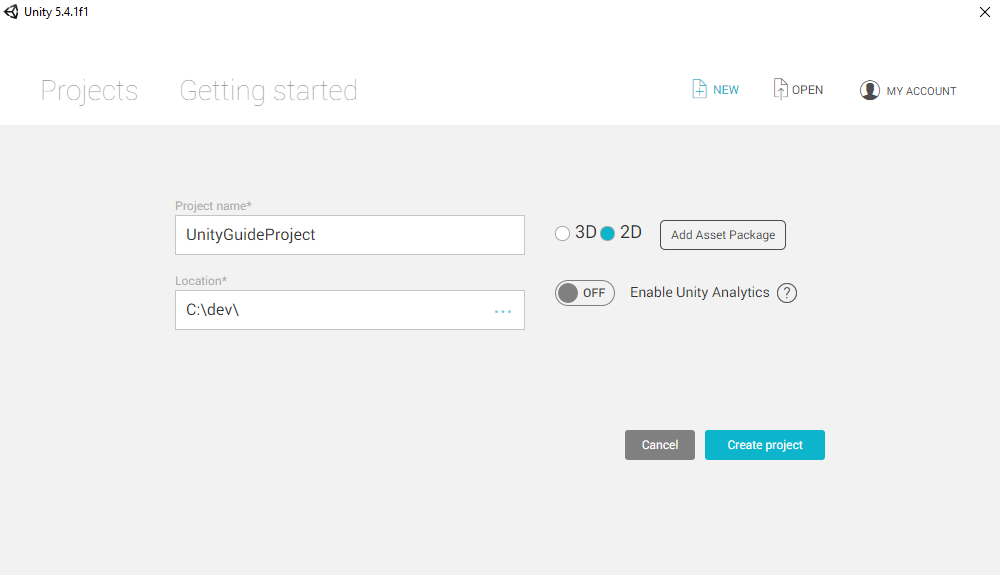
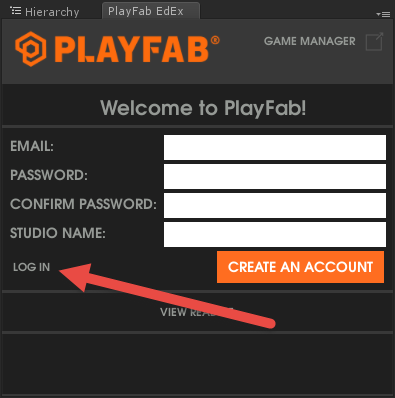
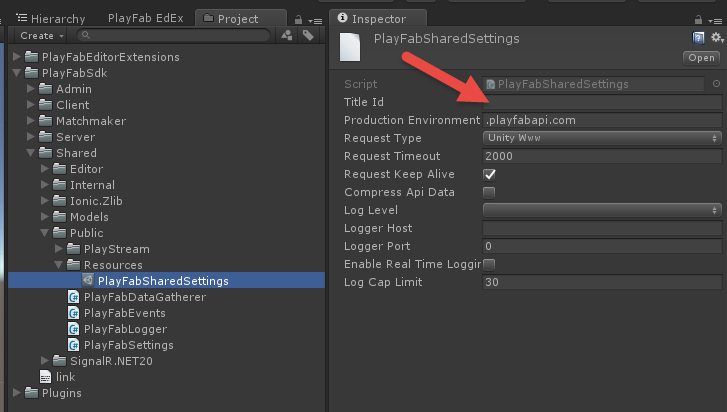
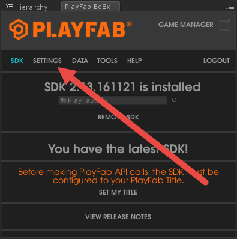
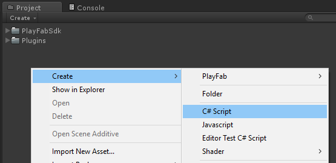

# Unity3D Quickstart

This guide will help you make your first PlayFab API call in the Unity3d engine.   

OS: This guide is written for Windows 10, however it should also work fine with a Mac.   

## Download Unity   
If you don't have unity installed, then you will need to install it and create a project.   

- Download Unity3D
  - [Download Unity](https://store.unity.com/download) 
  - We support all recent versions of Unity, some features work better with 5.3 or higher
  - Unity requires a license. Pick personal or professional based on your preferences
  - Keep going until you can start a new project 

 

  - Finish creating a new empty project with a name and location of your choice   


## Download PlayFab SDK   
The best way to acquire our Unity SDK is via our editor extensions. Although you can directly download the Unity SDK from our github page. [PlayFab UnitySDK Unity Package](https://api.playfab.com/sdks/download/unity-v2ap).   

- Download and Import the [PlayFab Unity Editor Extensions Package](https://github.com/PlayFab/UnityEditorExtensions/raw/master/Packages/PlayFabEditorExtensions.unitypackage)
  - To import the the Unity Editor Extensions package, navigate to where the file was downloaded and double click on the .UnityPackage file. This will bring up the following window.   

      

  - Click Import, which will import the PlayFab Unity Editor Extensions into your project.   

- Login or Register
  - Before you can download the SDK you must login with your PlayFab account. If you don't have one you can register or click the "log in" link to take you to the login pane and login with your PlayFab username or password.

     

  - Once you have registered & logged in, you will find yourself on this screen. Click Install PlayFab SDK and it will automatically import the SDK into your project.   
  
     

## Set Title Settings   

Now that you have installed the PlayFab SDK, you will need to set your title in Title Settings. If you are not using editor extensions you can do this directly in the PlayFab Settings Scriptable Object located in the following folder. 
 


Otherwise, you can easily set your Title settings in the Editor Extensions UI. Click on the settings tab in the Editor Extensions.   

    

Select your Studio and Title ID and click Save.   

    

## Making your first API Call   

Now that you have installed the SDK and set your Title settings, you are ready to make your first API call with the Unity SDK. This part of the guide will provide the minimum steps to make your first PlayFab API call, without any GUI or on-screen feedback. Confirmation will be done with the Console log.

- Find the Project panel
- Create a new C# script named "PlayFabLogin" 

 

- In Unity, Double click this file to open it in a code-editor
  - Depending on your settings/installed-programs, this will likely be Visual Studio or MonoDevelop   

- Next, Create a new GameObject, and attach this script (PlayFabLogin.cs) to the newly created GameObject
- Replace the contents of PlayFabLogin.cs with the following:

```csharp
using PlayFab;
using PlayFab.ClientModels;
using UnityEngine;

public class PlayFabLogin : MonoBehaviour
{
    public void Start()
    {
        //Note: Setting title Id here can be skipped if you have set the value in Editor Extensions already.
        if (string.IsNullOrEmpty(PlayFabSettings.TitleId)){
            PlayFabSettings.TitleId = "144"; // Please change this value to your own titleId from PlayFab Game Manager
        }
        var request = new LoginWithCustomIDRequest { CustomId = "GettingStartedGuide", CreateAccount = true};
        PlayFabClientAPI.LoginWithCustomID(request, OnLoginSuccess, OnLoginFailure);
    }

    private void OnLoginSuccess(LoginResult result)
    {
        Debug.Log("Congratulations, you made your first successful API call!");
    }

    private void OnLoginFailure(PlayFabError error)
    {
        Debug.LogWarning("Something went wrong with your first API call.  :(");
        Debug.LogError("Here's some debug information:");
        Debug.LogError(error.GenerateErrorReport());
    }
}
```   
> [!IMPORTANT]
> Please note that the above code is not for use with Mobile, this is an example only and shows how to login with a CustomID. Mobile games should use either
[LoginWithAndroidDeviceID](xref:titleid.playfabapi.com.client.authentication.loginwithandroiddeviceid), [LoginWithIOSDeviceID](xref:titleid.playfabapi.com.client.authentication.loginwithiosdeviceid) or some form of social login like [LoginWithFacebook](xref:titleid.playfabapi.com.client.authentication.loginwithfacebook).


## Finish and Execute
You are now ready to test out this sample.

- Be sure to Save all files, and return to the Unity Editor
- Press the Play button at the top of the editor   

Ideally, you should see the following in your Unity Console Panel.

  

Now you can start making other API calls and build your game.

For a list of all available client API Calls see our [PlayFab documentation](http://api.playfab.com/documentation).   

Happy Coding!

## Deconstruct the code   

This optional last section describes each part of PlayFabLogin.cs in detail.   

- There are 3 functions in PlayFabLogin
  - Start, OnLoginSuccess, OnLoginFailure
  - Start is a Unity function which is automatically called for every MonoBehaviour object
    - See the [Unity MonoBehaviour Guide](https://docs.unity3d.com/ScriptReference/MonoBehaviour.html) for more information   

Inside of Start():   

- PlayFabSettings.TitleId = "xxxx";
  - Every PlayFab developer creates a title in Game Manager. When you publish your game, you must code that titleId into your game. This lets the client know how to access the correct data within PlayFab. For most users, just consider it a mandatory step that makes PlayFab work.

- var request = new LoginWithCustomIDRequest { CustomId = "GettingStartedGuide", CreateAccount = true};
  - Most PlayFab API methods require input parameters, and those input parameters are packed into a request object
  - Every API method requires a unique request object, with a mix of optional and mandatory parameters
      - For LoginWithCustomIDRequest, there is a mandatory parameter of CustomId, which uniquely identifies a player and CreateAccount, which allows the creation of a new account with this call.   

  - For login, most developers will want to use a more appropriate login method
     - See the PlayFab Login Documentation for:
     - [LoginWithAndroidDeviceID](https://api.playfab.com/documentation/Client#Authentication)
     - [LoginWithIOSDeviceID](xref:titleid.playfabapi.com.client.authentication.loginwithiosdeviceid)
     - [LoginWithEmailAddress](xref:titleid.playfabapi.com.client.authentication.loginwithemailaddress)
     - [LoginWithFacebook](xref:titleid.playfabapi.com.client.authentication.loginwithfacebook)   

Inside of OnLoginSuccess:   

- The result object of many API success callbacks will contain the requested information
- LoginResult contains some basic information about the player, but for most users, login is simply a mandatory step before calling other APIs.   

Inside of OnLoginFailure:   

- API calls can fail for many reasons, and you should always attempt to handle failure
  - You can find error codes shared by all API methods in our [Global API Method Error Codes](../../features/config/dev-test-live/global-api-method-error-codes.md) tutorial, or specific codes at the bottom of each API method documentation

- Why API calls fail (In order of likelihood)
  - PlayFabSettings.TitleId is not set. If you forget to set titleId to your title, then nothing will work.
  - Request parameters. If you have not provided the correct or required information for a particular API call, then it will fail. See error.errorMessage, error.errorDetails, or error.GenerateErrorReport() for more info.
  - Device connectivity issue. Cell-phones lose/regain connectivity constantly, and so any API call at any time can fail randomly, and then work immediately after. Going into a tunnel can disconnect you completely.
  - The PlayFab Unity SDK currently expects API calls from the main Unity thread. Calling the SDK on a background thread will likely cause exceptions with coroutines and other Unity methods not being invoked on the main Unity thread.
  - PlayFab server issue. As with all software, there can be issues. See our [forums](https://community.playfab.com/index.html) to look for issue reports similar to yours, or post your own question. You can also review our [release notes](https://api.playfab.com/releaseNotes).   
