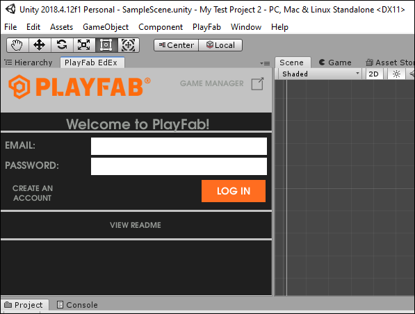

# Unity3D quickstart

This quickstart helps you make your first PlayFab API call in the Unity3d engine. Before continuing, make sure you have completed [Getting started for developers](../../personas/developer.md), which ensures you have a PlayFab account and are familiar with the PlayFab Game Manager.

## Requirements

- A [PlayFab developer account](https://developer.playfab.com/en-us/sign-up).
- An installed copy of the Unity Editor. For information on installing the Unity Editor, see [Installing Unity](https://docs.unity3d.com/Manual/GettingStartedInstallingUnity.html) in the Unity documentation. You can also install a version of the Unity using the Visual Studio feature installer.
  > [!NOTE]
  > The PlayFab Unity3D SDK supports Unity Editor version 5.3 and higher.
  >
- A Unity Project. For information on creating a Unity Project, see [Starting Unity for the first time](https://docs.unity3d.com/Manual/GettingStarted.html).
  > [!NOTE]
  > If you are unfamiliar with Unity, recent installation packages give you the option of installing game creation walkthroughs. You can use one of the walkthroughs to create a sample game to use in the following quickstart.
  >
- The PlayFab Unity3D SDK.

This guide is written for Windows 10, however it should also work well on the MacOS.

## Download PlayFab SDK

There are two ways to install the PlayFab Unity3D SDK:

- The preferred method is to install Unity SDK by using the Unity Editor extensions from within the Unity project window.
- You can also download the Unity 3D SDK from our GitHub page.

### Installing the Unity 3D SDK using the editor extensions

1. Download [PlayFab Unity Editor Extensions Asset Package](https://github.com/PlayFab/UnityEditorExtensions/raw/master/Packages/PlayFabEditorExtensions.unitypackage).
2. Sign in to the Unity Editor.
3. Navigate to where you downloaded the file, and double-click on the `.UnityPackage` file to open the **Import Unity Package** dialog in the Unity Editor.

   

4. To import the PlayFab Unity Editor Extensions into your project, select **Import**.
5. Select the **Log In** link to take you to the login pane and log in with your PlayFab username and password.  

     

   When you have logged in, your screen will change to the one shown in the following example.

   

6. Select **Install PlayFab SDK** to automatically import the SDK into your project or upgrade the version that is currently installed.

### Download and install the SDK only

1. Log in to the Unity editor and open your Unity project.
2. Download the [PlayFab Unity3D SDK Asset Package](https://api.playfab.com/downloads/unity-v2ap) from the PlayFab GitHub repo.
3. Navigate to where you downloaded the file, and double-click on the .UnityPackage file to open the **Import Unity Package** dialog in the Unity Editor.
4. To import the PlayFab Unity3D SDK into your project, select **Import**.

## Set your title settings

Before you can make an API call, you must specify the title to receive the call in the PlayFab **Title Settings**.

### Setting the title using the editor extensions

To set the title:

1. Select the **Settings** tab in the **Editor Extensions**. The **STUDIO** field displays your studio name. If you are a member of more than one studio you can select the field and then select the studio which contains your game from the drop-down menu.
2. The **Title ID** and **Developer Secret Key** are set automatically to the default title.

    

### Setting the Title ID without using the editor extensions

To set the title:

1. In the Unity Editor Project panel select the **Assets** folder.
2. Open the **Assets** > **PlayFabSdk** > **Shared** > **Public** > **Resources** folder.
3. Select the PlayFabSettings Asset.
4. In the **Inspector** window, set the **Title ID** and the **Developer Secret Key**.

    

## Making your first API call

This part of the guide provides the minimum steps to make your first PlayFab API call. This example does not provide any GUI or on-screen feedback. Confirmation is displayed in the Console log.

1. In the Unity Editor, on the Project panel left-click the **Assets** folder and select **Create**, then select **Folder**.
2. In the Assets window name the folder *scripts*.
3. Left-click the scripts folder and select **Create**, then select **C# Script**.
4. Name the script PlayFabLogin.
5. Double-click the file to open it in a code-editor.

    Depending on your settings/installed-programs, this will likely be Visual Studio or MonoDevelop.
6. In your code editor, replace the contents of `PlayFabLogin.cs` with the code shown below and save the file.

    ```csharp
    using PlayFab;
    using PlayFab.ClientModels;
    using UnityEngine;
    
    public class PlayFabLogin : MonoBehaviour
    {
        public void Start()
        {
            // Note: Setting title Id here can be skipped if you have set the value in Editor Extensions already.
            if (string.IsNullOrEmpty(PlayFabSettings.staticSettings.TitleId)){
                PlayFabSettings.staticSettings.TitleId = "144"; // Please change this value to your own titleId from PlayFab Game Manager
            }
            var request = new LoginWithCustomIDRequest { CustomId = "GettingStartedGuide", CreateAccount = true};
            PlayFabClientAPI.LoginWithCustomID(request, OnLoginSuccess, OnLoginFailure);
        }
    
        private void OnLoginSuccess(LoginResult result)
        {
            Debug.Log("Congratulations, you made your first successful API call!");
        }
    
        private void OnLoginFailure(PlayFabError error)
        {
            Debug.LogWarning("Something went wrong with your first API call.  :(");
            Debug.LogError("Here's some debug information:");
            Debug.LogError(error.GenerateErrorReport());
        }
    }
    ```
    > [!IMPORTANT]
    > The code shown above is not for use with Mobile. This is only an example, and shows how to log in with a CustomID. Mobile games should use either
    [LoginWithAndroidDeviceID](xref:titleid.playfabapi.com.client.authentication.loginwithandroiddeviceid), [LoginWithIOSDeviceID](xref:titleid.playfabapi.com.client.authentication.loginwithiosdeviceid), or some form of social login such as [LoginWithFacebook](xref:titleid.playfabapi.com.client.authentication.loginwithfacebook).

7. In the **Hierarchy** panel, select left-click your scene, then select **Game Object** > **Create Empty**.
8. Select the new Game Object and in the inspector window, select **Add Component**.
9. From the component drop-down menu, select **Scripts**, then from the **Scripts** panel select **Play Fab Login".

For more information on creating and using scripts in the Unity Editor, see [Creating and Using Scripts](https://docs.unity3d.com/Manual/CreatingAndUsingScripts.html) in the Unity documentation.

## Finish and execute

You are now ready to test out this sample.

- Be sure to save all files and return to the Unity Editor.
- Press the **Play** button at the top of the editor.

You should see the following in your Unity Console Panel.

  

> [!TIP]
>Alternatively, you can also log into the game in the PlayFab Game Manager, and select the **PlayStream Monitor** tab. Each time you **Alt+ TAB** focus away from the actively running Unity game, the game passes an event which you can see and confirm in the PlayStream Monitor.

For a list of all available client API calls, see our [PlayFab API References](../../api-references/index.md) documentation.

Happy Coding!

## Deconstruct the code

This optional last section describes each part of the code in PlayFabLogin.cs in detail.

- There are 3 functions in PlayFabLogin:

  - `Start`, `OnLoginSuccess`, `OnLoginFailure`
  - `Start` is a Unity function which is automatically called for every `MonoBehaviour` object.
    - See the [Unity MonoBehaviour Guide](https://docs.unity3d.com/ScriptReference/MonoBehaviour.html) for more information.

Inside of Start():

- `PlayFabSettings.staticSettings.TitleId = "xxxx"`;
  - Every PlayFab developer creates a title in Game Manager. When you publish your game, you must code that titleId into your game. This lets the client know how to access the correct data within PlayFab. For most users, just consider it a mandatory step that makes PlayFab work.

- `var request = new LoginWithCustomIDRequest { CustomId = "GettingStartedGuide", CreateAccount = true};`
  - Most PlayFab API methods require input parameters, and those input parameters are packed into a request object.
  - Every API method requires a unique request object, with a mix of optional and mandatory parameters.
    - For `LoginWithCustomIDRequest`, there is a mandatory parameter of `CustomId`, which uniquely identifies a player and `CreateAccount`, which allows the creation of a new account with this call.

  - For login, most developers will want to use a more appropriate login method.
    - See the PlayFab Login Documentation for:
    - [LoginWithAndroidDeviceID](xref:titleid.playfabapi.com.client.authentication.loginwithandroiddeviceid)
    - [LoginWithIOSDeviceID](xref:titleid.playfabapi.com.client.authentication.loginwithiosdeviceid)
    - [LoginWithEmailAddress](xref:titleid.playfabapi.com.client.authentication.loginwithemailaddress)
    - [LoginWithFacebook](xref:titleid.playfabapi.com.client.authentication.loginwithfacebook)

Inside of `OnLoginSuccess`

- The result object of many API success callbacks will contain the requested information.
- `LoginResult` contains some basic information about the player, but for most users, login is simply a mandatory step before calling other APIs.

Inside of OnLoginFailure

- API calls can fail for many reasons, and you should always attempt to handle failure.
  - You can find error codes shared by all API methods in our [Global API Method Error Codes](../../features/automation/cloudscript/global-api-method-error-codes.md) tutorial, or specific codes at the bottom of each API method documentation.

- Why API calls fail (In order of likelihood).
  - `PlayFabSettings.staticSettings.TitleId` is not set. If you forget to set titleId to your title, then nothing will work.
  - Request parameters. If you have not provided the correct or required information for a particular API call, then it will fail. See `error.errorMessage`, `error.errorDetails`, or `error.GenerateErrorReport()` for more info.
  - Device connectivity issue. Cell-phones lose/regain connectivity constantly, and so any API call at any time can fail randomly, and then work immediately after. Going into a tunnel can disconnect you completely.
  - The PlayFab Unity SDK currently expects API calls from the main Unity thread. Calling the SDK on a background thread will likely cause exceptions with coroutines and other Unity methods not being invoked on the main Unity thread.
  - PlayFab server issue. As with all software, there can be issues. See our [forums](https://community.playfab.com/index.html) to look for issue reports similar to yours, or post your own question. You can also review our [release notes](../../release-notes/index.md).
