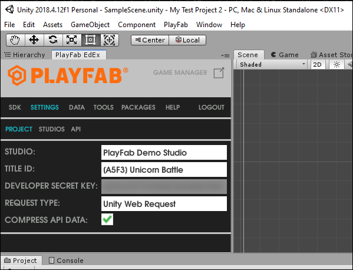

# Quickstart: PlayFab Client library for C# in Unity

Get started with the PlayFab Client library for C# in Unity. Follow steps to install the package and try out example code for a basic task.

This quickstart helps you make your first PlayFab API call in the Unity engine.

## Requirements

- A [PlayFab developer account](https://developer.playfab.com/en-us/sign-up).
- An installed copy of the Unity Editor. To install Unity for personal use via Unity Hub, or Unity+ for professional use, see [Download Unity](https://unity.com/download).
  > [!NOTE]
  > The PlayFab Unity SDK supports Unity Editor version 5.3 (released December 2015) and higher.
- A Unity Project of any of the following types:
  - A brand new project. For more information, see [Starting Unity for the first time](https://docs.unity3d.com/Manual/UnityOverview.html).
  - A guided tutorial project. For more information, see [Getting Started with Unity](https://learn.unity.com/).
  - An existing project.
- The PlayFab Unity SDK.

## Download and install PlayFab SDK

Use the PlayFab Editor Extensions package to install the SDK. The PlayFab Editor Extensions are a stand-alone Unity plug-in that streamlines installing the SDK and configuring the PlayFab settings for your Title. For information about installing the SDK without using the PlayFab Editor Extensions, see [Installing the PlayFab SDK for Unity](installing-unity3d-sdk.md#download-and-install-the-sdk-only).

1. Download the [PlayFab Unity Editor Extensions Asset Package](https://aka.ms/PlayFabUnityEdEx).
2. Open your Unity Project.
3. Navigate to where you downloaded the file and double-click on the `PlayFabEditorExtensions.UnityPackage` file to open the **Import Unity Package** dialog in the Unity Editor.

   
4. To import the PlayFab Unity Editor Extensions into your project, select **Import**.
5. When the import completes, the PlayFab Unity Editor Extensions panel should open automatically. If you already created a PlayFab developer account, select the **Log In** link to log in with your PlayFab username and password.

   
   > [!NOTE]
   > If the panel did not open, or if you close the panel and want to reopen it, you can do so by selecting **Window** > **PlayFab** > **Editor Extensions**
6. After logging in, the extension displays the SDK installation dialog.

   
7. Select **Install PlayFab SDK** to automatically import the SDK into your project or upgrade the version that is currently installed.

## Set your title settings

Before you can make an API call, you must specify the Title to receive the call in the PlayFab **Title Settings**. To set the Title:

1. Select **SET MY TITLE** in the **Editor Extensions**.

    

2. Select the **Studio** entry to open the studio drop-down menu. Select the studio that contains the Title to which you would like to connect.
3. Select the **Title ID** entry to open a drop-down menu of Titles associated with the selected studio.

The **Developer Secret Key** is automatically set to the default secret key for the Title. For more information about secret keys, see [Secret key management](../../gamemanager/secret-key-management.md).



[!NOTE] The extensions allow you to customize the http transport used to make requests to PlayFab. The recommended default is Unity Web Request. Other options exist to provide compatibility with older engine versions or game-specific http implementations.

## Making your first API call

This part of the guide provides the minimum steps to make your first PlayFab API call. This example doesn't provide any GUI or on-screen feedback. Confirmation is displayed in the Console log.

1. If your Unity Project doesn't already have a *Scripts* folder (**HDRP** and **LWRP/URP** templates have one by default), right-click on the **Assets** folder in the Project panel and select **Create** > **Folder**.
2. In the **Assets** window, name the folder *Scripts*.
3. Right-click the Scripts folder and select **Create** > **C# Script**.
4. Name the script PlayFabLogin.
5. Double-click the file to open it in a code-editor.
6. In your code editor, replace the contents of PlayFabLogin.cs with the provided code and save the file.

    ```csharp
    using PlayFab;
    using PlayFab.ClientModels;
    using UnityEngine;

    public class PlayFabLogin : MonoBehaviour
    {
        public void Start()
        {
            if (string.IsNullOrEmpty(PlayFabSettings.staticSettings.TitleId)){
                /*
                Please change the titleId below to your own titleId from PlayFab Game Manager.
                If you have already set the value in the Editor Extensions, this can be skipped.
                */
                PlayFabSettings.staticSettings.TitleId = "42";
            }
            var request = new LoginWithCustomIDRequest { CustomId = "GettingStartedGuide", CreateAccount = true};
            PlayFabClientAPI.LoginWithCustomID(request, OnLoginSuccess, OnLoginFailure);
        }

        private void OnLoginSuccess(LoginResult result)
        {
            Debug.Log("Congratulations, you made your first successful API call!");
        }

        private void OnLoginFailure(PlayFabError error)
        {
            Debug.LogWarning("Something went wrong with your first API call.  :(");
            Debug.LogError("Here's some debug information:");
            Debug.LogError(error.GenerateErrorReport());
        }
    }
    ```

    > [!IMPORTANT]
    > The provided code is not for use with mobile Titles. This is only an example, and shows how to log in with a `CustomID`. To implement login for a mobile Title, use either
    [LoginWithAndroidDeviceID](xref:titleid.playfabapi.com.client.authentication.loginwithandroiddeviceid), [LoginWithIOSDeviceID](xref:titleid.playfabapi.com.client.authentication.loginwithiosdeviceid), or some form of social login such as [LoginWithFacebook](xref:titleid.playfabapi.com.client.authentication.loginwithfacebook).
7. In the **Hierarchy** panel, right-click your scene, then select **Create Empty** (or **Game Object** > **Create Empty** in older versions of Unity).
8. Select the new Game Object and in the **Inspector** panel, select **Add Component**.
9. From the component drop-down menu, select **Scripts** > **PlayFabLogin**.

For more information on creating and using scripts in the Unity Editor, see [Creating and Using Scripts](https://docs.unity3d.com/Manual/CreatingAndUsingScripts.html) in the Unity documentation.

## Finish and execute

You're now ready to test out this sample.

- Be sure to save all files and return to the Unity Editor
- Press the **Play** button at the top of the editor

You should see the following message in your Unity Console Panel.

  

> [!TIP]
>Alternatively, you can log into PlayFab and navigate to the title in Game Manager, and select the **PlayStream Monitor** tab. Each time you switch focus away from the actively running Unity Title, it passes an event which you can see and confirm in the PlayStream Monitor.

For a list of all available client API calls, see [PlayFab API References](../../api-references/index.md).

## Next steps

This quickstart shows a simplified procedure for authenticating a user. For more information on user authentication, see [Login basics and best practices](../../features/authentication/login/login-basics-best-practices.md).

Learn how to bind an account to multiple devices and login mechanisms: [Account linking quickstart](../../features/authentication/login/quickstart.md).
