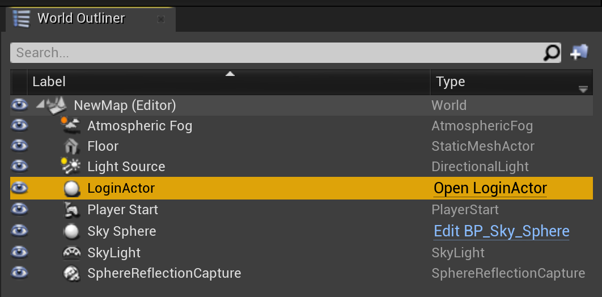
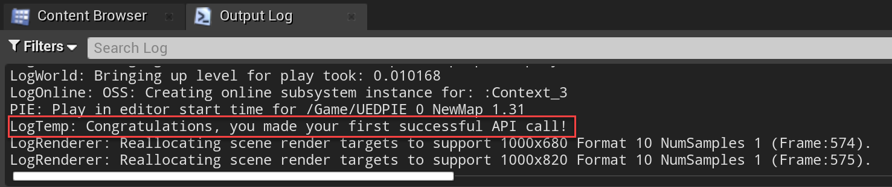
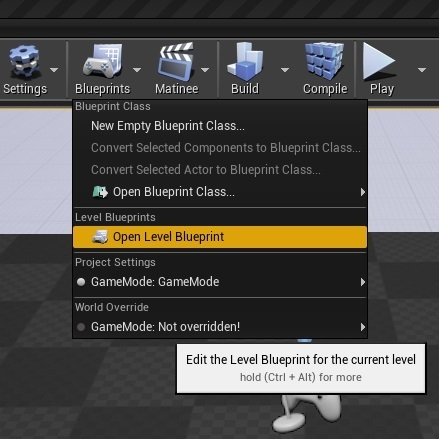
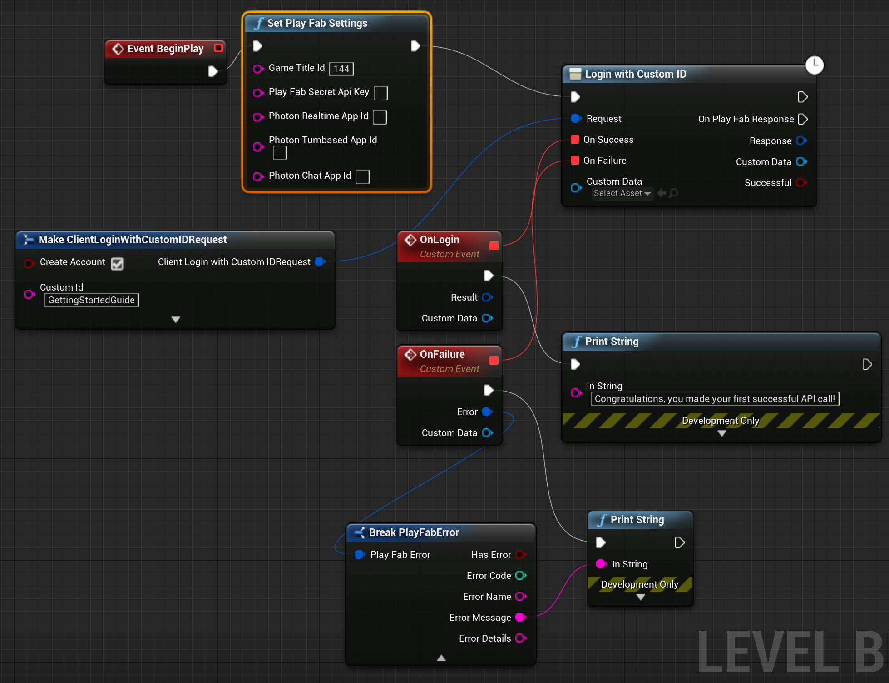
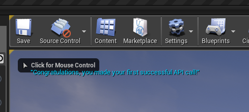

# Quickstart: PlayFab client library for Unreal Engine

Get started with the PlayFab plugin for the Unreal Engine. Follow this quickstart to install the PlayFab Unreal Engine plugin and create example apps that use the C++ client library and the Blueprint interface.

You can use the PlayFab plugin for the Unreal Engine to manage LiveOps for your Title and perform admin, client, and server operations such as:

* Player authentication.
* Managing virtual items and currency.
* Creating social features such as friends lists.

  [API reference documentation](../../api-references/index.md) | [Library source code](https://github.com/PlayFab/UnrealMarketplacePlugin) | [Unreal Marketplace](https://www.unrealengine.com/marketplace/playfab-sdk)

## Prerequisites

* A [PlayFab developer account](https://developer.playfab.com/en-us/sign-up).
* An installation of [Visual Studio](https://visualstudio.microsoft.com/downloads/) that is configured for Unreal Engine. For information about configuring Visual Studio, see [Setting Up Visual Studio for Unreal Engine](https://docs.unrealengine.com/en-US/Programming/Development/VisualStudioSetup/index.html).
* An installation of the [Unreal Engine](https://www.unrealengine.com/download). For information about installing the Unreal Engine, see the [Unreal Engine installation guide](https://docs.unrealengine.com/4.27/en-US/Basics/Projects/Browser/).
* An installation of the PlayFab Unreal plugin. You can install the Unreal plugin from the [Unreal Engine marketplace](https://www.unrealengine.com/marketplace/playfab-sdk).

## Create an Unreal project

In Unreal Engine, create a new Unreal Project. For detailed instructions, follow the [Create a New Project guide](https://docs.unrealengine.com/4.27/en-US/Basics/Projects/Browser/).

1. For **Project Category** select **Games**.
2. In **Select Template**, select **Blank**.
3. In **Project Settings**, select either **C++** or **Blueprint**.
4. Choose **No Starter Content**.
5. Choose a name for your project such as **MyProject**.

## Enable the PlayFab Plugin in your Unreal project

To enable the PlayFab Plugin:

1. From the **Settings** menu, under **Game Specific Settings** select **Plugins**.
2. Enable the **PlayFab** plugin and restart Unreal Engine as required.

### Add PlayFab as a Module dependency in C++

In Visual Studio, add PlayFab as a module dependency in your C++ project:

1. From the **View** menu open **Solution Explorer** which displays your C++ project files.
2. In Solution Explorer, navigate to **Solution\Games\YourProjectName\Source** and open **YourProjectName.Build.cs**.
3. Add the following line:

    ```cpp
    PrivateDependencyModuleNames.AddRange(new string[] { "PlayFab", "PlayFabCpp", "PlayFabCommon" });
    ```

4. Save your changes.

## Generate the necessary Visual Studio project files

To update and generate the Visual Studio project files necessary to use the PlayFab plugin:

1. Open a file explorer window and navigate to folder where your project files are located.
2. In the root folder of the project, right-click the YourProjectName.uproject file.
3. From the context menu, select **Generate Visual Studio project files**.

## Calling PlayFab with C++

The following steps walk you through creating a Tile that logs into PlayFab using a custom ID. For information about logging in from a Blueprints project, see "Calling PlayFab from Unreal Blueprints" later in this article.

### Create a new Actor

To create a new Actor:

1. From the **File** menu, select **New C++ Class**.
2. For **Parent Class** select **Actor**.
3. Name your actor **LoginActor**. After you create the Actor, Unreal Engine automatically opens your C++ development environment and loads LoginActor.cpp and LoginActor.h.
    > [!IMPORTANT]
    > For the purposes of this quickstart, you must name the Actor **LoginActor**. If you give the Actor a different name, you must update the sample code provided in this quickstart to match the new name.

4. Drag-and-drop your new Actor **LoginActor** from the Content Browser into the Viewport panel. It now appears in the "World Outliner" pane.
    If you don't see your **LoginActor**, select the **Show or hide the source panel** icon. Then select the name of your project under the C++ classes.

    



### Add PlayFab API calls to your C++ LoginActor

In this quickstart, you use [LoginWithCustomID](xref:titleid.playfabapi.com.client.authentication.loginwithcustomid) to perform the log in. While `LoginWithCustomId` is easy to use to get started, we recommend moving to a more secure player auth method for the release of your game. See the [Login basics and best practices](../../features/authentication/login/login-basics-best-practices.md) for information about implementing robust log in functionality.

The `LoginWithCustomID` call is made in your **LoginActor**. To add the PlayFab specific code to your **LoginActor**:

1. Replace the contents of LoginActor.h with the code shown:

```cpp
#pragma once

#include "CoreMinimal.h"
#include "GameFramework/Actor.h"
#include "PlayFab.h"
#include "Core/PlayFabError.h"
#include "Core/PlayFabClientDataModels.h"
#include "LoginActor.generated.h"

UCLASS()
class ALoginActor : public AActor
{
    GENERATED_BODY()
public:
    ALoginActor();
    virtual void BeginPlay() override;
    void OnSuccess(const PlayFab::ClientModels::FLoginResult& Result) const;
    void OnError(const PlayFab::FPlayFabCppError& ErrorResult) const;

    virtual void Tick(float DeltaSeconds) override;
private:
    PlayFabClientPtr clientAPI = nullptr;
};
```

2. Replace the contents of LoginActor.cpp with the following code.

```cpp
#include "LoginActor.h"
#include "Core/PlayFabClientAPI.h"

ALoginActor::ALoginActor()
{
    PrimaryActorTick.bCanEverTick = true;
}

void ALoginActor::BeginPlay()
{
    Super::BeginPlay();
    
    GetMutableDefault<UPlayFabRuntimeSettings>()->TitleId = TEXT("144");
    
    clientAPI = IPlayFabModuleInterface::Get().GetClientAPI();

    PlayFab::ClientModels::FLoginWithCustomIDRequest request;
    request.CustomId = TEXT("GettingStartedGuide");
    request.CreateAccount = true;

    clientAPI->LoginWithCustomID(request,
        PlayFab::UPlayFabClientAPI::FLoginWithCustomIDDelegate::CreateUObject(this, &ALoginActor::OnSuccess),
        PlayFab::FPlayFabErrorDelegate::CreateUObject(this, &ALoginActor::OnError)
    );
}

void ALoginActor::OnSuccess(const PlayFab::ClientModels::FLoginResult& Result) const
{
    UE_LOG(LogTemp, Log, TEXT("Congratulations, you made your first successful API call!"));
}

void ALoginActor::OnError(const PlayFab::FPlayFabCppError& ErrorResult) const
{
    UE_LOG(LogTemp, Error, TEXT("Something went wrong with your first API call.\nHere's some debug information:\n%s"), *ErrorResult.GenerateErrorReport());
}

void ALoginActor::Tick(float DeltaTime)
{
    Super::Tick(DeltaTime);
}
```

> [!TIP]
> Intellisense in Visual Studio will indicate that it cannot locate the include files and the PlayFab namespace. You can safely disregard these warnings.
> When you run your project it will build and execute correctly.
>

### Finish and execute with C++

Now you're ready to test a call to PlayFab from Unreal Engine in C++.  The results of your test call are displayed in the **Output Log** of Unreal Engine.

In Unreal Engine:

1. Display the Output Log from the **Windows** menu, select **Developer Tools** and enable **Output Log**.
2. In the toolbar, select **Compile** and wait for Unreal Engine to finish compiling. While your code is compiling, Unreal displays a "Compiling C++ Code."  
3. Select **Play**.  When the code runs, Unreal displays the following in the **Output Log** window:

`LogTemp: Congratulations, you made your first successful API call!`



## Calling PlayFab from Unreal Blueprints

This section guides you through creating a Blueprint structure, which uses the PlayFab API to call [LoginWithCustomID](/rest/api/playfab/client/authentication/login-with-custom-id?view=playfab-rest&preserve-view=true). While `LoginWithCustomId` is easy to use to get started, we recommend moving to a more secure player auth method for the release of your game. See the [Login basics and best practices](../../features/authentication/login/login-basics-best-practices.md) for information about implementing robust log in functionality.

> [!TIP]
> If you start from a Blueprint project, you must convert it to a C++ project for the PlayFab Blueprint Actions to function.

### Create a Blueprint structure

In Unreal Engine, from the toolbar, select **Open Level Blueprint**.

  

The EventGraph opens and is prepopulated with two Actions. `Event BeginPlay` and `Event Tick`. 

Actions used in this quickstart:

* `Set Play Fab Settings`
* `Login with Custom ID`
* `Make ClientLoginWithCustomIDRequest`
* `AddCustomEvent` x 2
* `Break PlayFabError`
* `Print String` x 2

Create your Blueprint as follows:

* Select the output pin on `Event BeginPlay` and drag it to an open location in the **Event Graph**. In the **Executable Actions** dialog, search for `Set Play Fab Settings` and select it to add it to your Blueprint. In `Set Play Fab Settings`, if **Game Title id** is blank, set it to the **Title ID** of your game.
* Select the output pin on `Set Play Fab Settings` and drag it to an open location. In the **Executable Actions** dialog, search for `Login with Custom ID` and select it to add it to your Blueprint.
* Select the **Request** pin on `Login with Custom ID` and drag it to an empty location. From the **Actions providing a(n) Client Login With Custom ID Request Structure**, select `Make ClientLoginWithCustomIDRequest`. 
* On `Make ClientLoginWithCustomIDRequest`:

  * Select **Create Account**.
  * Set the **Custom Id** to GettingStartedGuide.

* On `Login with Custom ID`, select the **On Success** pin and drag it to an empty location. In the **Actions providing a(n) Delegate**, search for `Add Custom Event` and select it to add it to your Blueprint.
  * Name it `OnLogin`.
* Select the **On Failure** pin and drag it to an empty location. In the **Actions providing a(n) Delegate**, search for `Add Custom Event` and select it to add it to your Blueprint.
  * Name it `OnFailure`.
* Select the output pin on `OnLogin` and drag it to an empty location. In the **Executable Actions** dialog, search for `Print String` and select it to add it to the Blueprint.
  * On `Print String`, set the **In String** value to "Congratulations, you made your first successful PlayFab API call using Blueprint!".
* Select the output pin of `OnFailure` and drag it to an empty location. In the **Executable Actions** dialog, search for `Print String` and select it to add it to the Blueprint.
* Select the **Error** pin on `OnFailure` and drag it to an empty location. In the **Actions providing a(n) string** dialog, search for **Break PlayFabError** and select it to add it to the Blueprint. In the **Actions taking a(n) PlayFab error structure** dialog, search for **Break PlayFabError** and select it to add it to the Blueprint.
* Connect the **Error Message** pin of `Break PlayFabError` to the **In String** pin of on failure `Print String` Action.

When you're finished, your Blueprint should look similar to this design:

  

**Save** the Blueprint, and close the Blueprint Editor window.

### Execute a PlayFab call with Blueprint

1. On the toolbar, select the **Play** button.

2. When the Blueprint runs, the following  output is shown in the Viewport window.

    

Congratulations, you made your first successful PlayFab API call using Blueprint!

## More Resources

* Unreal Engine documentation for [Blueprints Visual Scripting](https://docs.unrealengine.com/en-US/Engine/Blueprints/index.html).
* [Unreal Engine documentation](https://docs.unrealengine.com/).
