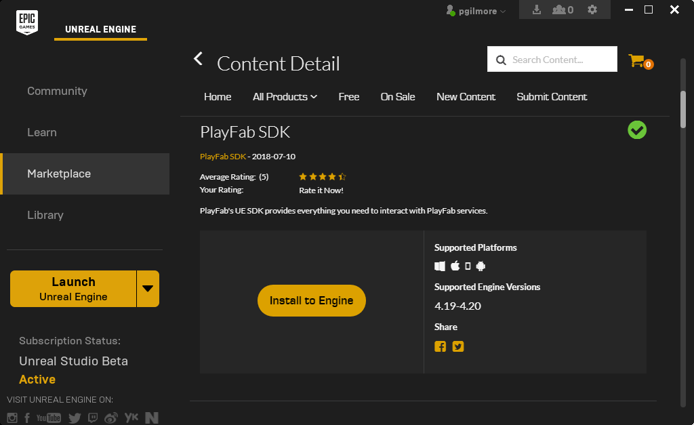
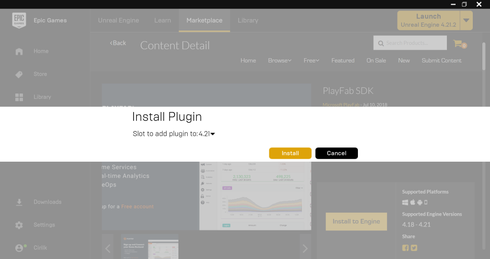
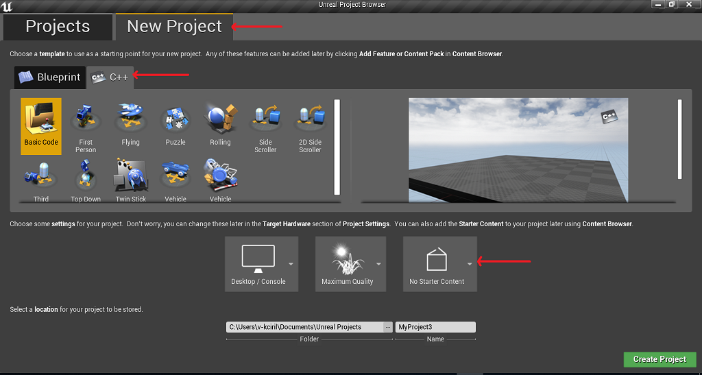
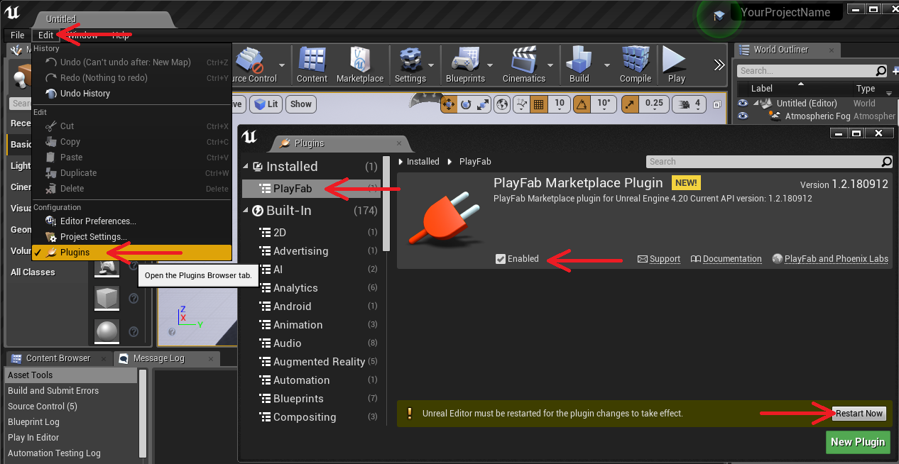
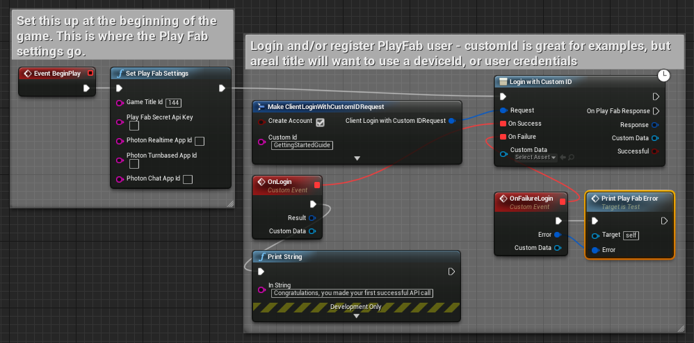
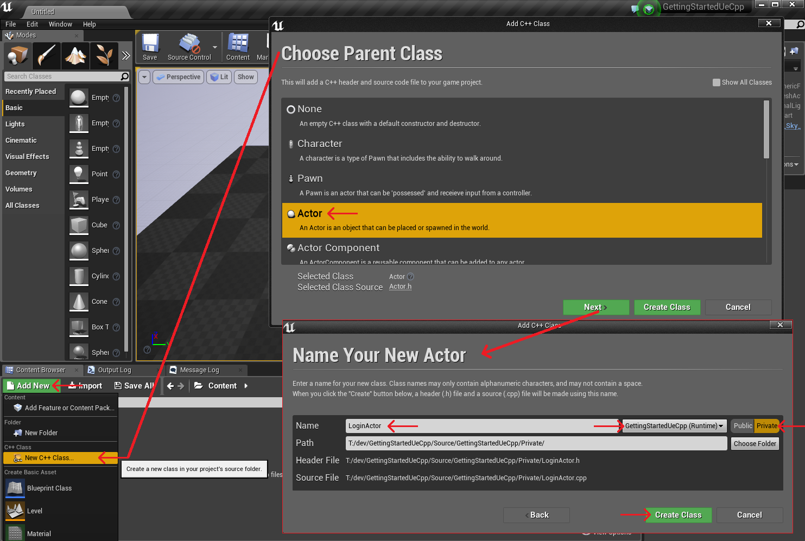
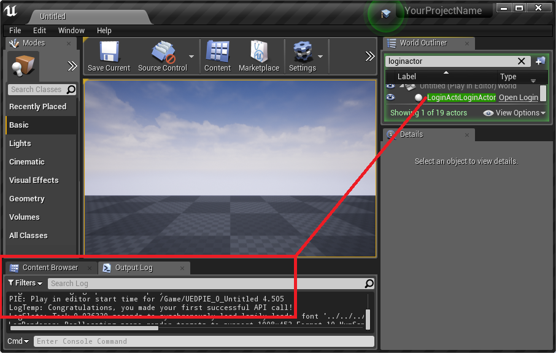

# Unreal Engine Quickstart

This guide will help you set up Unreal Engine, install the PlayFab Marketplace Plugin, and make your first API call in Unreal, using the PlayFab Marketplace Plugin. You can make your first API call using Blueprints, or C++, or both.

## Table of Contents

- [Unreal Project Setup](#unreal-project-setup) 
- [Set up your first Blueprint call](#set-up-your-first-blueprint-call)
  - [Finish and Execute with Blueprint](#finish-and-execute-with-blueprint)

- [Set up your first C++ call](#set-up-your-first-c++-call)
  - [Finish and Execute with C++](#finish-and-execute-with-c++)
  
- [Deconstruct the Blueprint Example](#deconstruct-the-blueprint-example)
- [Deconstruct the C++ code example](#deconstruct-the-c++-code-example)

## Unreal Project Setup

- OS: This guide is written for Windows 10, however steps should be similar for Mac
- This guide is created for using Visual Studio 2017, and Unreal Engine 4.x (Usually latest)
- Download Unreal Engine
  
  - Register and log in on the Unreal website
    - [https://accounts.unrealengine.com/login/index](https://accounts.unrealengine.com/login/index)
  
  - Download the Epic Games Launcher
    - [https://www.unrealengine.com/dashboard](https://www.unrealengine.com/dashboard)
    - Open Epic Games Launcher
      - Select the "Unreal Engine" tab, and "Library" from the left-navigation-bar
      - Click "+Add Versions"
      - Select the latest version supported by the [SDK readme](https://github.com/PlayFab/UnrealCppSdk)
- Install the PlayFab Plugin into your Engine
  - In the Epic Games launcher, go to the Marketplace and Search for the PlayFab SDK

    

  - Click on the PlayFab SDK, click “Free”, then click "Install to Engine"

     

  - Pick your version again

     

  - Click the "Launch" button, and run Unreal Engine
  - Select all the options as seen here:
    - New Project tab, C++ sub-tab, No Starter Content

       

  - Create Project with these options
  - Enable the PlayFab Plugin

     

- PlayFab Installation Complete!

## Set up your first Blueprint call 

This section will provide the minimum steps to make your first PlayFab Blueprint call. Confirmation will be done via an on-screen debug print.

- Start by opening the level blueprint

   

- Use the existing "Event BeginPlay" node, and build the following structure:

   

- Save the blueprint, and close the blueprint editor window
- Save the level

## Finish and Execute with Blueprint

- Push the play button
- When you execute this program, you should get the following output:

  

- Congratulations, you made your first successful API call!
- Done! Press any key to close

## Set up your first C++ call 

This section will provide the minimum steps to make your first PlayFab API call. Confirmation will be done via a debug print in the Output Log.

- Open your new project
- Create a new actor called LoginActor, and place it in the scene

   

- Creating the new LoginActor should automatically open Visual Studio, with LoginActor.cpp and LoginActor.h available to edit
- Under Solution Explorer -> Games/YourProjectName/Source, find and open YourProjectName.Build.cs
  - Add the following line:
  - PrivateDependencyModuleNames.AddRange(new string[] { "PlayFab", "PlayFabCpp", "PlayFabCommon" });
- Replace the contents of LoginActor.h with the following:

```cpp
#pragma once

#include "GameFramework/Actor.h"

#include "CoreMinimal.h"
#include "GameFramework/Actor.h"

#include "PlayFab.h"
#include "Core/PlayFabError.h"
#include "Core/PlayFabClientDataModels.h"

#include "LoginActor.generated.h"


UCLASS()
class YOURPROJECTNAME_API ALoginActor : public AActor
{
    GENERATED_BODY()
public:
    ALoginActor();
    virtual void BeginPlay() override;
    void OnSuccess(const PlayFab::ClientModels::FLoginResult& Result) const;
    void OnError(const PlayFab::FPlayFabCppError& ErrorResult) const;

    virtual void Tick(float DeltaSeconds) override;
private:
    PlayFabClientPtr clientAPI = nullptr;
};
```

- And Replace the contents of LoginActor.cpp with the following:

```cpp
#include "LoginActor.h"

#include "Core/PlayFabClientAPI.h"

ALoginActor::ALoginActor()
{
    PrimaryActorTick.bCanEverTick = true;
}

void ALoginActor::BeginPlay()
{
    Super::BeginPlay();

    clientAPI = IPlayFabModuleInterface::Get().GetClientAPI();
    clientAPI->SetTitleId(TEXT("144"));

    PlayFab::ClientModels::FLoginWithCustomIDRequest request;
    request.CustomId = TEXT("GettingStartedGuide");
    request.CreateAccount = true;

    clientAPI->LoginWithCustomID(request,
        PlayFab::UPlayFabClientAPI::FLoginWithCustomIDDelegate::CreateUObject(this, &ALoginActor::OnSuccess),
        PlayFab::FPlayFabErrorDelegate::CreateUObject(this, &ALoginActor::OnError)
    );
}

void ALoginActor::OnSuccess(const PlayFab::ClientModels::FLoginResult& Result) const
{
    UE_LOG(LogTemp, Log, TEXT("Congratulations, you made your first successful API call!"));
}

void ALoginActor::OnError(const PlayFab::FPlayFabCppError& ErrorResult) const
{
    UE_LOG(LogTemp, Error, TEXT("Something went wrong with your first API call.\nHere's some debug information:\n%s"), *ErrorResult.GenerateErrorReport());
}

void ALoginActor::Tick(float DeltaTime)
{
    Super::Tick(DeltaTime);
}
```

- Run the Unreal Editor (Debug -> Start Debugging)

## Finish and Execute with C++

- Earlier, you created a level with a LoginActor entity already placed in the world
  - Load this level

- Press Play
  - You will immediately see the following in the output log:
  - LogTemp: Congratulations, you made your first successful API call!

     

- Done! Press any key to close

## Deconstruct the Blueprint example

This optional last section describes each part of the blueprints above, in detail.

- Event BeginPlay
  - This is an Unreal node that exists by default for a level blueprint. It triggers the following notes immediately when the level is loaded
- Set Play Fab Settings
  - Use this to set the titleId. Other keys can be set here too, but for this guide, you only need to set titleId.
  - Every PlayFab developer creates a title in Game Manager. When you publish your game, you must code that titleId into your game. This lets the client know how to access the correct data within PlayFab. For most users, just consider it a mandatory step that makes PlayFab work.
- Make ClientLoginWithCustomIDRequest
  - Most PlayFab API methods require input parameters, and those input parameters are packed into a request object
  - Every API method requires a unique request object, with a mix of optional and mandatory parameters
    - For LoginWithCustomIDRequest, there is a mandatory parameter of CustomId, which uniquely identifies a player and CreateAccount, which allows the creation of a new account with this call
  
- Login with Custom ID
  - This begins the async request to "LoginWithCustomID"
  - For login, most developers will want to use a more appropriate login method
    - See the [PlayFab Login documentation](https://api.playfab.com/documentation/Client#Authentication) for a list of all login methods, and input parameters. Common choices are:
      - [LoginWithAndroidDeviceID](https://api.playfab.com/documentation/Client#Authentication)
      - [LoginWithIOSDeviceID](xref:titleid.playfabapi.com.client.authentication.loginwithiosdeviceid)
      - [LoginWithEmailAddress](xref:titleid.playfabapi.com.client.authentication.loginwithemailaddress)
  - The left-side blueprint pins
    - Blue: Request
      - For every PlayFab API blueprint, this must always receive from a paired Make Request blueprint node
    - Red: "On Success" and "On Failure"
      - You can drag an un-bound red marker to empty space, to create a new custom event for this action. One of those events, according to circumstances, is then invoked when the async-call returns
    - Cyan: Custom Data
      - Custom Data is just a relay. That object is passed un-touched into the red custom events
      - This isn't terribly useful for blueprints, but it's very useful when invoking API calls directly from C++ (Advanced topic: won't be covered in this guide)
  - The right-side blueprint pins
    - White: the unlabeled first exec pin is executed immediately as the API call is queued (response does not exist yet) - Do not use this pin!
    - White: the second exec pin is labeled "On Play Fab Response", and is executed after the async remote call has returned
      - Use this to trigger logic that needs to wait or use the Response
    - Blue: Response
      - This is a Json representation of the result
      - The OnSuccess pin provides a properly typed object with the correct fields pre-built into the blueprint
        - This json field is an older pin which is only maintained for legacy
    - Cyan: Custom Data - Same as Custom Data above
    - Maroon: Successful
      - Legacy boolean which indicates how to safely unpack the legacy Response pin
      - Again, it's better to use the red OnSuccess and OnFailure pins
  
- OnLoginSuccess and OnLoginFail
  - The names of these modules are optional, and should be different for every API call
  - Described above, they attach to the red pins of PlayFab API calls, and allow you to process success and failure for those calls.
  - The OnSuccess/Result pin:
    - The result pin will contain the requested information, according to the API called
  - Break PlayFab Result (Not displayed, the only valid connection for the OnSuccess/Result pin)
    - If you drag the Result pin from OnSuccess, it'll create a Break-Result blueprint. This blueprint is used to examine the response from any API call
  - The OnFailure/Error pin
    - Always connects to a Break PlayFabError blueprint
    - Contains some information about why your API call failed
    - Why API calls fail (In order of likelihood)
      - PlayFabSettings.TitleId is not set. If you forget to set titleId to your title, then nothing will work.
      - Request parameters. If you have not provided the correct or required information for a particular API call, then it will fail. See error.errorMessage, error.errorDetails, or error.GenerateErrorReport() for more info.
      - Device connectivity issue. Cell-phones lose/regain connectivity constantly, and so any API call at any time can fail randomly, and then work immediately after. Going into a tunnel can disconnect you completely.
      - PlayFab server issue. As with all software, there can be issues. See our [release notes](https://api.playfab.com/releaseNotes) for updates.
      - The internet is not 100% reliable. Sometimes the message is corrupted or fails to reach the PlayFab server.
    - If you are having difficulty debugging an issue, and the information within the error information is not sufficient, please visit us on our [forums](https://community.playfab.com/index.html)
  
- Prints and Append nodes
  - Just part of the example, giving you some on-screen feedback about what's happening
  - Most examples will extract and utilize the data, rather than just printing

## Deconstruct the C++ code example

This optional last section describes the code in this project line by line.

- GettingStartedUeCpp.Build.cs
  - To reference code from a plugin in your project, you have to add the plugin to your code dependencies. The Unreal build tools do all the work, if you add the "PlayFab" string to your plugins
  
- LoginActor.H
  - includes
    - The LoginActor includes are default includes that exist for the template file before we modified it
    - The PlayFab includes are necessary to make PlayFab API calls
  - UCLASS ALoginActor
    - Most of this file is the default template for a new actor; the only exceptions to this are:
  - OnSuccess and OnError
    - These are the asynchronous callbacks that will be invoked after PlayFab LoginWithCustomID completes
  - PlayFabClientPtr clientAPI
    - This is an object that lets you access the PlayFab client API

- LoginActor.cpp
  - Most of this file is the default template for a new actor; the only exceptions to this are:
  - clientAPI = IPlayFabModuleInterface::Get().GetClientAPI();
    - This fetches the clientAPI object from the PlayFab plugin, so you can make API calls with it
  - clientAPI->SetTitleId(TEXT("xxxx"));
    - Every PlayFab developer creates a title in Game Manager. When you publish your game, you must code that titleId into your game. This lets the client know how to access the correct data within PlayFab. For most users, just consider it a mandatory step that makes PlayFab work.
  - PlayFab::ClientModels::FLoginWithCustomIDRequest request;
    - Most PlayFab API methods require input parameters, and those input parameters are packed into a request object
    - Every API method requires a unique request object, with a mix of optional and mandatory parameters
      - For LoginWithCustomIDRequest, there is a mandatory parameter of CustomId, which uniquely identifies a player and CreateAccount, which allows the creation of a new account with this call.
  - clientAPI->LoginWithCustomID(request, {OnSuccess delegate}, {OnFail delegate});
    - This begins the async request to "LoginWithCustomID", which will call LoginCallback when the API call is complete
    - For login, most developers will want to use a more appropriate login method
      - See the [PlayFab Login documentation](https://api.playfab.com/documentation/Client#Authentication) for a list of all login methods, and input parameters. Common choices are:
        - [LoginWithAndroidDeviceID](https://api.playfab.com/documentation/Client#Authentication)
        - [LoginWithIOSDeviceID](xref:titleid.playfabapi.com.client.authentication.loginwithiosdeviceid)
        - [LoginWithEmailAddress](xref:titleid.playfabapi.com.client.authentication.loginwithemailaddress)
  - {OnSuccess delegate}: PlayFab::UPlayFabClientAPI::FLoginWithCustomIDDelegate::CreateUObject(this, &ALoginActor::OnSuccess)
    - combined with: void ALoginActor::OnSuccess(const PlayFab::ClientModels::FLoginResult& Result) const
    - These create a UObject callback/delegate which is called if your API call is successful
    - An API Result object will contain the requested information, according to the API called
      - FLoginResult contains some basic information about the player, but for most users, login is simply a mandatory step before calling other APIs.
  - {OnFail delegate} PlayFab::FPlayFabErrorDelegate::CreateUObject(this, &ALoginActor::OnError)
    - combined with: void ALoginActor::OnError(const PlayFab::FPlayFabError& ErrorResult) const
    - API calls can fail for many reasons, and you should always attempt to handle failure
    - Why API calls fail (In order of likelihood)
      - PlayFabSettings.TitleId is not set. If you forget to set titleId to your title, then nothing will work.
      - Request parameters. If you have not provided the correct or required information for a particular API call, then it will fail. See error.errorMessage, error.errorDetails, or error.GenerateErrorReport() for more info.
      - Device connectivity issue. Cell-phones lose/regain connectivity constantly, and so any API call at any time can fail randomly, and then work immediately after. Going into a tunnel can disconnect you completely.
      - PlayFab server issue. As with all software, there can be issues. See our [release notes](https://api.playfab.com/releaseNotes) for updates.
      - The internet is not 100% reliable. Sometimes the message is corrupted or fails to reach the PlayFab server.
    - At this time, the PlayFab Unreal C++ SDK maintains state with static variables which are non atomic and are not guarded by synchronization techniques. For this reason, we recommend limiting PlayFab calls to within the main Unreal thread.
    - If you are having difficulty debugging an issue, and the information within the error information is not sufficient, please visit us on our [forums](https://community.playfab.com/index.html)
