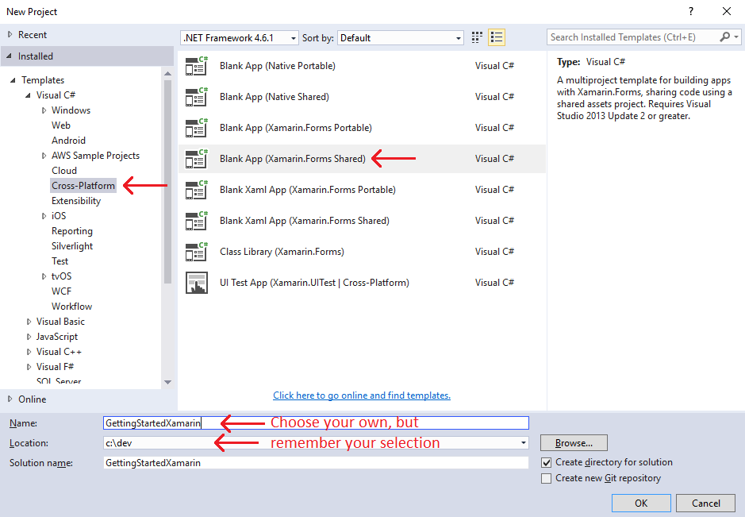
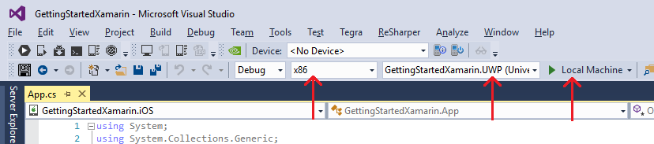
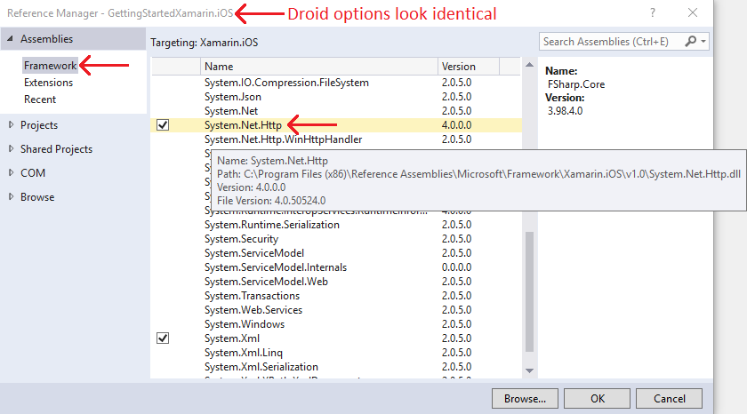

# Xamarin quickstart

This guide helps you make your first PlayFab API call in the Xamarin IDE using C#.

Before continuing, make sure you have completed [Getting started for developers](../../personas/developer.md), which ensures you have a PlayFab account and are familiar with the PlayFab Game Manager.

## Xamarin project setup

OS: This guide is written for Windows 10, using Visual Studio 2015.

1. Download Visual Studio 2015: [https://www.visualstudio.com/downloads/](https://www.visualstudio.com/downloads/).

2. Download Xamarin for Visual Studio by first creating an account or log-in here: <https://www.xamarin.com/download>
  
3. After registering and logging in, a **Download Now** link is provided for you.

4. Check for updates, even with fresh installs, as shown below.

        Tools -> Options -> Xamarin -> Other -> Check Now

      

5. Download and extract the PlayFab [Xamarin (C#) SDK](https://api.playfab.com/downloads/xamarin). This guide will use {CSharpSdkLocation} to describe the extracted location of this SDK.

6. Open Visual Studio and create a new cross-platform Xamarin project.

> [!NOTE]
> This example demonstrates a single Xamarin solution for all mobile platforms at the same time. You may, however, find it easier to target a single platform per solution.

7. Create a new project using the options shown below.

        Templates -> Visual C# -> Cross-Platform -> Blank App (Xamarin.Forms Shared)  

  

Pop-ups:  

- **Mac agent window**. Close this for now. If you plan to build for iOS, you'll need to set this up properly later.

- **New Universal Windows Project**. Choose your target version, or just use latest (highest build number) for all options.

- Set your platform and project settings to **x86 & Universal Windows** for the remainder of this example.

> [!NOTE]
> The UWP project runs directly on Windows 10, making it also easier to demonstrate with this example.



8. Import the PlayFab files into your project. We will copy and paste those files from the extracted zip we downloaded earlier.

9. Keep Visual Studio open. Also open an Explorer window to `{CSharpSdkLocation}/PlayFabClientSDK`, and find the "source" sub-folder (don't open it).

10. Drag the "source" sub-folder from the Explorer window, into the non-platform specific `GettingStartedXamarin` project in Visual Studio.

11. Once imported, rename the new "source" folder to "PlayFab". If you did this correctly, your **Solution Explorer** panel in Visual Studio should look like this:

      

12. Update a few project settings:

    - Add **XAMARIN** to all your platform-specific properties.

        - This flag is not a default for Xamarin, it's an identifier used by the PlayFab CSharpSdk which activates some Xamarin-specific code. Mostly you should just consider this a required step.  

        - For each Project in (`GettingStartedXamarin.Droid`, `GettingStartedXamarin.iOS`, `GettingStartedXamarin.UWP`, `GettingStartedXamarin.Windows`, `GettingStartedXamarin.WinPhone`):  

            - Right-click -> **Properties** -> Left-Menu: **Build** -> **Conditional compilation symbols:** -> **Append** ; **XAMARIN** to existing symbols (if any).

            - Each of these panels looks a little different, but each one should have this option.  

13. Update your Android specific settings:

    - Right-click **GettingStartedXamarin.Droid** -> **Properties** (If you closed it, otherwise you already opened this window above).

         - Left-menu: **Android Manifest** -> **Required Permissions** -> Check **Internet**.

    - Left-menu: **Application** -> Depending on your AndroidSDK installation, choose your SDK (In all 3 options, this guide uses "Android 6.0 (API Level 23 - Marshmallow)").

14. Xamarin installation prompts you to install the AndroidSDK. Navigate to that folder, and run **SDK Manager.exe** to modify which Android APIs you have available.

15. For each Project in (`GettingStartedXamarin.Droid`, `GettingStartedXamarin.iOS`), open the **Solution Explorer** panel, expand each project, and right-click **References** -> **Add Reference**. Find `System.Net.Http` and select the checkbox.



Your project should now compile.

> [!CAUTION]
> You likely have several warnings. The Android warnings can prevent you from testing or building to an actual device. Make sure to commit to a source code repository before you attempt to resolve Android warnings. These issues are insidious, and it's possible to permanently break your project.

Also, for `GettingStartedXamarin.Windows`, and `GettingStartedXamarin.UWP` projects, there are missing certificates, which are required for deploying builds. However, this will NOT prevent you from running a debug build on your local machine. Ultimately, we do not require that you resolve these warnings.

PlayFab installation complete!

## Set up your first API call

This guide provides the minimum steps to make your first PlayFab API call, without any GUI or on-screen feedback. Confirmation will be done with an on-screen text widget.

1. In Visual Studio, **Solution Explorer** (panel), find this file: `Solution/GettingStartedXamarin/App.cs`.

2. Replace the contents of App.cs with those shown below.

```csharp
using System;
using System.Threading.Tasks;
using PlayFab;
using PlayFab.ClientModels;
using Xamarin.Forms;

namespace GettingStartedXamarin
{
    public class App : Application
    {
        private readonly Label _myLabel;
        private string _myLabelText = "Logging into PlayFab...";

        public App()
        {
            _myLabel = new Label { HorizontalTextAlignment = TextAlignment.Center, Text = _myLabelText };

            // The root page of your application
            MainPage = new ContentPage
            {
                Content = new StackLayout { VerticalOptions = LayoutOptions.Center, Children = { _myLabel } }
            };

            LogIntoPlayFab();
            Device.StartTimer(TimeSpan.FromMilliseconds(16), Tick);
        }

        private bool Tick()
        {
            lock (_myLabelText)
            {
                _myLabel.Text = _myLabelText;
            }
            return true;
        }

        private void LogIntoPlayFab()
        {
            PlayFabSettings.TitleId = "144";
            var request = new LoginWithCustomIDRequest { CustomId = "GettingStartedGuide", CreateAccount = true };
            var loginTask = PlayFabClientAPI.LoginWithCustomIDAsync(request);
            loginTask.ContinueWith(OnLoginComplete);
        }

        private void OnLoginComplete(Task<PlayFabResult<LoginResult>> task)
        {
            var newLabel = "Unknown failure";
            if (task.Result.Result != null)
            {
                newLabel = "Congratulations, you made your first successful API call!";
            }
            if (task.Result.Error != null)
            {
                newLabel = "Something went wrong with your first API call.\n"
                    + "Here's some debug information:\n"
                    + task.Result.Error.GenerateErrorReport();
            }
            lock (_myLabelText)
            {
                _myLabelText = newLabel;
            }
        }
    }
}
```

## Finish and execute

1. Select **Build** from the drop-down menu -> and **Start Debugging** to run this project.

> [!NOTE]
> The first time you run a UWP program, it can take a long time to load.

2. When the project loads, you should see the following text:
"Congratulations, you made your first successful API call!"

At this point, you can start making other API calls, and building your game.

For a list of all available client API calls, see our [PlayFab API References](../../api-references/index.md) documentation.

Happy coding!

## Deconstruct the code

This optional last section describes each part of App.cs in detail.

- `App class` and `App() constructor`
  - These are the Xamarin template lines, trivially modified so that we can update the text-label as we process the login event

- `Device.StartTimer(TimeSpan.FromMilliseconds(16), Tick);` and `Tick()`
  - PlayFab API calls are executed on another thread. You can't set myLabel.Text from the other thread, so you must set up a thread-safe communication mechanism

- `LogIntoPlayFab`
  - `PlayFabSettings.TitleId = "144";`
    - Every PlayFab developer creates a title in Game Manager. When you publish your game, you must code that titleId into your game. This lets the client know how to access the correct data within PlayFab. For most users, just consider it a mandatory step that makes PlayFab work.

  - `var request = new LoginWithCustomIDRequest { CustomId = "GettingStartedGuide", CreateAccount = true };`
    - Most PlayFab API methods require input parameters, and those input parameters are packed into a request object
    - Every API method requires a unique request object, with a mix of optional and mandatory parameters
      - For `LoginWithCustomIDRequest`, there is a mandatory parameter of `CustomId`, which uniquely identifies a player - and `CreateAccount`, which allows the creation of a new account with this call.

    - For login, most developers will want to use a more appropriate login method.
      - See the [PlayFab Login documentation](xref:titleid.playfabapi.com.client.authentication) for a list of all login methods, and input parameters. Common choices are:
        - [LoginWithAndroidDeviceID](xref:titleid.playfabapi.com.client.authentication.loginwithandroiddeviceid)
        - [LoginWithIOSDeviceID](xref:titleid.playfabapi.com.client.authentication.loginwithiosdeviceid)
        - [LoginWithEmailAddress](xref:titleid.playfabapi.com.client.authentication.loginwithemailaddress)

  - `var loginTask = PlayFabClientAPI.LoginWithCustomIDAsync(request);`
    - This kicks off the thread which will execute the login call.

  - `loginTask.ContinueWith(OnLoginComplete);`
    - This queues up the `OnLoginComplete` function to execute after the login call has completed.
    - `OnLoginComplete` will receive the result information from that task.

  - `private void OnLoginComplete`
    - `(Task<PlayFabResult<LoginResult>> task)`
  - This is the callback, which receives the information about the success or failure of the login, and the returned data from that call
    - `task.Result.Result;`
      - When successful, Result object of many API callbacks will contain the requested information.
      - If not-null, `LoginResult`-type contains some basic information about the player, but for most users, login is simply a mandatory step before calling other APIs.

    - `task.Result.Error;`
      - If `apiError` is not `null`, your API has failed
      - API calls can fail for many reasons, and you should always attempt to handle failure.
      - Why API calls fail (In order of likelihood)
        - `PlayFabSettings.TitleId` is not set. If you forget to set `titleId` to your title, then nothing will work.
        - Request parameters. If you have not provided the correct or required information for a particular API call, then it will fail. See `error.errorMessage`, `error.errorDetails`, or `error.GenerateErrorReport()` for more info.
        - Device connectivity issue. Cell-phones lose/regain connectivity constantly, and so any API call at any time can fail randomly, and then work immediately after. Going into a tunnel can disconnect you completely.
        - PlayFab server issue. As with all software, there can be issues. See our [release notes](../../release-notes/index.md) for updates.
        - The internet is not 100% reliable. Sometimes the message is corrupted or fails to reach the PlayFab server.

      - If you are having difficulty debugging an issue, and the information within the error information is not sufficient, please visit us on our [forums](https://community.playfab.com/index.html)
